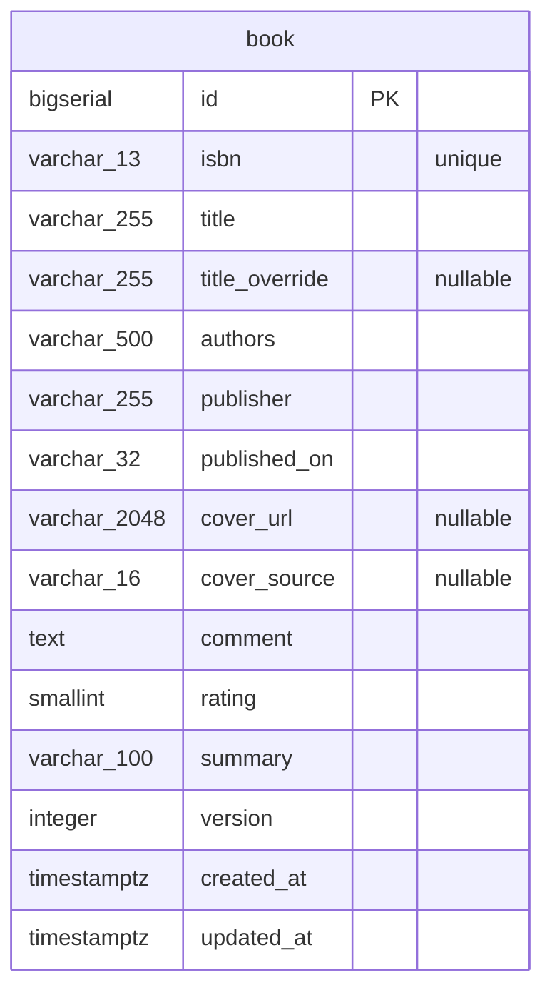
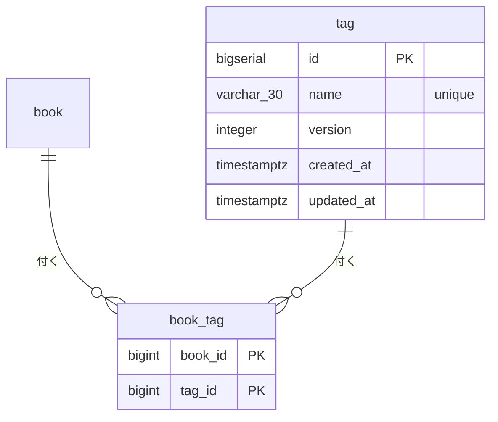
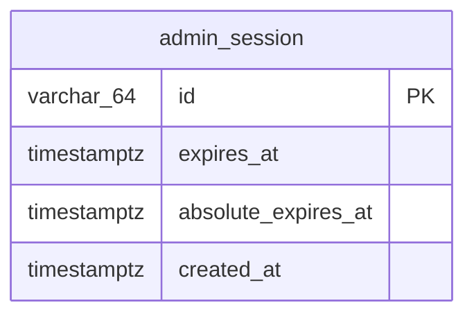

# バックエンド DB スキーマ

正は `backend/migrations/*.sql`。AI 向けの詳細（型・nullable・値の意味）は [`backend-schema.json`](./backend-schema.json)。ルールは [`docs/rules/db-documentation.md`](../rules/db-documentation.md)。

`book`: 自分が読んだ本。書誌（書名・著者・出版社・発売日）と書影の URL は ISBN で外部カタログから取得した値、感想と評価は自分で書いた値。著者は提供元の文字列のまま持つ（独立したテーブルは無い）。ISBN は一意。書影の提供元は openBD だけ（楽天ブックスは撤去した）。

`tag`: 自分が定義した分野タグ。本には `book_tag` 経由で複数付けられる。タグ名は一意。

`book_tag`: 本と分野タグの多対多の中間テーブル。本・タグどちらが消えても自動で外れる（`ON DELETE CASCADE`）。

`admin_session`: 管理画面のログイン済みセッション。利用者は自分 1 人なので誰のセッションかは持たない。期限切れの行は消さずに残す（判定は期限の比較で行い、1 人利用で行数は増えない）。

