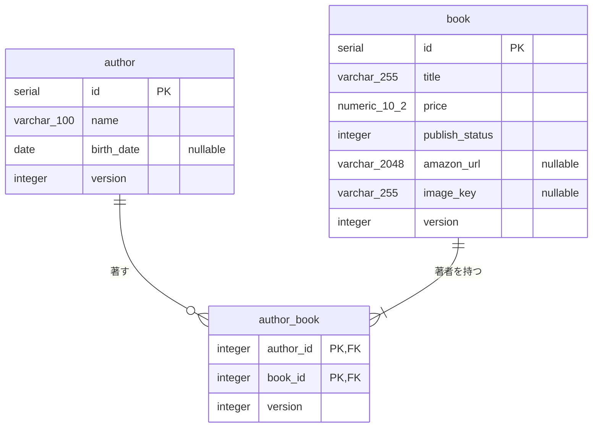

# バックエンド DB スキーマ

正は `backend/migrations/*.sql`。AI 向けの詳細（型・nullable・値の意味）は [`backend-schema.json`](./backend-schema.json)。ルールは [`docs/rules/db-documentation.md`](../rules/db-documentation.md)。

- `book`: 書籍情報。価格は円の整数、出版状況は 1: 未出版 / 2: 出版済み。Amazon の商品リンクと表紙画像のストレージ上のキーは任意。
- `author`: 著者情報。生年月日は任意。
- `author_book`: 著者と書籍の多対多の関連。書籍には著者が1人以上紐づく（アプリ側で保証）。

