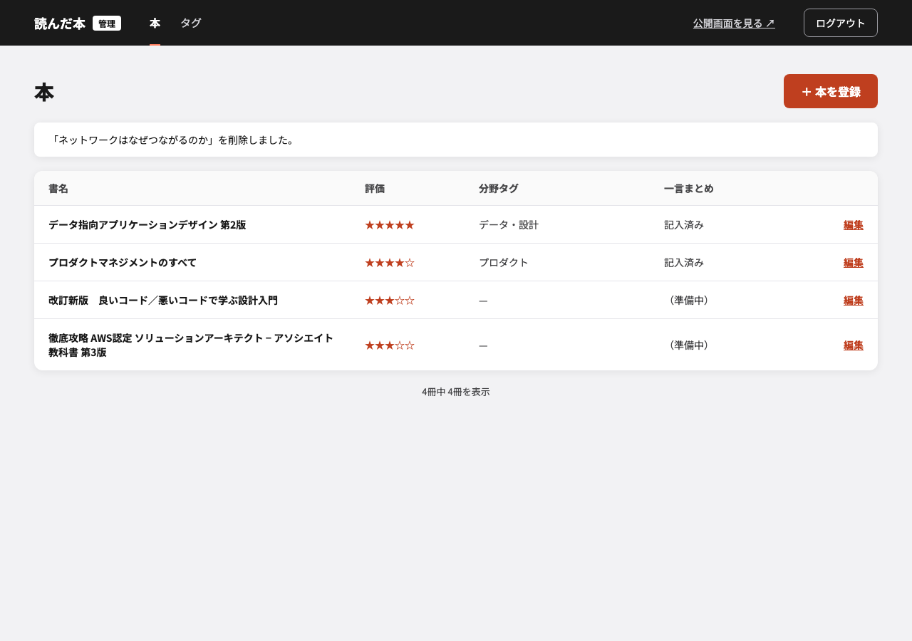
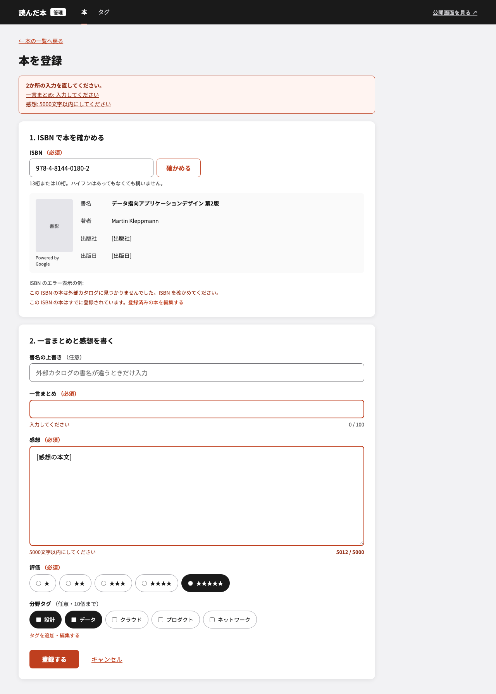
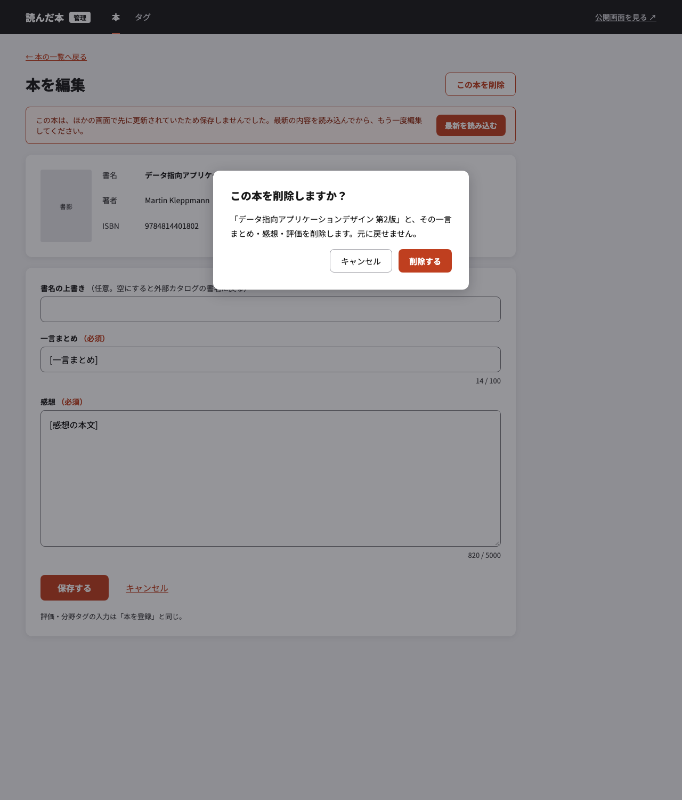
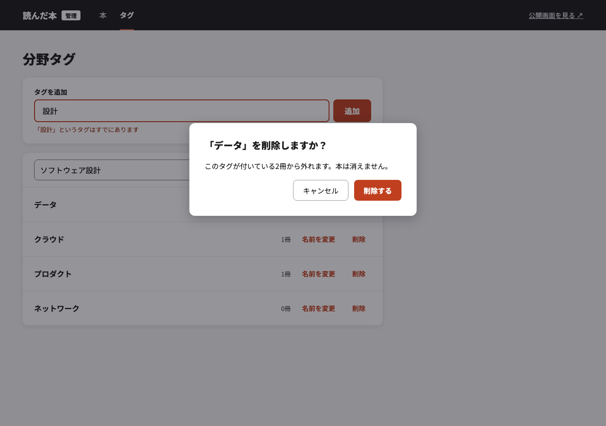

# 管理画面のモック（単位3）

[要求定義 §5](../../requirements.md#5-実現の単位と順序) の単位3（管理画面）の画面イメージ。実装前に見た目を固めるためのモックで、画面が満たすことの正は [要件定義 §3](../../specifications.md#3-管理画面自分だけ)。モックと要件がずれたら要件を正とする。

- 正は各 HTML（依存なしの静的 HTML。ブラウザで直接開ける）。PNG は GitHub 上で見るための書き出し
- `[ ]` で囲んだ文字（`[一言まとめ]`・`[感想の本文]`・`[出版社]` など）は仮置き。書名・著者・ISBN は実際の見本データ、分野タグの名前と冊数は例
- 1枚に「エラーのとき」「確認ダイアログを開いたとき」など、実装で確かめたい状態を重ねて描いている
- ログイン画面はこのモックの範囲外（設計は `docs/superpowers/specs/2026-09-30-admin-login-design.md`、判断は `docs/adr/2026-09-30-admin-login-with-server-side-session.md`）
- 採用の経緯は [ADR](../../adr/2026-09-29-design-mockups-as-html.md)

## 本の一覧（管理）

[books.html](./books.html) — 登録済みの本を表で並べ、各行から編集へ。削除したあとの完了メッセージを上に出す。

## 本の登録

[book-new.html](./book-new.html) — ISBN で書誌と書影を先に確かめてから、一言まとめ・感想・評価・分野タグを添えて登録する。入力の誤りを項目ごとと先頭のまとめに出したときの表示と、ISBN のエラー（カタログに無い・登録済み）の例。

## 本の編集

[book-edit.html](./book-edit.html) — 書名の上書き・一言まとめ・感想などを変える。先に別の更新があって保存しなかったときの表示と、削除の確認ダイアログ。

## タグの管理

[tags.html](./tags.html) — タグの一覧・追加・名前の変更・削除。同名のタグを追加しようとしたときの表示、名前の変更中の行、削除の確認ダイアログ（付いている本から外れることを伝える）。

## PNG の書き出し直し

HTML を変えたら、同じ PR で PNG も書き出し直す。

1. このディレクトリで `python3 -m http.server 8766 --bind 127.0.0.1` を起動する
2. ヘッドレス Chrome で、幅 1280・次の高さで撮り、`images/<名前>.png` に保存する（例: `"/Applications/Google Chrome.app/Contents/MacOS/Google Chrome" --headless=new --hide-scrollbars --force-device-scale-factor=1 --virtual-time-budget=5000 --window-size=1280,900 --screenshot=images/books.png http://127.0.0.1:8766/books.html`）
   - `books`・`tags`: 高さ 900
   - `book-edit`: 高さ 1500
   - `book-new`: 高さ 1790（中身が画面の枠より長いため、下まで入る高さにする）
3. 保存した PNG を開き、フォント（Noto Sans JP）が読み込まれて崩れていないことを確かめる
