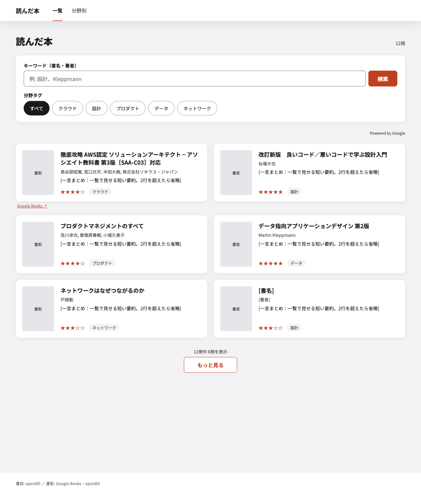
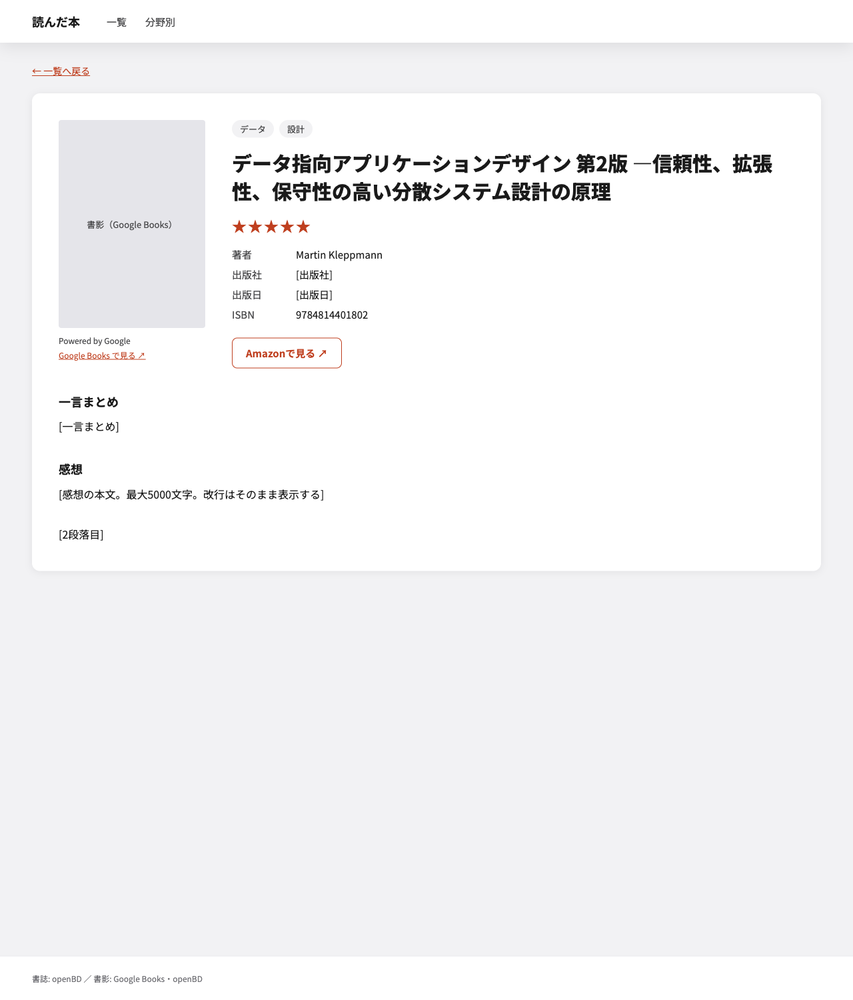
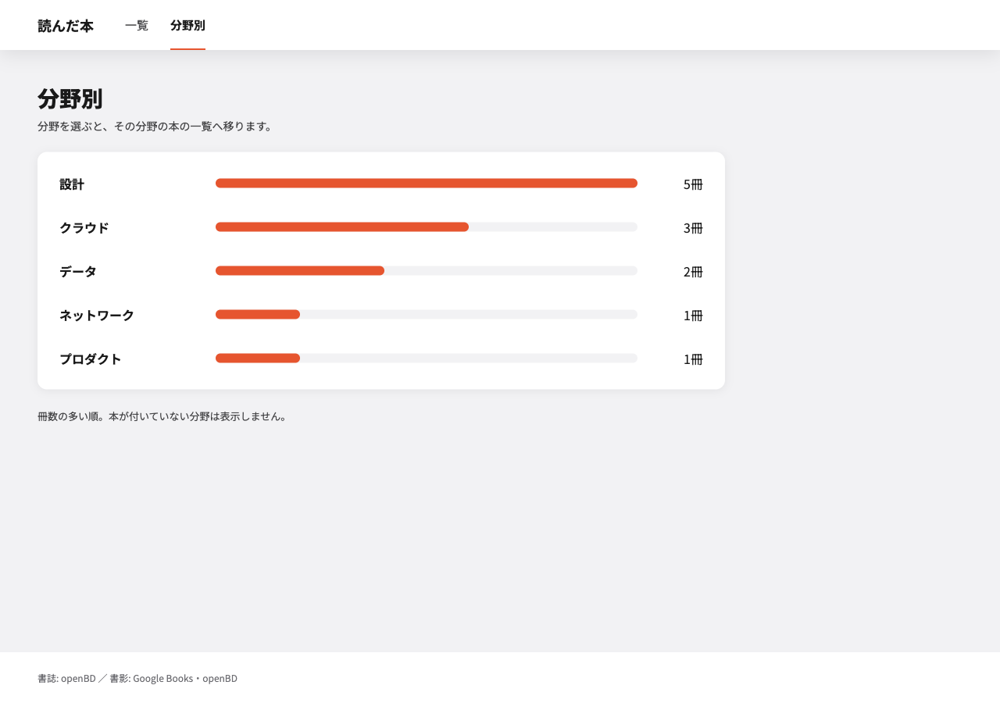
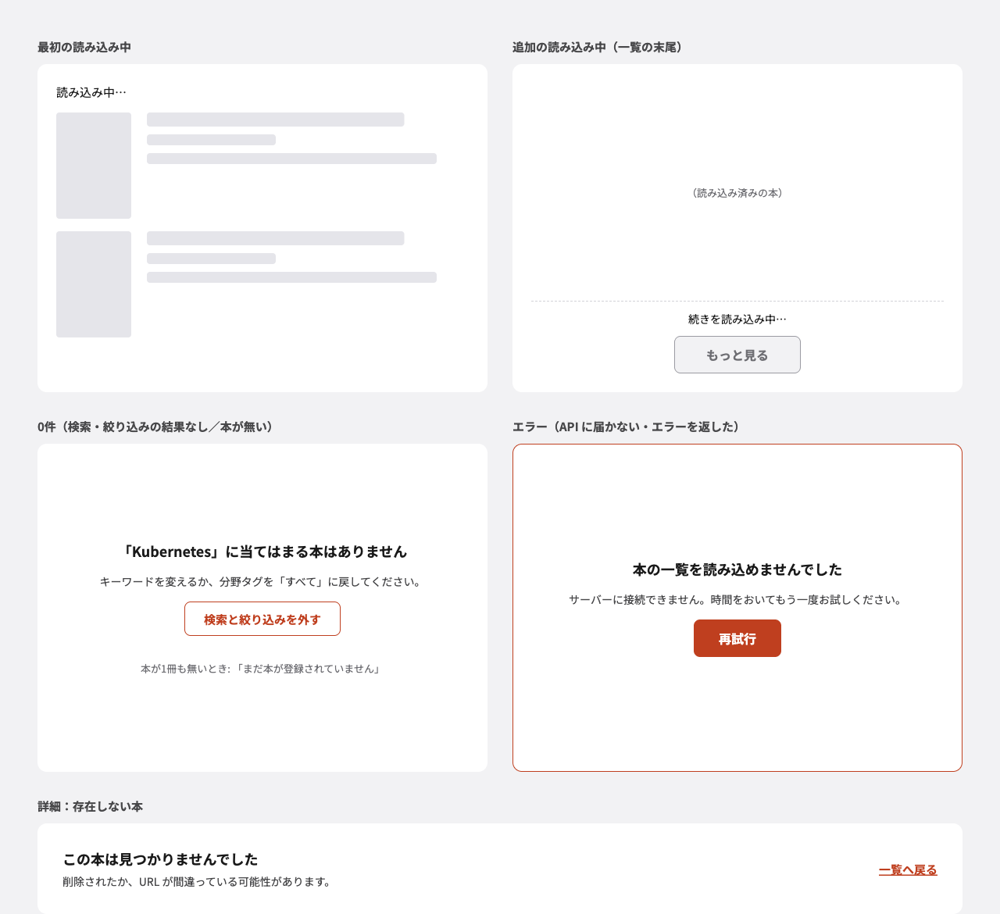
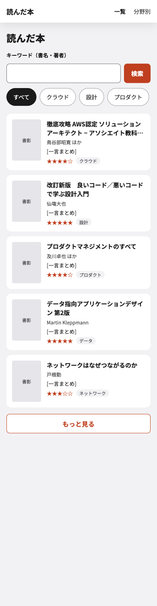

# 公開画面のモック（単位2）

[要求定義 §5](../../requirements.md#5-実現の単位と順序) の単位2（公開画面）の画面イメージ。実装前に見た目を固めるためのモックで、画面が満たすことの正は [要件定義 §2](../../specifications.md#2-公開画面誰でも見られる)。モックと要件がずれたら要件を正とする。

- 正は各 HTML（依存なしの静的 HTML。ブラウザで直接開ける）。PNG は GitHub 上で見るための書き出し
- `[ ]` で囲んだ文字（`[一言まとめ]`・`[出版社]` など）は仮置き。書名・著者は実際の見本データ、分野タグの名前と冊数は例
- 採用の経緯は [ADR](../../adr/2026-09-29-design-mockups-as-html.md)

## 一覧（PC）

[list.html](./list.html) — キーワード検索・分野タグの絞り込み・2列のカード・「もっと見る」で続きを読み込む。

## 詳細

[detail.html](./detail.html) — 書誌・書影・評価・分野タグ・一言まとめ・感想と、Amazon へのリンク。Google Books の書影の例で、書影の下に「Powered by Google」と Google Books へのリンクを出す。

## 分野別の集計

[counts.html](./counts.html) — 冊数の多い順。分野を選ぶと、その分野で絞り込んだ一覧へ移る。

## 画面の状態

[states.html](./states.html) — 最初の読み込み中・追加の読み込み中・0件・エラー（再試行）・存在しない本。

## 一覧（スマホ幅）

[list-mobile.html](./list-mobile.html) — 1列。分野タグは横にスクロールする。

## PNG の書き出し直し

HTML を変えたら、同じ PR で PNG も書き出し直す。

1. このディレクトリで `python3 -m http.server 8765 --bind 127.0.0.1` を起動する（Playwright は `file://` を開けないため）
2. Playwright（MCP の `browser_resize` → `browser_navigate` → `browser_take_screenshot`、`fullPage: true`・`scale: "css"`）で、`http://127.0.0.1:8765/<名前>.html` を次の幅で撮り、`images/<名前>.png` に保存する
   - `list`・`detail`・`counts`・`states`: 幅 1280
   - `list-mobile`: 幅 390
3. 保存した PNG を開き、フォント（Noto Sans JP）が読み込まれて崩れていないことを確かめる
