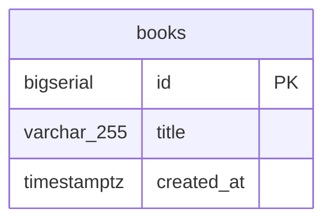

# DBスキーマドキュメントのルール

`backend` のマイグレーション（`backend/migrations/*.sql`）でテーブル構成を変更したら、**AI向け資料（JSON）**と**人向け資料（ER図）**の両方を同じ変更に含める。

## なぜ資料化するか

スキーマの正は golang-migrate の `backend/migrations/*.sql`（差分の積み重ね）で、GORM AutoMigrate は使わない（[`backend/architecture.md`](../../backend/architecture.md)）。GORM のモデル構造体（`infrastructure/postgres/<domain>/model.go`）は必要なカラムしか持たず、CHECK 制約・デフォルト値・インデックスのように SQL にしか無い情報もある。テーブルの「今の完全な状態」を知るには複数のマイグレーションを順に合成する必要があり、資料化する価値がある。

## なぜ2種類必要か

- **AI向け（`docs/db/backend-schema.json`）**: AIがSQLやクエリを書く際、複数のマイグレーションファイルを順に読んで頭の中で合成したりGORM構造体を辿ったりせずに、テーブル構成を一度のRead/grepで把握できるようにする。カラムのnullable・型・デフォルト値・**意味**の思い込みによる誤り（`NULL`比較漏れ、境界値の誤り、カラムの用途の勘違い等）を減らし、都度の調査コストを無くして応答速度を上げる
- **人向け（`docs/db/backend-schema.md`のMermaid ER図）**: レビュー・オンボーディング時に構造を一目で把握するための可視化。GitHub上でそのまま図として表示される

どちらか片方だけでは不十分（AI用JSONだけでは人がレビューしにくい、ER図だけではAIが型/nullable/デフォルト値を確実に読み取れない）。

## 更新するファイル

- `docs/db/backend-schema.json`（AI向け）
- `docs/db/backend-schema.md`（人向け）

まだ存在しない場合は、次にマイグレーションを変更する PR で既存の全テーブル分を含めて作成する。

## JSON フォーマット

テーブル・カラムそれぞれに、構造情報だけでなく**用途・意味の説明**を含める（型やnullableだけでは「このカラムに何が入るか」まではわからず、AIが勘違いしたコードを書く原因になるため）。

```json
{
  "database": "backend",
  "tables": {
    "<table_name>": {
      "description": "このテーブルが何を表すか（1〜2文）",
      "source": "backend/migrations/000001_create_books.up.sql",
      "columns": [
        { "name": "id", "type": "BIGSERIAL", "nullable": false, "pk": true, "description": "主キー" },
        { "name": "title", "type": "VARCHAR(255)", "nullable": false, "description": "このカラムに何が入るか" },
        { "name": "created_at", "type": "TIMESTAMPTZ", "nullable": false, "default": "NOW()", "description": "作成日時" }
      ],
      "indexes": ["ix_<table>_<column>"],
      "constraints": ["ck_<table>_<column> CHECK (...)"]
    }
  }
}
```

`source`はどのマイグレーションファイルが現在の定義かを示す（複数マイグレーションで変更されたテーブルは最新の実効定義をここに書く）。`description` は正確な事実のみ書く — コードから確認できない用途を推測で書かない（分からなければ「詳細不明」と書く方が、誤った説明より安全）。

### Enum的カラムは値ごとの意味も書く

固定の値集合しか取らないカラム（Postgres の `ENUM` 型、`CHECK IN (...)` 制約、または DB 制約はなくアプリ側の慣習で値が決まっているもの）は、`description` に加えて `enum` 配列で各値の意味を列挙する:

```json
{ "name": "publish_status", "type": "INTEGER", "nullable": false,
  "description": "出版状況。DB制約はなくアプリ側の慣習による。",
  "enum": [
    { "value": 1, "description": "未出版" },
    { "value": 2, "description": "出版済み" }
  ]
}
```

DB 制約が無い場合はその旨を `description` に明記する（「制約あり」と誤解させない）。値の意味も、コードやシード値から確認できる事実のみ書く。

## マイグレーション自体にもコメントを残す

`docs/db/backend-schema.{json,md}` は副次資料であり、正は `backend/migrations/*.sql`。DB を直接見る人（`psql \d+`、`information_schema`）にも同じ意味が伝わるよう、テーブル・カラムを追加／変更するマイグレーションには `COMMENT ON TABLE` / `COMMENT ON COLUMN` を含める。内容は JSON の `description` と揃える（重複を許容する。正本は SQL 側）。

## Mermaid ER図フォーマット

`docs/db/backend-schema.md`に以下の形式で埋め込む（GitHub上でそのまま図として表示される）。図の前に各テーブルの説明を1〜2文添える:

````markdown
`books`: このテーブルが何を表すか。


````

nullableなカラムは `text note "nullable"` のようにダブルクオートでコメントを付ける。テーブル間に外部キー関係があれば `tableA ||--o{ tableB : "関係"` の記法で線を追加する。

## 強制の仕組み

`.claude/hooks/require-db-docs-on-migration.sh`（Stop, blocking）が、`backend/migrations/*.sql` の変更を検知して対応するJSON/MD両方の変更が同じ差分に含まれているかを機械的にチェックする。構造的な有無のみの確認であり、内容の正確性までは保証しない — 内容が正しいかは人/AIレビューで確認すること。

バイパス: `SKIP_DB_DOCS_CHECK=1`（ドキュメントを伴わない理由がある場合のみ使用し、PRにその理由を明記する）。

関連: [ADRルール](./adr.md)
