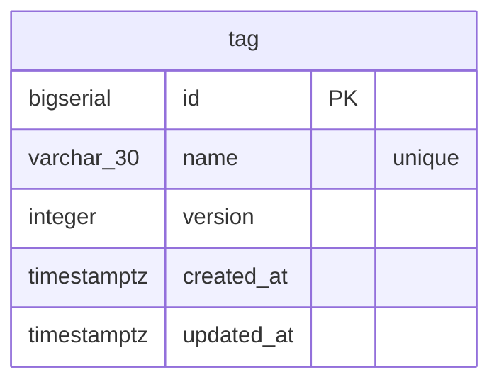
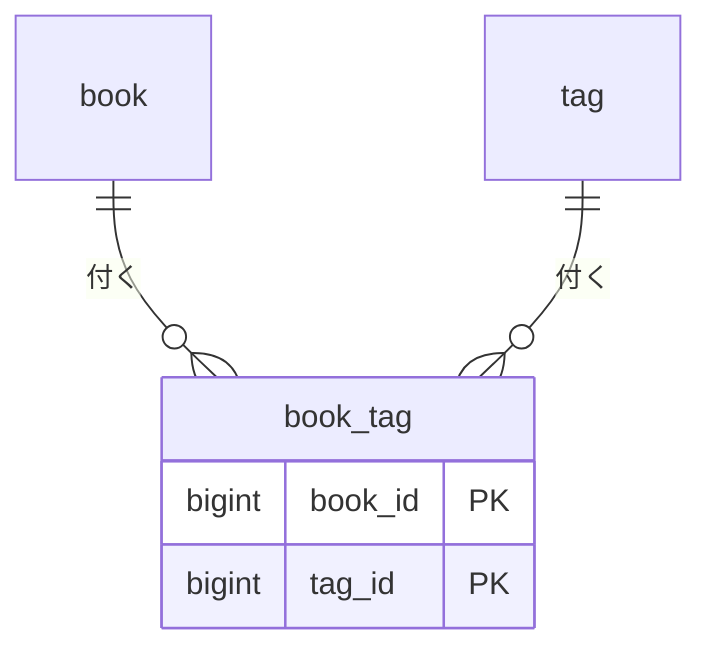

# 分野タグ Implementation Plan

> **For agentic workers:** REQUIRED SUB-SKILL: Use superpowers:subagent-driven-development (recommended) or superpowers:executing-plans to implement this plan task-by-task. Steps use checkbox (`- [ ]`) syntax for tracking.

**Goal:** 自分が定義した分野タグを、読んだ本に複数付けられるようにする。タグ自体の一覧・追加・改名・削除の API と、本の登録・更新・詳細・一覧にタグを反映する。

**Architecture:** `domain/tag` を新しい集約として作り、`domain/book` は `tag.ID` だけを軽く参照する（`Book.Tags` = `TagSelection` VO）。永続化は `tag` テーブルと `book_tag`（多対多の中間テーブル、`ON DELETE CASCADE`）の2テーブル。本の Repository の Create/Update は本行と `book_tag` を同一トランザクションで書く。一覧・詳細のタグ名は、本の行を確定させた後の別クエリで取って Go 側でマージする。

**Tech Stack:** Go / Echo / GORM / golang-migrate / swag / go-playground/validator（`dive`）/ Orval（フロントの型再生成のみ）

**Spec:** `docs/superpowers/specs/2026-09-28-book-tags-design.md`（変更前の形は `docs/superpowers/specs/2026-09-28-reading-api-design.md` と `docs/superpowers/specs/2026-09-28-title-override-summary-design.md`）

## Global Constraints

- タグ名: 前後の空白を除いて1〜30文字、制御文字は不可（トリム前に検査）
- 1冊に付けられるタグ: 0〜10個、同じタグIDの重複指定は不可
- タグ名の重複登録・改名は不可（一意制約 `uq_tag_name`）
- タグの削除・本の削除は、相手側の `book_tag` 行を `ON DELETE CASCADE` で自動的に外す（アプリコードで明示的に削除しない）
- 登録・更新の入力検証（タグIDの上限・重複・実在確認）は、外部カタログへの問い合わせより先に済ませる
- 閲覧系（`GET /api/tags`、本の一覧・詳細のタグ名）は認証不要。書き込み系（タグの追加・改名・削除、本へのタグ付け）は管理者トークンが必要
- コメントは日本語。Repository の型と各メソッドには1行の What コメント（CLAUDE.md）
- 関数の循環的複雑度は 10 以下（gocyclo / ESLint。テストは対象外）
- テスト名は期待する振る舞いを日本語で書く。境界値は「上限ちょうど」と「上限+1」の両方
- コミットは1つの論理的な変更ごとに分け、各コミット単体で `go build ./... && go test ./...` が通ること

## Review Focus

1. タグを11個指定して登録・更新 → 400 になり、カタログにも Repository にも到達しない。Task 12 のユースケーステストで固定する
2. 存在しないタグIDを指定して登録・更新 → 400（404 ではない。作ろうとしている本が見つからないわけではないため）になり、保存されない。Task 12 で固定する
3. タグを削除すると、そのタグが付いていた本からタグが消えるが、本自体は消えない。Task 10 の Repository 契約テストで固定する
4. 一覧のページングと、タグ名の別クエリ結合が正しく対応する本にだけ付く（他の本のタグが混ざらない）。Task 11 の Query 契約テストで固定する
5. タグ名の重複登録・改名は 409 になり、既存のタグ名は変わらない。Task 4 の Repository 契約テストで固定する

---

## PR 1: タグのドメイン（Task 1〜2）

### Task 1: `tag.Name` VO

**Files:**
- Create: `backend/internal/domain/tag/name.go`
- Create: `backend/internal/domain/tag/name_test.go`

**Interfaces:**
- Produces: `func NewName(raw string) (Name, error)`、`func (n Name) String() string`

- [ ] **Step 1: 失敗するテストを書く**（`name_test.go`）

```go
package tag_test

import (
	"errors"
	"strings"
	"testing"

	"github.com/mrstsgk/book-management-system/backend/internal/domain/common"
	"github.com/mrstsgk/book-management-system/backend/internal/domain/tag"
)

func TestNewName(t *testing.T) {
	t.Parallel()
	tests := []struct {
		name    string
		in      string
		want    string
		wantErr bool
	}{
		{name: "前後の空白を除いて保持する", in: " データベース ", want: "データベース"},
		{name: "途中の空白は残す", in: "分散 システム", want: "分散 システム"},
		{name: "1文字は有効", in: "本", want: "本"},
		{name: "30文字ちょうどは有効", in: strings.Repeat("あ", 30), want: strings.Repeat("あ", 30)},
		{name: "31文字はエラー", in: strings.Repeat("あ", 31), wantErr: true},
		{name: "空文字はエラー", in: "", wantErr: true},
		{name: "空白だけはエラー", in: "　 ", wantErr: true},
		{name: "改行はエラー", in: "分散\nシステム", wantErr: true},
		{name: "前後のタブもエラー", in: "\tデータベース", wantErr: true},
	}
	for _, tt := range tests {
		t.Run(tt.name, func(t *testing.T) {
			t.Parallel()
			got, err := tag.NewName(tt.in)
			if tt.wantErr {
				if !errors.Is(err, common.ErrInvalid) {
					t.Fatalf("err = %v, want ErrInvalid", err)
				}
				return
			}
			if err != nil {
				t.Fatalf("unexpected error: %v", err)
			}
			if got.String() != tt.want {
				t.Fatalf("got %q, want %q", got.String(), tt.want)
			}
		})
	}
}
```

- [ ] **Step 2: 失敗を確かめる**

Run: `cd backend && go test ./internal/domain/tag/ -run TestNewName`
Expected: FAIL（`no such package` または `undefined: tag.NewName`。パッケージが無いので `go: no packages to load` に近いビルドエラーになる）

- [ ] **Step 3: 実装する**（`name.go`）

```go
package tag

import (
	"fmt"
	"strings"
	"unicode"
	"unicode/utf8"

	"github.com/mrstsgk/book-management-system/backend/internal/domain/common"
)

const nameMaxLength = 30

// Name はタグの名前の VO。書名など他のドメインの命名規則には依存しない
// （タグの命名規則は本の書名と揃える理由が無いため、独立して検証する）。
type Name struct {
	value string
}

// NewName は前後の空白を除いて1〜30文字のタグ名を作る。タブや改行などの制御文字は受け付けない。
func NewName(raw string) (Name, error) {
	// 前後にあるタブや改行も、黙って取り除かずに拒否するためトリム前に検査する
	if strings.IndexFunc(raw, unicode.IsControl) >= 0 {
		return Name{}, fmt.Errorf("%w: タグ名にタブや改行は使用できません", common.ErrInvalid)
	}
	v := strings.TrimSpace(raw)
	if n := utf8.RuneCountInString(v); n < 1 || n > nameMaxLength {
		return Name{}, fmt.Errorf("%w: タグ名は1〜%d文字にしてください", common.ErrInvalid, nameMaxLength)
	}
	return Name{value: v}, nil
}

func (n Name) String() string {
	return n.value
}
```

- [ ] **Step 4: 通ることを確かめる**

Run: `cd backend && go test ./internal/domain/tag/ && go build ./...`
Expected: PASS

- [ ] **Step 5: コミット**

```bash
git add backend/internal/domain/tag/name.go backend/internal/domain/tag/name_test.go
git commit -m "feat: タグ名のVOを追加"
```

### Task 2: `Tag` エンティティと Repository/Query の IF

**Files:**
- Create: `backend/internal/domain/tag/tag.go`
- Create: `backend/internal/domain/tag/tag_test.go`

**Interfaces:**
- Consumes: `tag.Name`、`tag.NewName`（Task 1）
- Produces:
  - `type ID int64`
  - `func New(name Name) *Tag`
  - `func (t *Tag) Rename(name Name, version int)`
  - `type Repository interface { FindByID(ctx, ID) (*Tag, error); Create(ctx, *Tag) error; Update(ctx, *Tag) error; Delete(ctx, ID) error }`
  - `type TagListItem struct { ID ID; Name string }`
  - `type TagList struct { Items []*TagListItem }`
  - `type Query interface { FindList(ctx) (*TagList, error); ExistsAll(ctx, []ID) (bool, error) }`

- [ ] **Step 1: 失敗するテストを書く**（`tag_test.go`）

```go
package tag_test

import (
	"testing"

	"github.com/mrstsgk/book-management-system/backend/internal/domain/tag"
)

func mustName(t *testing.T, raw string) tag.Name {
	t.Helper()
	n, err := tag.NewName(raw)
	if err != nil {
		t.Fatal(err)
	}
	return n
}

func TestNew_SetsNameAndLeavesIdentityUnassigned(t *testing.T) {
	t.Parallel()
	tg := tag.New(mustName(t, "データベース"))

	if tg.ID != 0 || tg.Version != 0 {
		t.Fatalf("ID/Version = %d/%d, want zero values before saving", tg.ID, tg.Version)
	}
	if tg.Name.String() != "データベース" {
		t.Fatalf("Name = %q, want データベース", tg.Name.String())
	}
}

func TestTag_Rename(t *testing.T) {
	t.Parallel()
	tg := tag.New(mustName(t, "データベース"))

	tg.Rename(mustName(t, "分散システム"), 3)

	if tg.Name.String() != "分散システム" || tg.Version != 3 {
		t.Fatalf("got name=%q version=%d", tg.Name.String(), tg.Version)
	}
}
```

- [ ] **Step 2: 失敗を確かめる**

Run: `cd backend && go test ./internal/domain/tag/ -run 'TestNew_SetsNameAndLeavesIdentityUnassigned|TestTag_Rename'`
Expected: FAIL（`undefined: tag.New`、`undefined: tag.Tag`）

- [ ] **Step 3: 実装する**（`tag.go`）

```go
package tag

import "context"

type ID int64

// Tag は自分が定義した分野タグ。本には ID の集合（book.TagSelection）で付ける。
type Tag struct {
	ID      ID
	Name    Name
	Version int
}

// New は登録前のタグを作る（ID とバージョンは保存時に採番する）。
func New(name Name) *Tag {
	return &Tag{Name: name}
}

// Rename は名前を差し替える。version は更新元が読んだバージョン（楽観的ロックに使う）。
func (t *Tag) Rename(name Name, version int) {
	t.Name = name
	t.Version = version
}

// Repository はタグの書き込み系を永続化するポート。
type Repository interface {
	// FindByID は id のタグを取得する。存在しなければ common.ErrNotFound を返す。
	FindByID(ctx context.Context, id ID) (*Tag, error)
	// Create は t を新規作成し、採番した ID と初期バージョンを t に設定する。同じ名前があれば common.ErrConflict を返す。
	Create(ctx context.Context, t *Tag) error
	// Update は t.Version が一致する行を更新し、t.Version を進める。不一致・同名なら common.ErrConflict を返す。
	Update(ctx context.Context, t *Tag) error
	// Delete は id のタグを削除する。存在しなければ common.ErrNotFound を返す。付いていた本からは自動で外れる。
	Delete(ctx context.Context, id ID) error
}

// TagListItem はタグ一覧の1行分の Read Model。
type TagListItem struct {
	ID   ID
	Name string
}

// TagList はタグの一覧全体（想定件数が少ないため取得範囲は絞らない）。
type TagList struct {
	Items []*TagListItem
}

// Query はタグの参照系ポート。
type Query interface {
	// FindList は全件を返す。
	FindList(ctx context.Context) (*TagList, error)
	// ExistsAll は ids がすべて実在するかを返す（本の登録・更新時の入力検証に使う）。
	ExistsAll(ctx context.Context, ids []ID) (bool, error)
}
```

- [ ] **Step 4: 通ることを確かめる**

Run: `cd backend && go test ./internal/domain/tag/ && go build ./...`
Expected: PASS

- [ ] **Step 5: コミット**

```bash
git add backend/internal/domain/tag/tag.go backend/internal/domain/tag/tag_test.go
git commit -m "feat: タグのエンティティとRepository/QueryのIFを追加"
```

PR 1 を作る（ベース `develop`、設計書・計画・Task 1・2 のコミット）。

---

## PR 2: タグの API 一式（Task 3〜7）

### Task 3: マイグレーション `000003`（`tag` テーブル）と DB の資料

**Files:**
- Create: `backend/migrations/000003_create_tag.up.sql`
- Create: `backend/migrations/000003_create_tag.down.sql`
- Modify: `docs/db/backend-schema.json`、`docs/db/backend-schema.md`

- [ ] **Step 1: up を書く**

```sql
CREATE TABLE tag (
    id         BIGSERIAL PRIMARY KEY,
    name       VARCHAR(30) NOT NULL,
    version    INTEGER NOT NULL,
    created_at TIMESTAMPTZ NOT NULL DEFAULT NOW(),
    updated_at TIMESTAMPTZ NOT NULL DEFAULT NOW(),
    CONSTRAINT uq_tag_name UNIQUE (name)
);

COMMENT ON TABLE tag IS '自分が定義した分野タグ。本には book_tag 経由で複数付けられる';
COMMENT ON COLUMN tag.id IS 'タグのID（主キー）';
COMMENT ON COLUMN tag.name IS 'タグ名（1〜30文字）。一意';
COMMENT ON COLUMN tag.version IS 'バージョン（楽観的ロック用）。作成時1、更新ごとに+1';
COMMENT ON COLUMN tag.created_at IS '作成日時';
COMMENT ON COLUMN tag.updated_at IS '最終更新日時';
```

- [ ] **Step 2: down を書く**

```sql
DROP TABLE IF EXISTS tag;
```

- [ ] **Step 3: ローカル DB で up / down / up を確かめる**

Run: `cd backend && make migrate-up && make migrate-down && make migrate-up`
Expected: いずれもエラーなし。`psql` の `\d+ tag` に列とコメントがある

- [ ] **Step 4: DB の資料を更新する**

`docs/db/backend-schema.json` の `tables` に `book` と並べて足す。

```json
    "tag": {
      "description": "自分が定義した分野タグ。本には book_tag 経由で複数付けられる。",
      "source": "backend/migrations/000003_create_tag.up.sql",
      "columns": [
        { "name": "id", "type": "BIGSERIAL", "nullable": false, "pk": true, "description": "タグのID（主キー）" },
        { "name": "name", "type": "VARCHAR(30)", "nullable": false, "unique": true, "description": "タグ名（1〜30文字）" },
        { "name": "version", "type": "INTEGER", "nullable": false, "description": "バージョン（楽観的ロック用）。作成時1、更新ごとに+1" },
        { "name": "created_at", "type": "TIMESTAMPTZ", "nullable": false, "default": "NOW()", "description": "作成日時" },
        { "name": "updated_at", "type": "TIMESTAMPTZ", "nullable": false, "default": "NOW()", "description": "最終更新日時" }
      ],
      "indexes": [],
      "constraints": ["uq_tag_name UNIQUE (name)"]
    }
```

`docs/db/backend-schema.md` に説明文と ER 図のブロックを足す。



- [ ] **Step 5: コミット**

```bash
git add backend/migrations/000003_* docs/db/backend-schema.json docs/db/backend-schema.md
git commit -m "feat: 分野タグのテーブルを追加"
```

### Task 4: `infrastructure/postgres/tag`（Repository・Query 実装）

**Files:**
- Create: `backend/internal/infrastructure/postgres/tag/repository.go`
- Create: `backend/internal/infrastructure/postgres/tag/query.go`
- Create: `backend/internal/infrastructure/postgres/tag/helper_test.go`
- Create: `backend/internal/infrastructure/postgres/tag/repository_test.go`
- Create: `backend/internal/infrastructure/postgres/tag/query_test.go`

**Interfaces:**
- Consumes: `domaintag.New`、`domaintag.NewName`、`domaintag.Repository`、`domaintag.Query`（Task 1・2）
- Produces: `func NewRepository(db *gorm.DB) domaintag.Repository`、`func NewQuery(db *gorm.DB) domaintag.Query`

- [ ] **Step 1: 契約テストの下ごしらえ**（`helper_test.go`。`postgres/book/helper_test.go` と同じ形）

```go
package tag_test

import (
	"testing"

	"gorm.io/gorm"

	pgcommon "github.com/mrstsgk/book-management-system/backend/internal/infrastructure/postgres/common"
)

// connectTestDB はローカルの開発用 DB に接続する。実際の PostgreSQL に対する契約テストなので、
// DB に繋がらなければ失敗ではなく skip する（docs/rules/testing.md）。
func connectTestDB(t *testing.T) *gorm.DB {
	t.Helper()

	db, err := pgcommon.Connect(pgcommon.Config{
		Host: "localhost", Port: "5432", User: "postgres", Password: "postgres",
		DBName: "book_management", SSLMode: "disable",
	})
	if err != nil {
		t.Skipf("skipping: local Postgres not reachable (run `make db-up migrate-up` first): %v", err)
	}
	if err := db.Exec("SELECT 1 FROM tag LIMIT 0").Error; err != nil {
		t.Skipf("skipping: schema not migrated (run `make migrate-up` first): %v", err)
	}
	return db
}
```

- [ ] **Step 2: Repository の失敗するテストを書く**（`repository_test.go`）

```go
package tag_test

import (
	"context"
	"errors"
	"testing"

	domaincommon "github.com/mrstsgk/book-management-system/backend/internal/domain/common"
	domaintag "github.com/mrstsgk/book-management-system/backend/internal/domain/tag"
	pgtag "github.com/mrstsgk/book-management-system/backend/internal/infrastructure/postgres/tag"
)

func mustName(t *testing.T, raw string) domaintag.Name {
	t.Helper()
	n, err := domaintag.NewName(raw)
	if err != nil {
		t.Fatal(err)
	}
	return n
}

func createTag(t *testing.T, repo domaintag.Repository, name string) *domaintag.Tag {
	t.Helper()
	tg := domaintag.New(mustName(t, name))
	if err := repo.Create(context.Background(), tg); err != nil {
		t.Fatalf("Create: %v", err)
	}
	return tg
}

func TestRepository_CreateThenFindByID(t *testing.T) {
	db := connectTestDB(t)
	repo := pgtag.NewRepository(db)
	t.Cleanup(func() { db.Exec("DELETE FROM tag WHERE name LIKE 'repo-test-%'") })

	tg := createTag(t, repo, "repo-test-データベース")
	if tg.ID == 0 || tg.Version != 1 {
		t.Fatalf("got ID=%d Version=%d, want a nonzero ID and Version 1", tg.ID, tg.Version)
	}

	got, err := repo.FindByID(context.Background(), tg.ID)
	if err != nil {
		t.Fatalf("FindByID: %v", err)
	}
	if got.Name.String() != "repo-test-データベース" || got.Version != 1 {
		t.Fatalf("got %+v", got)
	}
}

func TestRepository_FindByID_NotFound(t *testing.T) {
	repo := pgtag.NewRepository(connectTestDB(t))
	if _, err := repo.FindByID(context.Background(), domaintag.ID(-1)); !errors.Is(err, domaincommon.ErrNotFound) {
		t.Fatalf("err = %v, want ErrNotFound", err)
	}
}

func TestRepository_Create_DuplicateNameIsConflict(t *testing.T) {
	db := connectTestDB(t)
	repo := pgtag.NewRepository(db)
	t.Cleanup(func() { db.Exec("DELETE FROM tag WHERE name LIKE 'repo-test-%'") })
	createTag(t, repo, "repo-test-重複")

	dup := domaintag.New(mustName(t, "repo-test-重複"))
	if err := repo.Create(context.Background(), dup); !errors.Is(err, domaincommon.ErrConflict) {
		t.Fatalf("err = %v, want ErrConflict", err)
	}
}

func TestRepository_Update(t *testing.T) {
	db := connectTestDB(t)
	repo := pgtag.NewRepository(db)
	t.Cleanup(func() { db.Exec("DELETE FROM tag WHERE name LIKE 'repo-test-%'") })

	t.Run("バージョン一致なら名前を変えバージョンが進む", func(t *testing.T) {
		tg := createTag(t, repo, "repo-test-旧名")
		tg.Rename(mustName(t, "repo-test-新名"), tg.Version)
		if err := repo.Update(context.Background(), tg); err != nil {
			t.Fatalf("Update: %v", err)
		}
		if tg.Version != 2 {
			t.Fatalf("Version = %d, want 2", tg.Version)
		}
		got, err := repo.FindByID(context.Background(), tg.ID)
		if err != nil || got.Name.String() != "repo-test-新名" {
			t.Fatalf("got %+v, err=%v", got, err)
		}
	})

	t.Run("古いバージョンはConflictで名前は変わらない", func(t *testing.T) {
		tg := createTag(t, repo, "repo-test-競合前")
		stale := domaintag.New(mustName(t, "repo-test-競合後"))
		stale.ID = tg.ID
		stale.Version = tg.Version - 1
		if err := repo.Update(context.Background(), stale); !errors.Is(err, domaincommon.ErrConflict) {
			t.Fatalf("err = %v, want ErrConflict", err)
		}
		got, err := repo.FindByID(context.Background(), tg.ID)
		if err != nil || got.Name.String() != "repo-test-競合前" {
			t.Fatalf("row was mutated on failure: got %+v, err=%v", got, err)
		}
	})

	t.Run("改名先が既存の別タグと同名ならConflict", func(t *testing.T) {
		createTag(t, repo, "repo-test-既存名")
		tg := createTag(t, repo, "repo-test-改名したい")
		tg.Rename(mustName(t, "repo-test-既存名"), tg.Version)
		if err := repo.Update(context.Background(), tg); !errors.Is(err, domaincommon.ErrConflict) {
			t.Fatalf("err = %v, want ErrConflict", err)
		}
	})
}

func TestRepository_Delete(t *testing.T) {
	db := connectTestDB(t)
	repo := pgtag.NewRepository(db)
	tg := createTag(t, repo, "repo-test-削除対象")

	if err := repo.Delete(context.Background(), tg.ID); err != nil {
		t.Fatalf("Delete: %v", err)
	}
	if _, err := repo.FindByID(context.Background(), tg.ID); !errors.Is(err, domaincommon.ErrNotFound) {
		t.Fatalf("FindByID after delete: err = %v, want ErrNotFound", err)
	}
	if err := repo.Delete(context.Background(), tg.ID); !errors.Is(err, domaincommon.ErrNotFound) {
		t.Fatalf("Delete again: err = %v, want ErrNotFound", err)
	}
}
```

- [ ] **Step 3: 失敗を確かめる**

Run: `cd backend && make migrate-up && go test ./internal/infrastructure/postgres/tag/ -v`
Expected: FAIL（`undefined: pgtag.NewRepository` などのビルドエラー）

- [ ] **Step 4: Repository を実装する**（`repository.go`）

```go
package tag

import (
	"context"
	"errors"
	"fmt"
	"time"

	"github.com/jackc/pgx/v5/pgconn"
	"gorm.io/gorm"

	domaincommon "github.com/mrstsgk/book-management-system/backend/internal/domain/common"
	domaintag "github.com/mrstsgk/book-management-system/backend/internal/domain/tag"
)

type model struct {
	ID        int64     `gorm:"column:id;primaryKey;autoIncrement"`
	Name      string    `gorm:"column:name;size:30;not null"`
	Version   int       `gorm:"column:version;not null"`
	CreatedAt time.Time `gorm:"column:created_at;not null"`
	UpdatedAt time.Time `gorm:"column:updated_at;not null"`
}

func (model) TableName() string {
	return "tag"
}

// repository は tag テーブルに対して domaintag.Repository を実装する。
type repository struct {
	db *gorm.DB
}

func NewRepository(db *gorm.DB) domaintag.Repository {
	return &repository{db: db}
}

// FindByID は id の行を取得する。存在しなければ common.ErrNotFound を返す。
func (r *repository) FindByID(ctx context.Context, id domaintag.ID) (*domaintag.Tag, error) {
	var row model
	if err := r.db.WithContext(ctx).First(&row, int64(id)).Error; err != nil {
		if errors.Is(err, gorm.ErrRecordNotFound) {
			return nil, fmt.Errorf("%w: タグが見つかりません", domaincommon.ErrNotFound)
		}
		return nil, err
	}
	return adapt(row)
}

// Create は行を初期バージョン 1 で挿入し、採番した ID とバージョンを t に設定する。同じ名前があれば common.ErrConflict を返す。
func (r *repository) Create(ctx context.Context, t *domaintag.Tag) error {
	row := model{Name: t.Name.String(), Version: 1}
	if err := r.db.WithContext(ctx).Create(&row).Error; err != nil {
		return translateDuplicateName(err)
	}
	t.ID = domaintag.ID(row.ID)
	t.Version = row.Version
	return nil
}

// Update は ID とバージョンが一致する行を更新してバージョンを進める。不一致・同名なら common.ErrConflict を返す。
func (r *repository) Update(ctx context.Context, t *domaintag.Tag) error {
	next := t.Version + 1
	res := r.db.WithContext(ctx).Model(&model{}).
		Where("id = ? AND version = ?", int64(t.ID), t.Version).
		Updates(map[string]any{"name": t.Name.String(), "version": next, "updated_at": gorm.Expr("NOW()")})
	if res.Error != nil {
		return translateDuplicateName(res.Error)
	}
	if res.RowsAffected == 0 {
		return fmt.Errorf("%w: タグの更新に失敗しました（他の更新と競合しました）", domaincommon.ErrConflict)
	}
	t.Version = next
	return nil
}

// Delete は id の行を削除する。存在しなければ common.ErrNotFound を返す。付いていた本からは book_tag の
// ON DELETE CASCADE で自動的に外れる。
func (r *repository) Delete(ctx context.Context, id domaintag.ID) error {
	res := r.db.WithContext(ctx).Delete(&model{}, int64(id))
	if res.Error != nil {
		return res.Error
	}
	if res.RowsAffected == 0 {
		return fmt.Errorf("%w: タグが見つかりません", domaincommon.ErrNotFound)
	}
	return nil
}

const uniqueViolation = "23505"

// translateDuplicateName はタグ名の一意制約違反を ErrConflict にする（500 ではなく 409 にするため）。
func translateDuplicateName(err error) error {
	var pgErr *pgconn.PgError
	if errors.As(err, &pgErr) && pgErr.Code == uniqueViolation && pgErr.ConstraintName == "uq_tag_name" {
		return fmt.Errorf("%w: 同じ名前のタグが既にあります", domaincommon.ErrConflict)
	}
	return err
}

// adapt は行を VO で検証し直して Tag に戻す。書き込み時に検証済みの値なので、失敗はデータの破損を意味する。
func adapt(row model) (*domaintag.Tag, error) {
	name, err := domaintag.NewName(row.Name)
	if err != nil {
		return nil, err
	}
	t := domaintag.New(name)
	t.ID = domaintag.ID(row.ID)
	t.Version = row.Version
	return t, nil
}
```

- [ ] **Step 5: Query の失敗するテストを書く**（`query_test.go`）

```go
package tag_test

import (
	"context"
	"testing"

	domaintag "github.com/mrstsgk/book-management-system/backend/internal/domain/tag"
	pgtag "github.com/mrstsgk/book-management-system/backend/internal/infrastructure/postgres/tag"
)

func TestQuery_FindList(t *testing.T) {
	db := connectTestDB(t)
	repo := pgtag.NewRepository(db)
	q := pgtag.NewQuery(db)
	t.Cleanup(func() { db.Exec("DELETE FROM tag WHERE name LIKE 'query-test-%'") })

	a := createTag(t, repo, "query-test-データベース")
	b := createTag(t, repo, "query-test-分散システム")

	list, err := q.FindList(context.Background())
	if err != nil {
		t.Fatalf("FindList: %v", err)
	}
	names := map[domaintag.ID]string{}
	for _, it := range list.Items {
		names[it.ID] = it.Name
	}
	if names[a.ID] != "query-test-データベース" || names[b.ID] != "query-test-分散システム" {
		t.Fatalf("got %+v", names)
	}
}

func TestQuery_ExistsAll(t *testing.T) {
	db := connectTestDB(t)
	repo := pgtag.NewRepository(db)
	q := pgtag.NewQuery(db)
	t.Cleanup(func() { db.Exec("DELETE FROM tag WHERE name LIKE 'query-test-%'") })

	a := createTag(t, repo, "query-test-存在確認A")
	b := createTag(t, repo, "query-test-存在確認B")

	tests := []struct {
		name string
		ids  []domaintag.ID
		want bool
	}{
		{name: "空配列は常にtrue", ids: []domaintag.ID{}, want: true},
		{name: "全部実在すればtrue", ids: []domaintag.ID{a.ID, b.ID}, want: true},
		{name: "1つでも欠ければfalse", ids: []domaintag.ID{a.ID, domaintag.ID(-1)}, want: false},
	}
	for _, tt := range tests {
		t.Run(tt.name, func(t *testing.T) {
			got, err := q.ExistsAll(context.Background(), tt.ids)
			if err != nil {
				t.Fatalf("ExistsAll: %v", err)
			}
			if got != tt.want {
				t.Fatalf("got %v, want %v", got, tt.want)
			}
		})
	}
}
```

- [ ] **Step 6: 失敗を確かめる**

Run: `cd backend && go test ./internal/infrastructure/postgres/tag/ -run 'TestQuery' -v`
Expected: FAIL（`undefined: pgtag.NewQuery`）

- [ ] **Step 7: Query を実装する**（`query.go`）

```go
package tag

import (
	"context"

	"gorm.io/gorm"

	domaintag "github.com/mrstsgk/book-management-system/backend/internal/domain/tag"
)

type query struct {
	db *gorm.DB
}

func NewQuery(db *gorm.DB) domaintag.Query {
	return &query{db: db}
}

// FindList は全件を id 昇順で返す。
func (q *query) FindList(ctx context.Context) (*domaintag.TagList, error) {
	var rows []model
	if err := q.db.WithContext(ctx).Order("id").Find(&rows).Error; err != nil {
		return nil, err
	}
	list := &domaintag.TagList{Items: make([]*domaintag.TagListItem, 0, len(rows))}
	for _, row := range rows {
		list.Items = append(list.Items, &domaintag.TagListItem{ID: domaintag.ID(row.ID), Name: row.Name})
	}
	return list, nil
}

// ExistsAll は ids がすべて実在するかを、一致件数が ids の個数と等しいかで判定する。
func (q *query) ExistsAll(ctx context.Context, ids []domaintag.ID) (bool, error) {
	if len(ids) == 0 {
		return true, nil
	}
	raw := make([]int64, len(ids))
	for i, id := range ids {
		raw[i] = int64(id)
	}
	var count int64
	if err := q.db.WithContext(ctx).Model(&model{}).Where("id IN ?", raw).Count(&count).Error; err != nil {
		return false, err
	}
	return int(count) == len(ids), nil
}
```

- [ ] **Step 8: 通ることを確かめる**

Run: `cd backend && go test ./internal/infrastructure/postgres/tag/ -v`
Expected: PASS（SKIP になっていないこと）

- [ ] **Step 9: コミット**

```bash
git add backend/internal/infrastructure/postgres/tag
git commit -m "feat: タグのRepository/Query実装を追加"
```

### Task 5: `usecase/tag`（コマンド・クエリ）

**Files:**
- Create: `backend/internal/usecase/tag/command/register.go`
- Create: `backend/internal/usecase/tag/command/rename.go`
- Create: `backend/internal/usecase/tag/command/delete.go`
- Create: `backend/internal/usecase/tag/command/register_test.go`
- Create: `backend/internal/usecase/tag/command/rename_test.go`
- Create: `backend/internal/usecase/tag/command/delete_test.go`
- Create: `backend/internal/usecase/tag/query/list.go`
- Create: `backend/internal/usecase/tag/query/list_test.go`

**Interfaces:**
- Consumes: `domaintag.Repository`、`domaintag.Query`、`domaintag.New`、`domaintag.NewName`、`domaintag.Tag`、`domaintag.TagList`（Task 1・2）
- Produces:
  - `type RegisterCommand struct { Name string }`、`type RegisterUsecase interface { Execute(ctx, RegisterCommand) (*book.TagView, error) }`（Read Model は下記）
  - `type RenameCommand struct { ID int64; Name string; Version int }`、`RenameUsecase`
  - `DeleteUsecase interface { Execute(ctx, id int64) error }`
  - `ListUsecase interface { Execute(ctx) (*domaintag.TagList, error) }`
  - `type TagView struct { ID int64; Name string; Version int }`（登録・改名の戻り値の Read Model。パッケージは `usecase/tag/command` に置く）

- [ ] **Step 1: 登録の失敗するテストを書く**（`register_test.go`）

```go
package command_test

import (
	"context"
	"errors"
	"testing"

	"github.com/mrstsgk/book-management-system/backend/internal/domain/common"
	"github.com/mrstsgk/book-management-system/backend/internal/domain/tag"
	"github.com/mrstsgk/book-management-system/backend/internal/usecase/tag/command"
)

// fakeTags は tag.Repository の手書き Fake（docs/rules/testing.md）。
type fakeTags struct {
	created   *tag.Tag
	createErr error

	findByID    *tag.Tag
	findByIDErr error

	updated   *tag.Tag
	updateErr error

	deletedID tag.ID
	deleteErr error
}

func (f *fakeTags) FindByID(context.Context, tag.ID) (*tag.Tag, error) {
	return f.findByID, f.findByIDErr
}

func (f *fakeTags) Create(_ context.Context, t *tag.Tag) error {
	if f.createErr != nil {
		return f.createErr
	}
	t.ID, t.Version = 1, 1
	f.created = t
	return nil
}

func (f *fakeTags) Update(_ context.Context, t *tag.Tag) error {
	if f.updateErr != nil {
		return f.updateErr
	}
	t.Version++
	f.updated = t
	return nil
}

func (f *fakeTags) Delete(_ context.Context, id tag.ID) error {
	f.deletedID = id
	return f.deleteErr
}

func TestRegisterUsecase_Execute(t *testing.T) {
	t.Parallel()

	t.Run("タグ名を登録して返す", func(t *testing.T) {
		t.Parallel()
		tags := &fakeTags{}
		uc := &command.RegisterUsecaseImpl{Tags: tags}

		got, err := uc.Execute(context.Background(), command.RegisterCommand{Name: "データベース"})
		if err != nil {
			t.Fatalf("unexpected error: %v", err)
		}
		if tags.created == nil || tags.created.Name.String() != "データベース" {
			t.Fatalf("created %+v", tags.created)
		}
		if got.ID != 1 || got.Name != "データベース" || got.Version != 1 {
			t.Fatalf("got %+v", got)
		}
	})

	t.Run("空文字は保存を呼ばずにエラー", func(t *testing.T) {
		t.Parallel()
		tags := &fakeTags{}
		uc := &command.RegisterUsecaseImpl{Tags: tags}

		if _, err := uc.Execute(context.Background(), command.RegisterCommand{Name: " "}); !errors.Is(err, common.ErrInvalid) {
			t.Fatalf("err = %v, want ErrInvalid", err)
		}
		if tags.created != nil {
			t.Fatal("Repository.Create must not be called")
		}
	})

	t.Run("同名の登録済みはConflict", func(t *testing.T) {
		t.Parallel()
		tags := &fakeTags{createErr: common.ErrConflict}
		uc := &command.RegisterUsecaseImpl{Tags: tags}

		if _, err := uc.Execute(context.Background(), command.RegisterCommand{Name: "データベース"}); !errors.Is(err, common.ErrConflict) {
			t.Fatalf("err = %v, want ErrConflict", err)
		}
	})
}
```

- [ ] **Step 2: 失敗を確かめる**

Run: `cd backend && go test ./internal/usecase/tag/... -run TestRegisterUsecase`
Expected: FAIL（パッケージが無いビルドエラー）

- [ ] **Step 3: 登録を実装する**（`register.go`）

```go
package command

import (
	"context"

	"github.com/mrstsgk/book-management-system/backend/internal/domain/tag"
)

// RegisterCommand は RegisterUsecase の入力。データだけを持ち、ロジックは持たない。
type RegisterCommand struct {
	Name string
}

// TagView はタグの登録・改名の結果を返す Read Model。
type TagView struct {
	ID      int64
	Name    string
	Version int
}

type RegisterUsecase interface {
	Execute(ctx context.Context, cmd RegisterCommand) (*TagView, error)
}

type RegisterUsecaseImpl struct {
	Tags tag.Repository
}

// Execute はタグ名を検証してから登録する。
func (u *RegisterUsecaseImpl) Execute(ctx context.Context, cmd RegisterCommand) (*TagView, error) {
	name, err := tag.NewName(cmd.Name)
	if err != nil {
		return nil, err
	}
	t := tag.New(name)
	if err := u.Tags.Create(ctx, t); err != nil {
		return nil, err
	}
	return &TagView{ID: int64(t.ID), Name: t.Name.String(), Version: t.Version}, nil
}
```

- [ ] **Step 4: 通ることを確かめる**

Run: `cd backend && go test ./internal/usecase/tag/... -run TestRegisterUsecase -v`
Expected: PASS

- [ ] **Step 5: 改名の失敗するテストを書く**（`rename_test.go`）

```go
package command_test

import (
	"context"
	"errors"
	"testing"

	"github.com/mrstsgk/book-management-system/backend/internal/domain/common"
	"github.com/mrstsgk/book-management-system/backend/internal/domain/tag"
	"github.com/mrstsgk/book-management-system/backend/internal/usecase/tag/command"
)

func TestRenameUsecase_Execute(t *testing.T) {
	t.Parallel()

	existing := func(t *testing.T) *tag.Tag {
		t.Helper()
		n, err := tag.NewName("旧名")
		if err != nil {
			t.Fatal(err)
		}
		tg := tag.New(n)
		tg.ID, tg.Version = 5, 2
		return tg
	}

	t.Run("名前を差し替えて返す", func(t *testing.T) {
		t.Parallel()
		tags := &fakeTags{findByID: existing(t)}
		uc := &command.RenameUsecaseImpl{Tags: tags}

		got, err := uc.Execute(context.Background(), command.RenameCommand{ID: 5, Name: "新名", Version: 2})
		if err != nil {
			t.Fatalf("unexpected error: %v", err)
		}
		if tags.updated == nil || tags.updated.Name.String() != "新名" {
			t.Fatalf("updated %+v", tags.updated)
		}
		if got.Name != "新名" || got.Version != 3 {
			t.Fatalf("got %+v", got)
		}
	})

	t.Run("空文字はエラーで保存しない", func(t *testing.T) {
		t.Parallel()
		tags := &fakeTags{findByID: existing(t)}
		uc := &command.RenameUsecaseImpl{Tags: tags}

		if _, err := uc.Execute(context.Background(), command.RenameCommand{ID: 5, Name: " ", Version: 2}); !errors.Is(err, common.ErrInvalid) {
			t.Fatalf("err = %v, want ErrInvalid", err)
		}
		if tags.updated != nil {
			t.Fatal("Repository.Update must not be called")
		}
	})

	t.Run("存在しないタグはNotFound", func(t *testing.T) {
		t.Parallel()
		tags := &fakeTags{findByIDErr: common.ErrNotFound}
		uc := &command.RenameUsecaseImpl{Tags: tags}

		if _, err := uc.Execute(context.Background(), command.RenameCommand{ID: 5, Name: "新名", Version: 2}); !errors.Is(err, common.ErrNotFound) {
			t.Fatalf("err = %v, want ErrNotFound", err)
		}
	})

	t.Run("バージョン競合はConflict", func(t *testing.T) {
		t.Parallel()
		tags := &fakeTags{findByID: existing(t), updateErr: common.ErrConflict}
		uc := &command.RenameUsecaseImpl{Tags: tags}

		if _, err := uc.Execute(context.Background(), command.RenameCommand{ID: 5, Name: "新名", Version: 2}); !errors.Is(err, common.ErrConflict) {
			t.Fatalf("err = %v, want ErrConflict", err)
		}
	})
}
```

- [ ] **Step 6: 失敗を確かめる**

Run: `cd backend && go test ./internal/usecase/tag/... -run TestRenameUsecase`
Expected: FAIL（`undefined: command.RenameUsecaseImpl`）

- [ ] **Step 7: 改名を実装する**（`rename.go`）

```go
package command

import (
	"context"

	"github.com/mrstsgk/book-management-system/backend/internal/domain/tag"
)

// RenameCommand は RenameUsecase の入力。データだけを持ち、ロジックは持たない。
type RenameCommand struct {
	ID      int64
	Name    string
	Version int
}

type RenameUsecase interface {
	Execute(ctx context.Context, cmd RenameCommand) (*TagView, error)
}

type RenameUsecaseImpl struct {
	Tags tag.Repository
}

// Execute はタグの名前を検証してから差し替える。
func (u *RenameUsecaseImpl) Execute(ctx context.Context, cmd RenameCommand) (*TagView, error) {
	t, err := u.Tags.FindByID(ctx, tag.ID(cmd.ID))
	if err != nil {
		return nil, err
	}
	name, err := tag.NewName(cmd.Name)
	if err != nil {
		return nil, err
	}
	t.Rename(name, cmd.Version)
	if err := u.Tags.Update(ctx, t); err != nil {
		return nil, err
	}
	return &TagView{ID: int64(t.ID), Name: t.Name.String(), Version: t.Version}, nil
}
```

- [ ] **Step 8: 通ることを確かめる**

Run: `cd backend && go test ./internal/usecase/tag/... -run TestRenameUsecase -v`
Expected: PASS

- [ ] **Step 9: 削除の失敗するテストを書く**（`delete_test.go`）

```go
package command_test

import (
	"context"
	"errors"
	"testing"

	"github.com/mrstsgk/book-management-system/backend/internal/domain/common"
	"github.com/mrstsgk/book-management-system/backend/internal/domain/tag"
	"github.com/mrstsgk/book-management-system/backend/internal/usecase/tag/command"
)

func TestDeleteUsecase_Execute(t *testing.T) {
	t.Parallel()

	t.Run("指定したIDのタグを削除する", func(t *testing.T) {
		t.Parallel()
		tags := &fakeTags{}
		uc := &command.DeleteUsecaseImpl{Tags: tags}

		if err := uc.Execute(context.Background(), 7); err != nil {
			t.Fatalf("unexpected error: %v", err)
		}
		if tags.deletedID != 7 {
			t.Fatalf("deletedID = %d, want 7", tags.deletedID)
		}
	})

	t.Run("存在しないタグはNotFoundのまま返す", func(t *testing.T) {
		t.Parallel()
		tags := &fakeTags{deleteErr: common.ErrNotFound}
		uc := &command.DeleteUsecaseImpl{Tags: tags}

		if err := uc.Execute(context.Background(), 7); !errors.Is(err, common.ErrNotFound) {
			t.Fatalf("err = %v, want ErrNotFound", err)
		}
	})
}
```

- [ ] **Step 10: 失敗を確かめる**

Run: `cd backend && go test ./internal/usecase/tag/... -run TestDeleteUsecase`
Expected: FAIL（`undefined: command.DeleteUsecaseImpl`）

- [ ] **Step 11: 削除を実装する**（`delete.go`）

```go
package command

import (
	"context"

	"github.com/mrstsgk/book-management-system/backend/internal/domain/tag"
)

type DeleteUsecase interface {
	Execute(ctx context.Context, id int64) error
}

type DeleteUsecaseImpl struct {
	Tags tag.Repository
}

func (u *DeleteUsecaseImpl) Execute(ctx context.Context, id int64) error {
	return u.Tags.Delete(ctx, tag.ID(id))
}
```

- [ ] **Step 12: 一覧の失敗するテストを書く**（`query/list_test.go`）

```go
package query_test

import (
	"context"
	"testing"

	"github.com/mrstsgk/book-management-system/backend/internal/domain/tag"
	"github.com/mrstsgk/book-management-system/backend/internal/usecase/tag/query"
)

// fakeTagQuery は tag.Query の手書き Fake。
type fakeTagQuery struct {
	list *tag.TagList
}

func (f *fakeTagQuery) FindList(context.Context) (*tag.TagList, error) {
	return f.list, nil
}

func (f *fakeTagQuery) ExistsAll(context.Context, []tag.ID) (bool, error) {
	return true, nil
}

func TestListUsecase_Execute(t *testing.T) {
	t.Parallel()
	want := &tag.TagList{Items: []*tag.TagListItem{{ID: 1, Name: "データベース"}}}
	uc := &query.ListUsecaseImpl{Tags: &fakeTagQuery{list: want}}

	got, err := uc.Execute(context.Background())
	if err != nil {
		t.Fatalf("unexpected error: %v", err)
	}
	if got != want {
		t.Fatalf("got %+v, want the query's result", got)
	}
}
```

- [ ] **Step 13: 失敗を確かめる**

Run: `cd backend && go test ./internal/usecase/tag/... -run TestListUsecase`
Expected: FAIL（パッケージが無いビルドエラー）

- [ ] **Step 14: 一覧を実装する**（`query/list.go`）

```go
package query

import (
	"context"

	"github.com/mrstsgk/book-management-system/backend/internal/domain/tag"
)

type ListUsecase interface {
	Execute(ctx context.Context) (*tag.TagList, error)
}

type ListUsecaseImpl struct {
	Tags tag.Query
}

func (u *ListUsecaseImpl) Execute(ctx context.Context) (*tag.TagList, error) {
	return u.Tags.FindList(ctx)
}
```

- [ ] **Step 15: すべて通ることを確かめる**

Run: `cd backend && go test ./internal/usecase/tag/... -v`
Expected: PASS

- [ ] **Step 16: コミット**

```bash
git add backend/internal/usecase/tag
git commit -m "feat: タグの登録・改名・削除・一覧のユースケースを追加"
```

### Task 6: `presentation/http/tag`（Handler）

**Files:**
- Create: `backend/internal/presentation/http/tag/handler.go`
- Create: `backend/internal/presentation/http/tag/handler_test.go`

**Interfaces:**
- Consumes: `command.RegisterUsecase`・`RenameUsecase`・`DeleteUsecase`、`query.ListUsecase`、`command.RegisterCommand`・`RenameCommand`・`TagView`、`tag.TagList`（Task 5）、`common.RequireAdminToken`・`BindValidate`・`ParseID`・`ErrorResponse`（既存）
- Produces: `type Handler struct { RegisterUC, RenameUC, DeleteUC, ListUC ...; AdminOnly echo.MiddlewareFunc }`、`func (h *Handler) Register(g *echo.Group)`

- [ ] **Step 1: 失敗するテストを書く**（`handler_test.go`）

```go
package tag_test

import (
	"context"
	"encoding/json"
	"io"
	"log/slog"
	"net/http"
	"net/http/httptest"
	"reflect"
	"strings"
	"testing"

	"github.com/labstack/echo/v4"

	domaincommon "github.com/mrstsgk/book-management-system/backend/internal/domain/common"
	domaintag "github.com/mrstsgk/book-management-system/backend/internal/domain/tag"
	"github.com/mrstsgk/book-management-system/backend/internal/presentation/http/common"
	httptag "github.com/mrstsgk/book-management-system/backend/internal/presentation/http/tag"
	tagcmd "github.com/mrstsgk/book-management-system/backend/internal/usecase/tag/command"
	tagqry "github.com/mrstsgk/book-management-system/backend/internal/usecase/tag/query"
)

const adminToken = "test-admin-token"

type fakeRegister func(context.Context, tagcmd.RegisterCommand) (*tagcmd.TagView, error)

func (f fakeRegister) Execute(ctx context.Context, cmd tagcmd.RegisterCommand) (*tagcmd.TagView, error) {
	return f(ctx, cmd)
}

type fakeRename func(context.Context, tagcmd.RenameCommand) (*tagcmd.TagView, error)

func (f fakeRename) Execute(ctx context.Context, cmd tagcmd.RenameCommand) (*tagcmd.TagView, error) {
	return f(ctx, cmd)
}

type fakeDelete func(context.Context, int64) error

func (f fakeDelete) Execute(ctx context.Context, id int64) error { return f(ctx, id) }

type fakeList func(context.Context) (*domaintag.TagList, error)

func (f fakeList) Execute(ctx context.Context) (*domaintag.TagList, error) { return f(ctx) }

// serve は cmd/api/main.go と同じ形（NewEcho + Register）でハンドラを組み立ててリクエストを流す。
func serve(t *testing.T, h *httptag.Handler, method, path, body string, withToken bool) *httptest.ResponseRecorder {
	t.Helper()
	orig := slog.Default()
	slog.SetDefault(slog.New(slog.NewTextHandler(io.Discard, nil)))
	t.Cleanup(func() { slog.SetDefault(orig) })

	h.AdminOnly = common.RequireAdminToken(adminToken)
	e := common.NewEcho()
	h.Register(e.Group("/api/tags"))
	req := httptest.NewRequest(method, path, strings.NewReader(body))
	req.Header.Set(echo.HeaderContentType, echo.MIMEApplicationJSON)
	if withToken {
		req.Header.Set(echo.HeaderAuthorization, "Bearer "+adminToken)
	}
	rec := httptest.NewRecorder()
	e.ServeHTTP(rec, req)
	return rec
}

func mustNotCall(t *testing.T) func() {
	return func() { t.Error("usecase must not be called") }
}

func TestHandlerList(t *testing.T) {
	list := &domaintag.TagList{Items: []*domaintag.TagListItem{{ID: 1, Name: "データベース"}}}
	h := &httptag.Handler{ListUC: fakeList(func(context.Context) (*domaintag.TagList, error) { return list, nil })}

	rec := serve(t, h, http.MethodGet, "/api/tags", "", false)
	if rec.Code != http.StatusOK {
		t.Fatalf("status = %d, want 200 (認証不要)", rec.Code)
	}
	var got httptag.ListResponse
	if err := json.Unmarshal(rec.Body.Bytes(), &got); err != nil {
		t.Fatal(err)
	}
	want := httptag.ListResponse{Items: []httptag.Response{{ID: 1, Name: "データベース"}}}
	if !reflect.DeepEqual(got, want) {
		t.Fatalf("body = %+v, want %+v", got, want)
	}
}

func TestHandlerRegister(t *testing.T) {
	t.Run("トークンがあれば登録して200", func(t *testing.T) {
		var got tagcmd.RegisterCommand
		h := &httptag.Handler{RegisterUC: fakeRegister(func(_ context.Context, cmd tagcmd.RegisterCommand) (*tagcmd.TagView, error) {
			got = cmd
			return &tagcmd.TagView{ID: 1, Name: "データベース", Version: 1}, nil
		})}
		rec := serve(t, h, http.MethodPost, "/api/tags", `{"name":"データベース"}`, true)

		if rec.Code != http.StatusOK {
			t.Fatalf("status = %d, want 200 (body=%s)", rec.Code, rec.Body.String())
		}
		if got.Name != "データベース" {
			t.Fatalf("usecase received %+v", got)
		}
	})

	t.Run("トークンが無ければ401でusecaseを呼ばない", func(t *testing.T) {
		called := mustNotCall(t)
		h := &httptag.Handler{RegisterUC: fakeRegister(func(context.Context, tagcmd.RegisterCommand) (*tagcmd.TagView, error) {
			called()
			return nil, nil
		})}
		if rec := serve(t, h, http.MethodPost, "/api/tags", `{"name":"データベース"}`, false); rec.Code != http.StatusUnauthorized {
			t.Fatalf("status = %d, want 401", rec.Code)
		}
	})

	for _, tt := range []struct {
		name string
		body string
		want []common.FieldError
	}{
		{name: "必須項目なしは400", body: `{}`, want: []common.FieldError{{Field: "name", Rule: "required"}}},
		{name: "31文字は400", body: `{"name":"` + strings.Repeat("あ", 31) + `"}`, want: []common.FieldError{{Field: "name", Rule: "max"}}},
	} {
		t.Run(tt.name, func(t *testing.T) {
			called := mustNotCall(t)
			h := &httptag.Handler{RegisterUC: fakeRegister(func(context.Context, tagcmd.RegisterCommand) (*tagcmd.TagView, error) {
				called()
				return nil, nil
			})}
			rec := serve(t, h, http.MethodPost, "/api/tags", tt.body, true)
			if rec.Code != http.StatusBadRequest {
				t.Fatalf("status = %d, want 400", rec.Code)
			}
			if got := (func() []common.FieldError {
				var e common.ErrorResponse
				_ = json.Unmarshal(rec.Body.Bytes(), &e)
				return e.Errors
			})(); !reflect.DeepEqual(got, tt.want) {
				t.Fatalf("errors = %+v, want %+v", got, tt.want)
			}
		})
	}

	t.Run("同名の登録済みは409", func(t *testing.T) {
		h := &httptag.Handler{RegisterUC: fakeRegister(func(context.Context, tagcmd.RegisterCommand) (*tagcmd.TagView, error) {
			return nil, domaincommon.ErrConflict
		})}
		if rec := serve(t, h, http.MethodPost, "/api/tags", `{"name":"データベース"}`, true); rec.Code != http.StatusConflict {
			t.Fatalf("status = %d, want 409", rec.Code)
		}
	})
}

func TestHandlerRename(t *testing.T) {
	body := `{"name":"新名","version":2}`

	t.Run("トークンがあればパスのIDとバージョンをusecaseに渡し200で返す", func(t *testing.T) {
		var got tagcmd.RenameCommand
		h := &httptag.Handler{RenameUC: fakeRename(func(_ context.Context, cmd tagcmd.RenameCommand) (*tagcmd.TagView, error) {
			got = cmd
			return &tagcmd.TagView{ID: 5, Name: "新名", Version: 3}, nil
		})}
		rec := serve(t, h, http.MethodPut, "/api/tags/5", body, true)
		if rec.Code != http.StatusOK {
			t.Fatalf("status = %d, want 200 (body=%s)", rec.Code, rec.Body.String())
		}
		if want := (tagcmd.RenameCommand{ID: 5, Name: "新名", Version: 2}); got != want {
			t.Fatalf("usecase received %+v, want %+v", got, want)
		}
	})

	for _, tt := range []struct {
		name      string
		path      string
		body      string
		withToken bool
		err       error
		want      int
	}{
		{name: "トークンが無ければ401", path: "/api/tags/5", body: body, withToken: false, want: http.StatusUnauthorized},
		{name: "不正なIDは400", path: "/api/tags/abc", body: body, withToken: true, want: http.StatusBadRequest},
		{name: "バージョンなしは400", path: "/api/tags/5", body: `{"name":"新名"}`, withToken: true, want: http.StatusBadRequest},
		{name: "存在しないタグは404", path: "/api/tags/5", body: body, withToken: true, err: domaincommon.ErrNotFound, want: http.StatusNotFound},
		{name: "楽観的ロックの競合は409", path: "/api/tags/5", body: body, withToken: true, err: domaincommon.ErrConflict, want: http.StatusConflict},
	} {
		t.Run(tt.name, func(t *testing.T) {
			h := &httptag.Handler{RenameUC: fakeRename(func(context.Context, tagcmd.RenameCommand) (*tagcmd.TagView, error) {
				if tt.err == nil {
					t.Error("usecase must not be called")
				}
				return nil, tt.err
			})}
			if rec := serve(t, h, http.MethodPut, tt.path, tt.body, tt.withToken); rec.Code != tt.want {
				t.Fatalf("status = %d, want %d", rec.Code, tt.want)
			}
		})
	}
}

func TestHandlerDelete(t *testing.T) {
	t.Run("トークンがあれば削除して204", func(t *testing.T) {
		var gotID int64
		h := &httptag.Handler{DeleteUC: fakeDelete(func(_ context.Context, id int64) error { gotID = id; return nil })}
		rec := serve(t, h, http.MethodDelete, "/api/tags/5", "", true)
		if rec.Code != http.StatusNoContent || gotID != 5 {
			t.Fatalf("status = %d id = %d, want 204 for id 5", rec.Code, gotID)
		}
	})

	for _, tt := range []struct {
		name      string
		withToken bool
		err       error
		want      int
	}{
		{name: "トークンが無ければ401", withToken: false, want: http.StatusUnauthorized},
		{name: "存在しないタグは404", withToken: true, err: domaincommon.ErrNotFound, want: http.StatusNotFound},
	} {
		t.Run(tt.name, func(t *testing.T) {
			h := &httptag.Handler{DeleteUC: fakeDelete(func(context.Context, int64) error {
				if tt.err == nil {
					t.Error("usecase must not be called")
				}
				return tt.err
			})}
			if rec := serve(t, h, http.MethodDelete, "/api/tags/5", "", tt.withToken); rec.Code != tt.want {
				t.Fatalf("status = %d, want %d", rec.Code, tt.want)
			}
		})
	}
}
```

- [ ] **Step 2: 失敗を確かめる**

Run: `cd backend && go test ./internal/presentation/http/tag/ -v`
Expected: FAIL（パッケージが無いビルドエラー）

- [ ] **Step 3: 実装する**（`handler.go`）

```go
package tag

import (
	"net/http"

	"github.com/labstack/echo/v4"

	"github.com/mrstsgk/book-management-system/backend/internal/presentation/http/common"
	tagcmd "github.com/mrstsgk/book-management-system/backend/internal/usecase/tag/command"
	tagqry "github.com/mrstsgk/book-management-system/backend/internal/usecase/tag/query"
)

type RegisterRequest struct {
	Name string `json:"name" validate:"required,max=30" example:"データベース"`
} // @name RegisterTagRequest

type RenameRequest struct {
	Name    string `json:"name" validate:"required,max=30" example:"分散システム"`
	Version *int   `json:"version" validate:"required" example:"1"`
} // @name RenameTagRequest

type Response struct {
	ID      int64  `json:"id" example:"1"`
	Name    string `json:"name" example:"データベース"`
	Version int    `json:"version" example:"1"`
} // @name TagResponse

type ListResponse struct {
	Items []Response `json:"items"`
} // @name TagListResponse

// Handler は HTTP と UseCase の変換だけを行う（業務ロジックは持たない）。
type Handler struct {
	RegisterUC tagcmd.RegisterUsecase
	RenameUC   tagcmd.RenameUsecase
	DeleteUC   tagcmd.DeleteUsecase
	ListUC     tagqry.ListUsecase
	// AdminOnly は追加・改名・削除に掛ける認証（閲覧は誰でもできる）。
	AdminOnly echo.MiddlewareFunc
}

func (h *Handler) Register(g *echo.Group) {
	g.GET("", h.List)
	g.POST("", h.RegisterTag, h.AdminOnly)
	g.PUT("/:id", h.Rename, h.AdminOnly)
	g.DELETE("/:id", h.Delete, h.AdminOnly)
}

// List godoc
// @Summary      分野タグの一覧を取得する
// @Tags         tags
// @Produce      json
// @Success      200 {object} ListResponse
// @Failure      500 {object} common.ErrorResponse
// @Router       /api/tags [get]
func (h *Handler) List(c echo.Context) error {
	out, err := h.ListUC.Execute(c.Request().Context())
	if err != nil {
		return err
	}
	items := make([]Response, 0, len(out.Items))
	for _, it := range out.Items {
		items = append(items, Response{ID: int64(it.ID), Name: it.Name})
	}
	return c.JSON(http.StatusOK, ListResponse{Items: items})
}

// RegisterTag godoc
// @Summary      分野タグを追加する（自分だけ）
// @Description  同じ名前のタグは登録できない（409）
// @Tags         tags
// @Accept       json
// @Produce      json
// @Security     AdminToken
// @Param        body body RegisterRequest true "body"
// @Success      200 {object} Response
// @Failure      400 {object} common.ErrorResponse
// @Failure      401 {object} common.ErrorResponse
// @Failure      409 {object} common.ErrorResponse
// @Failure      500 {object} common.ErrorResponse
// @Router       /api/tags [post]
func (h *Handler) RegisterTag(c echo.Context) error {
	req, err := common.BindValidate[RegisterRequest](c)
	if err != nil {
		return err
	}
	out, err := h.RegisterUC.Execute(c.Request().Context(), tagcmd.RegisterCommand{Name: req.Name})
	if err != nil {
		return err
	}
	return c.JSON(http.StatusOK, toResponse(out))
}

// Rename godoc
// @Summary      分野タグの名前を変更する（自分だけ）
// @Description  version が一致しない場合は 409
// @Tags         tags
// @Accept       json
// @Produce      json
// @Security     AdminToken
// @Param        id   path int            true "タグのID"
// @Param        body body RenameRequest true "body"
// @Success      200 {object} Response
// @Failure      400 {object} common.ErrorResponse
// @Failure      401 {object} common.ErrorResponse
// @Failure      404 {object} common.ErrorResponse
// @Failure      409 {object} common.ErrorResponse
// @Failure      500 {object} common.ErrorResponse
// @Router       /api/tags/{id} [put]
func (h *Handler) Rename(c echo.Context) error {
	id, err := common.ParseID(c, "id")
	if err != nil {
		return err
	}
	req, err := common.BindValidate[RenameRequest](c)
	if err != nil {
		return err
	}
	out, err := h.RenameUC.Execute(c.Request().Context(), tagcmd.RenameCommand{ID: id, Name: req.Name, Version: *req.Version})
	if err != nil {
		return err
	}
	return c.JSON(http.StatusOK, toResponse(out))
}

// Delete godoc
// @Summary      分野タグを削除する（自分だけ）
// @Description  付いていた本からは自動で外れる
// @Tags         tags
// @Security     AdminToken
// @Param        id path int true "タグのID"
// @Success      204
// @Failure      400 {object} common.ErrorResponse
// @Failure      401 {object} common.ErrorResponse
// @Failure      404 {object} common.ErrorResponse
// @Failure      500 {object} common.ErrorResponse
// @Router       /api/tags/{id} [delete]
func (h *Handler) Delete(c echo.Context) error {
	id, err := common.ParseID(c, "id")
	if err != nil {
		return err
	}
	if err := h.DeleteUC.Execute(c.Request().Context(), id); err != nil {
		return err
	}
	return c.NoContent(http.StatusNoContent)
}

func toResponse(v *tagcmd.TagView) Response {
	return Response{ID: v.ID, Name: v.Name, Version: v.Version}
}
```

`List` は `h.ListUC.Execute` の戻り値（`*domaintag.TagList`）のフィールドを `:=` で受けて使うだけで、`domaintag` という型名を明示的に書かない。そのため `handler.go` に `domain/tag` の import は不要（書くと未使用 import でビルドが落ちる）。

- [ ] **Step 4: 通ることを確かめる**

Run: `cd backend && go test ./internal/presentation/http/tag/ -v`
Expected: PASS

- [ ] **Step 5: コミット**

```bash
git add backend/internal/presentation/http/tag
git commit -m "feat: 分野タグのAPIを追加"
```

### Task 7: main.go への配線・OpenAPI・フロント・ドキュメント

**Files:**
- Modify: `backend/cmd/api/main.go`、`backend/cmd/api/main_test.go`
- Modify: `backend/api/docs/swagger.json`、`swagger.yaml`（生成）
- Modify: `frontend/web/src/api/generated/*`（生成）
- Modify: `backend/architecture.md`（プロダクト API 範囲の表）、`backend/README.md`

- [ ] **Step 1: main_test.go のルート検査を確かめる**（既存のテストがあれば、まず現状を見る）

Run: `cd backend && grep -n "func Test" cmd/api/main_test.go`
Expected: `TestRegisterRoutes` のような、登録済みルートを列挙するテストが見つかる

- [ ] **Step 2: main_test.go にタグのルートを足す**

既存のルート一覧の検査（`e.Routes()` を数える、またはパスの一覧と突き合わせるテーブル）に `GET /api/tags`・`POST /api/tags`・`PUT /api/tags/:id`・`DELETE /api/tags/:id` を4行足す。既存のテーブルの書式に合わせる（`main_test.go` を読んで実際の書式に揃えること）。

- [ ] **Step 3: 失敗を確かめる**

Run: `cd backend && go test ./cmd/api/... -v`
Expected: FAIL（タグのルートが登録されていない）

- [ ] **Step 4: main.go に配線する**

```go
	pgtag "github.com/mrstsgk/book-management-system/backend/internal/infrastructure/postgres/tag"
	httptag "github.com/mrstsgk/book-management-system/backend/internal/presentation/http/tag"
	tagcmd "github.com/mrstsgk/book-management-system/backend/internal/usecase/tag/command"
	tagqry "github.com/mrstsgk/book-management-system/backend/internal/usecase/tag/query"
```

を import に足し、`registerRoutes` に足す。

```go
	tags := pgtag.NewRepository(db)
	tagQuery := pgtag.NewQuery(db)
	(&httptag.Handler{
		RegisterUC: &tagcmd.RegisterUsecaseImpl{Tags: tags},
		RenameUC:   &tagcmd.RenameUsecaseImpl{Tags: tags},
		DeleteUC:   &tagcmd.DeleteUsecaseImpl{Tags: tags},
		ListUC:     &tagqry.ListUsecaseImpl{Tags: tagQuery},
		AdminOnly:  adminOnly,
	}).Register(api.Group("/tags"))
```

- [ ] **Step 5: 通ることを確かめる**

Run: `cd backend && go build ./... && go test ./... -v`
Expected: PASS

- [ ] **Step 6: OpenAPI・フロントを再生成する**

Run: `cd backend && make swagger && cd ../frontend && pnpm gen:api`
Expected: `swagger.yaml` に `/api/tags` が出る

- [ ] **Step 7: フロントの検査を通す**

Run: `cd frontend && pnpm typecheck && pnpm lint && pnpm test && pnpm build`
Expected: PASS

- [ ] **Step 8: ドキュメントを直す**

`backend/architecture.md` の「プロダクト API 範囲」の表に4行足す。

```markdown
| `GET` | `/api/tags` | 分野タグの一覧 | 不要 |
| `POST` | `/api/tags` | 分野タグを追加する（同名は409） | 必要 |
| `PUT` | `/api/tags/{id}` | 分野タグの名前を変更する（楽観的ロック） | 必要 |
| `DELETE` | `/api/tags/{id}` | 分野タグを削除する（付いていた本からは自動で外れる） | 必要 |
```

- [ ] **Step 9: ずれが無いことを確かめる（コミット後に確認）**

まずコミットし、その後に再実行して差分が無いことを確認する（`make swagger-check`/`pnpm gen:api:check` は直前のコミットとの差分検査のため、再生成の変更をコミットする前に実行すると差分が出るのが正しい。書名の上書き・一言まとめの Task 5 と同じ手順）。

- [ ] **Step 10: コミット（2つに分ける）**

```bash
git add backend/cmd/api backend/api/docs frontend/web/src/api/generated
git commit -m "feat: 分野タグAPIをmain.goに配線しAPIの型を再生成"
git add backend/architecture.md backend/README.md
git commit -m "chore: 分野タグAPIをドキュメントに反映"
```

- [ ] **Step 11: ドリフト確認**

Run: `cd backend && make swagger-check && cd ../frontend && pnpm gen:api:check`
Expected: 差分なし（Step 10 でコミット済みのため）

PR 2 を作る（ベースは PR 1 のブランチ、PR 1 のマージ後に `develop` へ切り替える）。

---

## PR 3: 本とタグの結びつけ（Task 8〜13）

`Book.New`・`ChangeReview` の引数が変わるため、Task 8〜13 は TDD サイクルを振る舞いごとに下の層から回す。コミットはビルドが通る最後の1回だけにする（[書名の上書き・一言まとめ 実装計画](./2026-09-28-title-override-summary.md) の Task 4 と同じ進め方）。

### Task 8: `book.TagSelection` VO と `Book.Tags`（Domain）

**Files:**
- Create: `backend/internal/domain/book/tag_selection.go`
- Create: `backend/internal/domain/book/tag_selection_test.go`
- Modify: `backend/internal/domain/book/book.go`、`book_test.go`

**Interfaces:**
- Consumes: `tag.ID`（PR 1・2 で作った `domain/tag`）
- Produces:
  - `func NewTagSelection(ids []tag.ID) (TagSelection, error)`、`func (s TagSelection) IDs() []tag.ID`
  - `func New(isbn ISBN, bibliography Bibliography, cover *Cover, summary Summary, comment Comment, rating Rating, tags TagSelection) *Book`
  - `func (b *Book) ChangeReview(summary Summary, comment Comment, rating Rating, tags TagSelection, version int)`
  - `Book.Tags TagSelection`
  - `BookDetail.Tags []string`、`BookListItem.Tags []string`

#### サイクル 1: `TagSelection`

- [ ] **Step 1: 失敗するテストを書く**（`tag_selection_test.go`）

```go
package book_test

import (
	"errors"
	"testing"

	"github.com/mrstsgk/book-management-system/backend/internal/domain/book"
	"github.com/mrstsgk/book-management-system/backend/internal/domain/common"
	"github.com/mrstsgk/book-management-system/backend/internal/domain/tag"
)

func TestNewTagSelection(t *testing.T) {
	t.Parallel()
	ids := func(n int) []tag.ID {
		s := make([]tag.ID, n)
		for i := range s {
			s[i] = tag.ID(i + 1)
		}
		return s
	}

	tests := []struct {
		name    string
		ids     []tag.ID
		wantLen int
		wantErr bool
	}{
		{name: "0個は有効（タグ無し）", ids: nil, wantLen: 0},
		{name: "10個ちょうどは有効", ids: ids(10), wantLen: 10},
		{name: "11個はエラー", ids: ids(11), wantErr: true},
		{name: "同じIDの重複はエラー", ids: []tag.ID{1, 1}, wantErr: true},
	}
	for _, tt := range tests {
		t.Run(tt.name, func(t *testing.T) {
			t.Parallel()
			got, err := book.NewTagSelection(tt.ids)
			if tt.wantErr {
				if !errors.Is(err, common.ErrInvalid) {
					t.Fatalf("err = %v, want ErrInvalid", err)
				}
				return
			}
			if err != nil {
				t.Fatalf("unexpected error: %v", err)
			}
			if len(got.IDs()) != tt.wantLen {
				t.Fatalf("len(IDs()) = %d, want %d", len(got.IDs()), tt.wantLen)
			}
		})
	}
}
```

- [ ] **Step 2: 失敗を確かめる**

Run: `cd backend && go test ./internal/domain/book/ -run TestNewTagSelection`
Expected: FAIL（`undefined: book.NewTagSelection`）

- [ ] **Step 3: 最小の実装**（`tag_selection.go`）

```go
package book

import (
	"fmt"

	"github.com/mrstsgk/book-management-system/backend/internal/domain/common"
	"github.com/mrstsgk/book-management-system/backend/internal/domain/tag"
)

// tagMaxCount は1冊に付けられる分野タグの上限。
const tagMaxCount = 10

// TagSelection は本に付ける分野タグの ID の集合の VO。タグの実体は持たず、ID の妥当性（上限・重複）だけを保証する。
// タグが実在するかどうかは、外部データを見る必要があるため VO では検証できず、ユースケースが確認する。
type TagSelection struct {
	ids []tag.ID
}

// NewTagSelection は0〜10個、重複の無いタグIDの集合を作る。
func NewTagSelection(ids []tag.ID) (TagSelection, error) {
	if len(ids) > tagMaxCount {
		return TagSelection{}, fmt.Errorf("%w: 分野タグは%d個までにしてください", common.ErrInvalid, tagMaxCount)
	}
	seen := make(map[tag.ID]bool, len(ids))
	for _, id := range ids {
		if seen[id] {
			return TagSelection{}, fmt.Errorf("%w: 同じ分野タグが重複しています", common.ErrInvalid)
		}
		seen[id] = true
	}
	cp := make([]tag.ID, len(ids))
	copy(cp, ids)
	return TagSelection{ids: cp}, nil
}

func (s TagSelection) IDs() []tag.ID {
	return s.ids
}
```

- [ ] **Step 4: 通ることを確かめる**

Run: `cd backend && go test ./internal/domain/book/ -run TestNewTagSelection`
Expected: PASS

#### サイクル 2: `Book.Tags`・`New`・`ChangeReview`

- [ ] **Step 5: 失敗するテストを書く**（`book_test.go` を直す）

`mustBook` に空の `TagSelection` を渡すよう `book.New` の呼び出しを直し、次を足す・直す。

```go
func TestNew_SetsFieldsCopiesCoverAndLeavesIdentityUnassigned(t *testing.T) {
	// ...(既存のアサーションに以下を追加)
	if len(b.Tags.IDs()) != 0 {
		t.Fatalf("Tags = %v, want empty for a newly created book", b.Tags.IDs())
	}
}

func TestBook_ChangeReview(t *testing.T) {
	t.Parallel()
	b := mustBook(t)
	summary, _ := book.NewSummary("読み返して見方が変わった")
	comment, _ := book.NewComment("読み返して評価が変わった")
	rating, _ := book.NewRating(4)
	tags, _ := book.NewTagSelection([]tag.ID{1, 2})

	b.ChangeReview(summary, comment, rating, tags, 3)

	if b.Summary != summary || b.Comment != comment || b.Rating != rating || b.Version != 3 {
		t.Fatalf("got summary=%q comment=%q rating=%d version=%d", b.Summary.String(), b.Comment.String(), b.Rating.Int(), b.Version)
	}
	if got := b.Tags.IDs(); len(got) != 2 || got[0] != 1 || got[1] != 2 {
		t.Fatalf("Tags = %v, want [1 2]", got)
	}
	if b.Bibliography.Title() != "データ指向アプリケーションデザイン" || b.Cover == nil {
		t.Fatal("changing the review must not touch the catalog data")
	}
}
```

`mustBook` の `book.New(...)` 呼び出しに、末尾の引数として `tags`（空の `TagSelection`）を足す。テストファイル冒頭の import に `"github.com/mrstsgk/book-management-system/backend/internal/domain/tag"` を足す。

- [ ] **Step 6: 失敗を確かめる**

Run: `cd backend && go test ./internal/domain/book/`
Expected: FAIL（`not enough arguments in call to book.New`、`too many arguments in call to b.ChangeReview`）

- [ ] **Step 7: 最小の実装**（`book.go`）

```go
type Book struct {
	ID           ID
	ISBN         ISBN
	Bibliography Bibliography
	Cover         *Cover
	TitleOverride *Title
	Summary       Summary
	Comment       Comment
	Rating        Rating
	Tags          TagSelection
	Version       int
}

func New(isbn ISBN, bibliography Bibliography, cover *Cover, summary Summary, comment Comment, rating Rating, tags TagSelection) *Book {
	return &Book{ISBN: isbn, Bibliography: bibliography, Cover: copyOf(cover), Summary: summary, Comment: comment, Rating: rating, Tags: tags}
}

// ChangeReview は一言まとめ・感想・評価・分野タグを差し替える。version は更新元が読んだバージョン（楽観的ロックに使う）。
func (b *Book) ChangeReview(summary Summary, comment Comment, rating Rating, tags TagSelection, version int) {
	b.Summary = summary
	b.Comment = comment
	b.Rating = rating
	b.Tags = tags
	b.Version = version
}
```

`import` に `"github.com/mrstsgk/book-management-system/backend/internal/domain/tag"` を足す。

Read Model を足す。

```go
type BookDetail struct {
	// ...(既存のフィールドの末尾に足す)
	Tags []string
}

type BookListItem struct {
	// ...(既存のフィールドの末尾に足す)
	Tags []string
}
```

- [ ] **Step 8: 通ることを見る**

Run: `cd backend && go test ./internal/domain/book/`
Expected: PASS（この時点で `usecase`/`infrastructure` はビルドが通らない。次の足場で直す）

#### 足場: 呼び出し側をビルドが通る形にする

- [ ] **Step 9: 型と引数だけを合わせる**

- `postgres/book/repository.go` の `adapt` は `domainbook.New(isbn, bib, cover, summary, comment, rating, domainbook.TagSelection{})`（空のタグ、まだ本物は繋がない）に、`toModel` はそのまま
- `usecase/book/command/register.go` は `book.New(isbn, entry.Bibliography, entry.Cover, summary, comment, rating, book.TagSelection{})` に
- `usecase/book/command/update.go` は `b.ChangeReview(summary, comment, rating, b.Tags, cmd.Version)` に
- `postgres/book/repository_test.go` の `newBook`、`postgres/book/query_test.go`、`usecase/book/command/update_test.go` の `existingBook` の `domainbook.New`/`book.New` 呼び出しに `domainbook.TagSelection{}`/`book.TagSelection{}` を足す

- [ ] **Step 10: 既存のテストが通ることを見る**

Run: `cd backend && go build ./... && go test ./...`
Expected: PASS（新しいテストはまだ無い）

- [ ] **Step 11: コミット**

```bash
git add backend/internal/domain/book/tag_selection.go backend/internal/domain/book/tag_selection_test.go backend/internal/domain/book/book.go backend/internal/domain/book/book_test.go backend/internal/infrastructure/postgres/book backend/internal/usecase/book/command
git commit -m "feat: 本に分野タグを持たせるVOと集約の変更を追加"
```

### Task 9: マイグレーション `000004`（`book_tag` テーブル）と DB の資料

**Files:**
- Create: `backend/migrations/000004_create_book_tag.up.sql`
- Create: `backend/migrations/000004_create_book_tag.down.sql`
- Modify: `docs/db/backend-schema.json`、`docs/db/backend-schema.md`

- [ ] **Step 1: up を書く**

```sql
CREATE TABLE book_tag (
    book_id BIGINT NOT NULL REFERENCES book(id) ON DELETE CASCADE,
    tag_id  BIGINT NOT NULL REFERENCES tag(id) ON DELETE CASCADE,
    PRIMARY KEY (book_id, tag_id)
);

COMMENT ON TABLE book_tag IS '本と分野タグの多対多の中間テーブル。本・タグどちらが消えても自動で外れる';
COMMENT ON COLUMN book_tag.book_id IS '読んだ本のID';
COMMENT ON COLUMN book_tag.tag_id IS 'タグのID';
```

- [ ] **Step 2: down を書く**

```sql
DROP TABLE IF EXISTS book_tag;
```

- [ ] **Step 3: ローカル DB で up / down / up を確かめる**

Run: `cd backend && make migrate-up && make migrate-down && make migrate-up`
Expected: いずれもエラーなし。`psql` の `\d+ book_tag` に外部キーとコメントがある

- [ ] **Step 4: DB の資料を更新する**

`docs/db/backend-schema.json` に `book_tag` を足す。

```json
    "book_tag": {
      "description": "本と分野タグの多対多の中間テーブル。本・タグどちらが消えても自動で外れる。",
      "source": "backend/migrations/000004_create_book_tag.up.sql",
      "columns": [
        { "name": "book_id", "type": "BIGINT", "nullable": false, "pk": true, "description": "読んだ本のID" },
        { "name": "tag_id", "type": "BIGINT", "nullable": false, "pk": true, "description": "タグのID" }
      ],
      "indexes": [],
      "constraints": [
        "PRIMARY KEY (book_id, tag_id)",
        "book_id REFERENCES book(id) ON DELETE CASCADE",
        "tag_id REFERENCES tag(id) ON DELETE CASCADE"
      ]
    }
```

`docs/db/backend-schema.md` に説明文・ER 図・関係線を足す。



- [ ] **Step 5: コミット**

```bash
git add backend/migrations/000004_* docs/db/backend-schema.json docs/db/backend-schema.md
git commit -m "feat: 本と分野タグの中間テーブルを追加"
```

### Task 10: `postgres/book` の Repository（`book_tag` の同期）

**Files:**
- Modify: `backend/internal/infrastructure/postgres/book/repository.go`、`repository_test.go`

**Interfaces:**
- Consumes: `tag.ID`、`book.TagSelection.IDs()`

- [ ] **Step 1: 失敗するテストを書く**（`repository_test.go`）

`newBook` ヘルパーにタグ引数を可変長で足す（可変長引数なので、既存の呼び出しはそのままで通る）。

```go
func newBook(t *testing.T, isbn, title string, cover *domainbook.Cover, rating int, tagIDs ...domaintag.ID) *domainbook.Book {
	t.Helper()
	i, err := domainbook.NewISBN(isbn)
	if err != nil {
		t.Fatal(err)
	}
	bib, err := domainbook.NewBibliography(title, "Kleppmann,Martin", "オーム社", "201907")
	if err != nil {
		t.Fatal(err)
	}
	s, err := domainbook.NewSummary("一言まとめ")
	if err != nil {
		t.Fatal(err)
	}
	c, err := domainbook.NewComment("感想\n2行目")
	if err != nil {
		t.Fatal(err)
	}
	r, err := domainbook.NewRating(rating)
	if err != nil {
		t.Fatal(err)
	}
	tags, err := domainbook.NewTagSelection(tagIDs)
	if err != nil {
		t.Fatal(err)
	}
	return domainbook.New(i, bib, cover, s, c, r, tags)
}
```

`domaintag "github.com/mrstsgk/book-management-system/backend/internal/domain/tag"` を import に足す。`tagIDs ...domaintag.ID` は可変長引数にすることで、既存の `newBook(t, isbn, title, cover, rating)` 呼び出しをそのまま残せる（Go の可変長引数は省略できる）。

次のテストを足す。

```go
func TestRepository_Tags(t *testing.T) {
	db := connectTestDB(t)
	repo := pgbook.NewRepository(db)

	// テスト用のタグを2つ作る
	var tagA, tagB int64
	db.Exec("INSERT INTO tag (name, version) VALUES ('repo-test-タグA', 1) RETURNING id").Scan(&tagA)
	db.Exec("INSERT INTO tag (name, version) VALUES ('repo-test-タグB', 1) RETURNING id").Scan(&tagB)
	t.Cleanup(func() { db.Exec("DELETE FROM tag WHERE name LIKE 'repo-test-%'") })

	t.Run("タグ付きで作成して読み込める", func(t *testing.T) {
		b := newBook(t, "9780000002419", "カタログの書名", nil, 4, domaintag.ID(tagA), domaintag.ID(tagB))
		createBook(t, db, b)

		got, err := repo.FindByID(context.Background(), b.ID)
		if err != nil {
			t.Fatalf("FindByID: %v", err)
		}
		ids := got.Tags.IDs()
		if len(ids) != 2 {
			t.Fatalf("Tags = %v, want 2 tags", ids)
		}
	})

	t.Run("更新でタグを差し替えると入れ替わる", func(t *testing.T) {
		b := newBook(t, "9780000002426", "カタログの書名", nil, 4, domaintag.ID(tagA))
		createBook(t, db, b)

		newTags, err := domainbook.NewTagSelection([]domaintag.ID{domaintag.ID(tagB)})
		if err != nil {
			t.Fatal(err)
		}
		b.ChangeReview(b.Summary, b.Comment, b.Rating, newTags, b.Version)
		if err := repo.Update(context.Background(), b); err != nil {
			t.Fatalf("Update: %v", err)
		}

		got, err := repo.FindByID(context.Background(), b.ID)
		if err != nil {
			t.Fatalf("FindByID: %v", err)
		}
		ids := got.Tags.IDs()
		if len(ids) != 1 || ids[0] != domaintag.ID(tagB) {
			t.Fatalf("Tags = %v, want [%d]", ids, tagB)
		}
	})

	t.Run("タグを削除すると本から自動で外れる", func(t *testing.T) {
		var soloTag int64
		db.Exec("INSERT INTO tag (name, version) VALUES ('repo-test-単独', 1) RETURNING id").Scan(&soloTag)
		b := newBook(t, "9780000002433", "カタログの書名", nil, 4, domaintag.ID(soloTag))
		createBook(t, db, b)

		db.Exec("DELETE FROM tag WHERE id = ?", soloTag)

		got, err := repo.FindByID(context.Background(), b.ID)
		if err != nil {
			t.Fatalf("FindByID: %v", err)
		}
		if len(got.Tags.IDs()) != 0 {
			t.Fatalf("Tags = %v, want empty after the tag was deleted", got.Tags.IDs())
		}
	})
}
```

ISBN の3つ（`9780000002419`・`9780000002426`・`9780000002433`）はチェックディジット込みの値。他のテストと重ならないことを確認する。

- [ ] **Step 2: 失敗を確かめる**

Run: `cd backend && go test ./internal/infrastructure/postgres/book/ -run TestRepository_Tags -v`
Expected: FAIL（`got.Tags.IDs()` が常に空。`Create`/`Update` が `book_tag` を書いていないため）

- [ ] **Step 3: 最小の実装**（`repository.go`）

```go
// Create は行を初期バージョン 1 で挿入し、採番した ID とバージョンを b に設定する。同じ ISBN があれば common.ErrConflict を返す。
// 本の行と book_tag の挿入は同一トランザクションで行う。
func (r *repository) Create(ctx context.Context, b *domainbook.Book) error {
	return r.db.WithContext(ctx).Transaction(func(tx *gorm.DB) error {
		row := toModel(b)
		row.Version = 1
		if err := tx.Create(&row).Error; err != nil {
			return translateDuplicateISBN(err)
		}
		if err := insertBookTags(tx, row.ID, b.Tags.IDs()); err != nil {
			return err
		}
		b.ID = domainbook.ID(row.ID)
		b.Version = row.Version
		return nil
	})
}

// Update は ID とバージョンが一致する行を更新してバージョンを進める。一致しなければ common.ErrConflict を返す。
// book_tag はいったん全削除して入れ直す（付け外しの両方を単純な形で扱うため）。
func (r *repository) Update(ctx context.Context, b *domainbook.Book) error {
	return r.db.WithContext(ctx).Transaction(func(tx *gorm.DB) error {
		row := toModel(b)
		next := b.Version + 1
		res := tx.Model(&model{}).
			Where("id = ? AND version = ?", int64(b.ID), b.Version).
			Updates(map[string]any{
				"title": row.Title, "title_override": row.TitleOverride, "authors": row.Authors,
				"publisher": row.Publisher, "published_on": row.PublishedOn,
				"cover_url": row.CoverURL, "cover_source": row.CoverSource,
				"summary": row.Summary, "comment": row.Comment, "rating": row.Rating,
				"version": next, "updated_at": gorm.Expr("NOW()"),
			})
		if res.Error != nil {
			return res.Error
		}
		if res.RowsAffected == 0 {
			return fmt.Errorf("%w: 読んだ本の更新に失敗しました（他の更新と競合しました）", common.ErrConflict)
		}
		if err := tx.Where("book_id = ?", int64(b.ID)).Delete(&bookTagModel{}).Error; err != nil {
			return err
		}
		if err := insertBookTags(tx, int64(b.ID), b.Tags.IDs()); err != nil {
			return err
		}
		b.Version = next
		return nil
	})
}

// bookTagModel は book_tag テーブルの1行。
type bookTagModel struct {
	BookID int64 `gorm:"column:book_id;primaryKey"`
	TagID  int64 `gorm:"column:tag_id;primaryKey"`
}

func (bookTagModel) TableName() string {
	return "book_tag"
}

// insertBookTags は bookID に tagIDs を付ける行を挿入する。tagIDs が空なら何もしない。
func insertBookTags(tx *gorm.DB, bookID int64, tagIDs []domaintag.ID) error {
	if len(tagIDs) == 0 {
		return nil
	}
	rows := make([]bookTagModel, len(tagIDs))
	for i, id := range tagIDs {
		rows[i] = bookTagModel{BookID: bookID, TagID: int64(id)}
	}
	return tx.Create(&rows).Error
}

// findBookTagIDs は bookID に付いているタグIDを返す。
func findBookTagIDs(db *gorm.DB, ctx context.Context, bookID int64) ([]domaintag.ID, error) {
	var rows []bookTagModel
	if err := db.WithContext(ctx).Where("book_id = ?", bookID).Find(&rows).Error; err != nil {
		return nil, err
	}
	ids := make([]domaintag.ID, len(rows))
	for i, row := range rows {
		ids[i] = domaintag.ID(row.TagID)
	}
	return ids, nil
}
```

`FindByID` の末尾（`adapt` を呼ぶ前）でタグIDを取り、`adapt` に渡す。

```go
func (r *repository) FindByID(ctx context.Context, id domainbook.ID) (*domainbook.Book, error) {
	var row model
	if err := r.db.WithContext(ctx).First(&row, int64(id)).Error; err != nil {
		if errors.Is(err, gorm.ErrRecordNotFound) {
			return nil, fmt.Errorf("%w: 読んだ本が見つかりません", common.ErrNotFound)
		}
		return nil, err
	}
	tagIDs, err := findBookTagIDs(r.db, ctx, row.ID)
	if err != nil {
		return nil, err
	}
	return adapt(row, tagIDs)
}
```

`adapt` のシグネチャに `tagIDs []domaintag.ID` を足し、`domainbook.NewTagSelection(tagIDs)` を呼んで `domainbook.New(...)` に渡す。呼び出し元（本タスクの `FindByID`）以外に `adapt` を呼ぶ場所が無いことを確認する。

`import` に `domaintag "github.com/mrstsgk/book-management-system/backend/internal/domain/tag"` を足す。

- [ ] **Step 4: 通ることを見る**

Run: `cd backend && go test ./internal/infrastructure/postgres/book/ -v`
Expected: PASS（SKIP になっていないこと）

- [ ] **Step 5: コミット**

```bash
git add backend/internal/infrastructure/postgres/book
git commit -m "feat: 本のRepositoryで分野タグをbook_tagに同期する"
```

### Task 11: `postgres/book` の Query（タグ名の結合）

**Files:**
- Modify: `backend/internal/infrastructure/postgres/book/query.go`、`query_test.go`

- [ ] **Step 1: 失敗するテストを書く**（`query_test.go`）

```go
func TestQuery_Tags(t *testing.T) {
	db := connectTestDB(t)
	q := pgbook.NewQuery(db)

	var tagA, tagB int64
	db.Exec("INSERT INTO tag (name, version) VALUES ('query-test-タグA', 1) RETURNING id").Scan(&tagA)
	db.Exec("INSERT INTO tag (name, version) VALUES ('query-test-タグB', 1) RETURNING id").Scan(&tagB)
	t.Cleanup(func() { db.Exec("DELETE FROM tag WHERE name LIKE 'query-test-%'") })

	tagged := newBook(t, "9780000002440", "タグ付きの本", nil, 4, domaintag.ID(tagA), domaintag.ID(tagB))
	createBook(t, db, tagged)
	untagged := newBook(t, "9780000002457", "タグ無しの本", nil, 4)
	createBook(t, db, untagged)

	t.Run("詳細はタグ名を返す", func(t *testing.T) {
		got, err := q.FindDetailByID(context.Background(), tagged.ID)
		if err != nil {
			t.Fatalf("FindDetailByID: %v", err)
		}
		if len(got.Tags) != 2 {
			t.Fatalf("Tags = %v, want 2 names", got.Tags)
		}
	})

	t.Run("タグが無い本は空スライスを返す", func(t *testing.T) {
		got, err := q.FindDetailByID(context.Background(), untagged.ID)
		if err != nil {
			t.Fatalf("FindDetailByID: %v", err)
		}
		if got.Tags == nil || len(got.Tags) != 0 {
			t.Fatalf("Tags = %v, want an empty non-nil slice", got.Tags)
		}
	})

	t.Run("一覧はそれぞれの本に対応するタグ名だけを返す", func(t *testing.T) {
		r, err := domaincommon.NewListRange(100, 0)
		if err != nil {
			t.Fatal(err)
		}
		list, err := q.FindList(context.Background(), r)
		if err != nil {
			t.Fatalf("FindList: %v", err)
		}
		byID := map[domainbook.ID]*domainbook.BookListItem{}
		for _, it := range list.Items {
			byID[it.ID] = it
		}
		if it := byID[tagged.ID]; it == nil || len(it.Tags) != 2 {
			t.Fatalf("tagged item = %+v", it)
		}
		if it := byID[untagged.ID]; it == nil || len(it.Tags) != 0 {
			t.Fatalf("untagged item = %+v", it)
		}
	})
}
```

- [ ] **Step 2: 失敗を確かめる**

Run: `cd backend && go test ./internal/infrastructure/postgres/book/ -run TestQuery_Tags -v`
Expected: FAIL（`got.Tags` が常に空）

- [ ] **Step 3: 最小の実装**（`query.go`）

```go
// bookTagRow は book_tag と tag を結合した1行（どの本にどのタグ名が付くか）。
type bookTagRow struct {
	BookID  int64
	TagName string
}

// tagNamesByBookID は bookIDs に対応するタグ名を book_id ごとにまとめて返す（1回の別クエリ、N+1にしない）。
func tagNamesByBookID(ctx context.Context, db *gorm.DB, bookIDs []int64) (map[int64][]string, error) {
	result := make(map[int64][]string, len(bookIDs))
	if len(bookIDs) == 0 {
		return result, nil
	}
	var rows []bookTagRow
	err := db.WithContext(ctx).Table("book_tag").
		Select("book_tag.book_id AS book_id, tag.name AS tag_name").
		Joins("JOIN tag ON tag.id = book_tag.tag_id").
		Where("book_tag.book_id IN ?", bookIDs).
		Order("tag.name").
		Find(&rows).Error
	if err != nil {
		return nil, err
	}
	for _, row := range rows {
		result[row.BookID] = append(result[row.BookID], row.TagName)
	}
	return result, nil
}
```

`FindDetailByID` を直す。

```go
func (q *query) FindDetailByID(ctx context.Context, id domainbook.ID) (*domainbook.BookDetail, error) {
	var row model
	if err := q.db.WithContext(ctx).First(&row, int64(id)).Error; err != nil {
		if errors.Is(err, gorm.ErrRecordNotFound) {
			return nil, fmt.Errorf("%w: 読んだ本が見つかりません", common.ErrNotFound)
		}
		return nil, err
	}
	tagNames, err := tagNamesByBookID(ctx, q.db, []int64{row.ID})
	if err != nil {
		return nil, err
	}
	return &domainbook.BookDetail{
		ID: domainbook.ID(row.ID), ISBN: row.ISBN, Title: displayTitle(row.TitleOverride, row.Title), Authors: row.Authors,
		Publisher: row.Publisher, PublishedOn: row.PublishedOn, AmazonURL: amazonURLOf(row.ISBN),
		CoverURL: row.CoverURL, CoverSource: row.CoverSource, TitleOverride: row.TitleOverride, Summary: row.Summary,
		Tags: orEmpty(tagNames[row.ID]), Comment: row.Comment, Rating: row.Rating, Version: row.Version,
	}, nil
}

// orEmpty は nil のスライスを空スライスに揃える（Read Model は「タグ無し」と「未取得」を区別しないため）。
func orEmpty(names []string) []string {
	if names == nil {
		return []string{}
	}
	return names
}
```

`FindList` を直す（本の行を取った後にまとめてタグ名を引く）。

```go
func (q *query) FindList(ctx context.Context, r common.ListRange) (*domainbook.BookList, error) {
	db := q.db.WithContext(ctx)
	var total int64
	if err := db.Model(&model{}).Count(&total).Error; err != nil {
		return nil, err
	}
	var rows []model
	err := db.Select("id, isbn, title, title_override, authors, cover_url, cover_source, summary, rating").
		Order("created_at DESC, id DESC").Limit(r.Limit()).Offset(r.Offset()).
		Find(&rows).Error
	if err != nil {
		return nil, err
	}
	bookIDs := make([]int64, len(rows))
	for i, row := range rows {
		bookIDs[i] = row.ID
	}
	tagNames, err := tagNamesByBookID(ctx, q.db, bookIDs)
	if err != nil {
		return nil, err
	}
	list := &domainbook.BookList{Items: make([]*domainbook.BookListItem, 0, len(rows)), Total: int(total)}
	for _, row := range rows {
		list.Items = append(list.Items, &domainbook.BookListItem{
			ID: domainbook.ID(row.ID), ISBN: row.ISBN, Title: displayTitle(row.TitleOverride, row.Title), Summary: row.Summary,
			Authors: row.Authors, AmazonURL: amazonURLOf(row.ISBN), CoverURL: row.CoverURL, CoverSource: row.CoverSource,
			Rating: row.Rating, Tags: orEmpty(tagNames[row.ID]),
		})
	}
	return list, nil
}
```

- [ ] **Step 4: 通ることを見る**

Run: `cd backend && go test ./internal/infrastructure/postgres/book/ -v`
Expected: PASS（SKIP になっていないこと）

- [ ] **Step 5: コミット**

```bash
git add backend/internal/infrastructure/postgres/book/query.go backend/internal/infrastructure/postgres/book/query_test.go
git commit -m "feat: 本のQueryでタグ名を別クエリで結合して返す"
```

### Task 12: 登録・更新のユースケース（タグの検証）

**Files:**
- Modify: `backend/internal/usecase/book/command/register.go`、`register_test.go`
- Modify: `backend/internal/usecase/book/command/update.go`、`update_test.go`

**Interfaces:**
- Consumes: `tag.Query.ExistsAll`

#### サイクル 4: 登録

- [ ] **Step 1: 失敗するテストを書く**（`register_test.go`）

```go
// fakeTagQuery は tag.Query の手書き Fake。
type fakeTagQuery struct {
	exists    bool
	existsErr error
	gotIDs    []tag.ID
}

func (f *fakeTagQuery) FindList(context.Context) (*tag.TagList, error) { return nil, nil }

func (f *fakeTagQuery) ExistsAll(_ context.Context, ids []tag.ID) (bool, error) {
	f.gotIDs = ids
	return f.exists, f.existsErr
}
```

（`register_test.go` の先頭に `"github.com/mrstsgk/book-management-system/backend/internal/domain/tag"` の import を足す。）

`valid` に `TagIDs: []int64{1, 2}` を足し、`RegisterUsecaseImpl` の組み立てに `Tags: &fakeTagQuery{exists: true}` を足す。正常系の検証に `c.Tags.IDs()` の中身を足す。

```go
	t.Run("カタログの書誌・書影と感想・評価を組み合わせて登録し詳細を返す", func(t *testing.T) {
		t.Parallel()
		cover := mustCover(t, "https://cover.openbd.jp/9784873118703.jpg")
		books := &fakeBooks{}
		want := &book.BookDetail{ID: 1}
		details := &fakeDetails{detail: want}
		uc := &command.RegisterUsecaseImpl{
			Books: books, Catalog: &fakeCatalog{entry: catalogEntry(t, "データ指向アプリケーションデザイン", cover)},
			Details: details, Tags: &fakeTagQuery{exists: true},
		}

		got, err := uc.Execute(context.Background(), valid)
		if err != nil {
			t.Fatalf("unexpected error: %v", err)
		}
		c := books.created
		if c == nil || c.ISBN.String() != "9784873118703" || c.Bibliography.Title() != "データ指向アプリケーションデザイン" ||
			c.Cover == nil || *c.Cover != *cover || c.Summary.String() != "分散データの設計を学べる" ||
			c.Comment.String() != "良書" || c.Rating.Int() != 5 || c.TitleOverride != nil {
			t.Fatalf("created %+v", c)
		}
		if ids := c.Tags.IDs(); len(ids) != 2 || ids[0] != 1 || ids[1] != 2 {
			t.Fatalf("Tags = %v, want [1 2]", ids)
		}
		if got != want || details.gotID != 1 {
			t.Fatalf("got %+v (detail looked up for %d), want the created book's detail", got, details.gotID)
		}
	})
```

`valid` の定義を直す。

```go
	valid := command.RegisterCommand{ISBN: "4873118700", Summary: "分散データの設計を学べる", TagIDs: []int64{1, 2}, Comment: "良書", Rating: 5}
```

既存の他のサブテスト（`invalid`・カタログ障害・Conflict）にも `Tags: &fakeTagQuery{exists: true}` を足す（`TagIDs` を指定しないケースは既定の空スライスのままでよい）。次を足す。

```go
	t.Run("存在しないタグIDはカタログも保存も呼ばずにエラー", func(t *testing.T) {
		t.Parallel()
		books := &fakeBooks{}
		catalog := &fakeCatalog{}
		tags := &fakeTagQuery{exists: false}
		uc := &command.RegisterUsecaseImpl{Books: books, Catalog: catalog, Details: &fakeDetails{}, Tags: tags}
		cmd := valid
		cmd.TagIDs = []int64{999}

		if _, err := uc.Execute(context.Background(), cmd); !errors.Is(err, common.ErrInvalid) {
			t.Fatalf("err = %v, want ErrInvalid", err)
		}
		if catalog.called != 0 || books.created != nil {
			t.Fatal("neither the catalog nor the repository may be called for invalid input")
		}
	})

	t.Run("タグを11個指定するとカタログも保存も呼ばずにエラー", func(t *testing.T) {
		t.Parallel()
		books := &fakeBooks{}
		catalog := &fakeCatalog{}
		uc := &command.RegisterUsecaseImpl{Books: books, Catalog: catalog, Details: &fakeDetails{}, Tags: &fakeTagQuery{exists: true}}
		cmd := valid
		cmd.TagIDs = []int64{1, 2, 3, 4, 5, 6, 7, 8, 9, 10, 11}

		if _, err := uc.Execute(context.Background(), cmd); !errors.Is(err, common.ErrInvalid) {
			t.Fatalf("err = %v, want ErrInvalid", err)
		}
		if catalog.called != 0 || books.created != nil {
			t.Fatal("neither the catalog nor the repository may be called for invalid input")
		}
	})
```

- [ ] **Step 2: 失敗を確かめる**

Run: `cd backend && go test ./internal/usecase/book/command/ -run TestRegisterUsecase`
Expected: FAIL（`unknown field TagIDs`、`unknown field Tags`）

- [ ] **Step 3: 最小の実装**（`register.go`）

```go
type RegisterCommand struct {
	ISBN          string
	Summary       string
	TitleOverride string
	TagIDs        []int64
	Comment       string
	Rating        int
}

type RegisterUsecaseImpl struct {
	Books   book.Repository
	Catalog book.BookCatalog
	Details book.Query
	Tags    tag.Query
}
```

`Execute` に、`comment`/`rating` の検証の後・カタログ問い合わせの前でタグを検証する処理を足す。

```go
	tags, err := parseTagSelection(ctx, u.Tags, cmd.TagIDs)
	if err != nil {
		return nil, err
	}
```

`book.New(...)` の呼び出しに `tags` を足す。複雑度が10を超えないよう、タグの検証は共有の非公開関数に分ける（`register.go`・`update.go` の両方から呼ぶので、新しいファイルに置く）。

- [ ] **Step 4: `parseTagSelection` を実装する**（新規: `backend/internal/usecase/book/command/tag_selection.go`）

```go
package command

import (
	"context"
	"fmt"

	"github.com/mrstsgk/book-management-system/backend/internal/domain/book"
	"github.com/mrstsgk/book-management-system/backend/internal/domain/common"
	"github.com/mrstsgk/book-management-system/backend/internal/domain/tag"
)

// parseTagSelection はタグIDの入力を検証し、実在するかも確かめる。
func parseTagSelection(ctx context.Context, tags tag.Query, rawIDs []int64) (book.TagSelection, error) {
	ids := make([]tag.ID, len(rawIDs))
	for i, v := range rawIDs {
		ids[i] = tag.ID(v)
	}
	selection, err := book.NewTagSelection(ids)
	if err != nil {
		return book.TagSelection{}, err
	}
	ok, err := tags.ExistsAll(ctx, ids)
	if err != nil {
		return book.TagSelection{}, err
	}
	if !ok {
		return book.TagSelection{}, fmt.Errorf("%w: 存在しない分野タグが含まれています", common.ErrInvalid)
	}
	return selection, nil
}
```

`register.go` に import `"github.com/mrstsgk/book-management-system/backend/internal/domain/tag"` を足し、`Execute` に Step 3 の呼び出しと `book.New(isbn, entry.Bibliography, entry.Cover, summary, comment, rating, tags)` を反映する。

- [ ] **Step 5: 通ることを見る**

Run: `cd backend && go test ./internal/usecase/book/command/ -run TestRegisterUsecase -v`
Expected: PASS

#### サイクル 5: 更新

- [ ] **Step 6: 失敗するテストを書く**（`update_test.go`）

`existingBook` は変更不要（既にタグ無しで作られている）。`cmd` に `TagIDs: []int64{3}` を足し、`UpdateUsecaseImpl` の組み立てに `Tags: &fakeTagQuery{exists: true}` を足す。正常系の検証に `u.Tags.IDs()` を足す。次を足す。

```go
	t.Run("存在しないタグIDはカタログも保存も呼ばずにエラー", func(t *testing.T) {
		t.Parallel()
		books := &fakeBooks{findByID: existingBook(t)}
		catalog := &fakeCatalog{}
		c := cmd
		c.TagIDs = []int64{999}
		uc := &command.UpdateUsecaseImpl{Books: books, Catalog: catalog, Details: &fakeDetails{}, Tags: &fakeTagQuery{exists: false}}

		if _, err := uc.Execute(context.Background(), c); !errors.Is(err, common.ErrInvalid) {
			t.Fatalf("err = %v, want ErrInvalid", err)
		}
		if catalog.called != 0 || books.updated != nil {
			t.Fatal("neither the catalog nor the repository may be called for invalid input")
		}
	})
```

- [ ] **Step 7: 失敗を確かめる**

Run: `cd backend && go test ./internal/usecase/book/command/ -run TestUpdateUsecase`
Expected: FAIL（`unknown field TagIDs`、`unknown field Tags`）

- [ ] **Step 8: 最小の実装**（`update.go`）

```go
type UpdateCommand struct {
	ID            int64
	Summary       string
	TitleOverride string
	TagIDs        []int64
	Comment       string
	Rating        int
	Version       int
}

type UpdateUsecaseImpl struct {
	Books   book.Repository
	Catalog book.BookCatalog
	Details book.Query
	Tags    tag.Query
}
```

`Execute` に `tags, err := parseTagSelection(ctx, u.Tags, cmd.TagIDs)` を足し（`comment`/`rating` 検証の後）、`b.ChangeReview(summary, comment, rating, tags, cmd.Version)` に直す。`import` に `"github.com/mrstsgk/book-management-system/backend/internal/domain/tag"` を足す。

- [ ] **Step 9: 通ることを見る**

Run: `cd backend && go test ./internal/usecase/book/command/ -v`
Expected: PASS

- [ ] **Step 10: コミット**

```bash
git add backend/internal/usecase/book/command
git commit -m "feat: 登録・更新で分野タグの上限・重複・実在を検証する"
```

### Task 13: Handler・OpenAPI・フロント・ドキュメント

**Files:**
- Modify: `backend/internal/presentation/http/book/handler.go`、`handler_test.go`
- Modify: `backend/cmd/api/main.go`（`RegisterUsecaseImpl`/`UpdateUsecaseImpl` に `Tags: tagQuery` を渡す）
- Modify: `backend/api/docs/swagger.json`、`swagger.yaml`（生成）
- Modify: `frontend/web/src/api/generated/*`（生成）
- Modify: `backend/architecture.md`、`backend/README.md`

- [ ] **Step 1: 失敗するテストを書く**（`handler_test.go`）

`detail`・`detailResponse` に `Tags: []string{"データベース"}` を足す。一覧の項目にも `Tags: []string{"データベース"}` を足す。登録・更新のリクエストの JSON に `"tagIds":[1,2]` を足し、Command に `TagIDs` が渡ることを確かめる。次を足す。

```go
	t.Run("分野タグを指定するとusecaseに渡る", func(t *testing.T) {
		var got bookcmd.RegisterCommand
		h := &httpbook.Handler{RegisterUC: fakeRegister(func(_ context.Context, cmd bookcmd.RegisterCommand) (*domainbook.BookDetail, error) {
			got = cmd
			return detail, nil
		})}
		withTags := `{"isbn":"978-4-87311-870-3","summary":"分散データの設計を学べる","tagIds":[1,2],"comment":"良書","rating":5}`
		rec := serve(t, h, http.MethodPost, "/api/books", withTags, true)

		if rec.Code != http.StatusOK {
			t.Fatalf("status = %d, want 200 (body=%s)", rec.Code, rec.Body.String())
		}
		if len(got.TagIDs) != 2 || got.TagIDs[0] != 1 || got.TagIDs[1] != 2 {
			t.Fatalf("usecase received TagIDs=%v", got.TagIDs)
		}
	})
```

`RegisterRequest`/`UpdateRequest` の検証テーブルに足す。

```go
		{name: "タグを11個指定すると400", body: `{"isbn":"4873118700","summary":"要約","tagIds":[1,2,3,4,5,6,7,8,9,10,11],"comment":"良書","rating":5}`, want: []common.FieldError{{Field: "tagIds", Rule: "max"}}},
```

- [ ] **Step 2: 失敗を確かめる**

Run: `cd backend && go test ./internal/presentation/http/book/ -v`
Expected: FAIL（`unknown field Tags`、`tagIds` が無視される）

- [ ] **Step 3: 最小の実装**（`handler.go`）

```go
type RegisterRequest struct {
	ISBN          string  `json:"isbn" validate:"required,max=17" example:"9784873118703"`
	Summary       string  `json:"summary" validate:"required,max=100" example:"分散データの設計を体系的に学べる"`
	TitleOverride string  `json:"titleOverride" validate:"max=255" example:""`
	// TagIDs は分野タグのID。0〜10個、実在するIDのみ指定できる。
	TagIDs  []int64 `json:"tagIds" validate:"max=10" example:"1,2"`
	Comment string  `json:"comment" validate:"required,max=5000" example:"分散システムの設計を体系的に学べた"`
	Rating  *int    `json:"rating" validate:"required,min=1,max=5" example:"5"`
} // @name RegisterBookRequest

type UpdateRequest struct {
	Summary       string  `json:"summary" validate:"required,max=100" example:"読み返して理解が深まった"`
	TitleOverride string  `json:"titleOverride" validate:"max=255" example:""`
	TagIDs        []int64 `json:"tagIds" validate:"max=10" example:"1,2"`
	Comment       string  `json:"comment" validate:"required,max=5000" example:"読み返して理解が深まった"`
	Rating        *int    `json:"rating" validate:"required,min=1,max=5" example:"5"`
	Version       *int    `json:"version" validate:"required" example:"1"`
} // @name UpdateBookRequest
```

`Response`/`ListItemResponse` に足す。

```go
	Tags []string `json:"tags" example:"データベース,分散システム"`
```

`toResponse`・一覧の変換・`RegisterBook`/`Update` の Command 組み立てに `Tags: d.Tags`/`TagIDs: req.TagIDs` を足す。

- [ ] **Step 4: 通ることを見る**

Run: `cd backend && go test ./internal/presentation/http/book/ -v`
Expected: PASS

- [ ] **Step 5: main.go に `Tags` を配線する**

`RegisterUsecaseImpl`・`UpdateUsecaseImpl` の組み立てに `Tags: tagQuery` を足す（Task 7 で作った `tagQuery := pgtag.NewQuery(db)` を再利用する）。

- [ ] **Step 6: すべて通ることを見る**

Run: `cd backend && make migrate-up && go build ./... && go test ./... && golangci-lint run ./...`
Expected: PASS、`0 issues.`（契約テストが skip されていないこと）

- [ ] **Step 7: OpenAPI・フロントを再生成する**

Run: `cd backend && make swagger && cd ../frontend && pnpm gen:api`
Expected: `swagger.yaml` に `tagIds`・`tags` が出る

- [ ] **Step 8: フロントの検査を通す**

Run: `cd frontend && pnpm typecheck && pnpm lint && pnpm test && pnpm build`
Expected: PASS

- [ ] **Step 9: ドキュメントを直す**

- `backend/architecture.md` の `POST /api/books`/`PUT /api/books/{id}` の用途に「分野タグ（`tagIds`）」を足す
- `backend/README.md` の curl の例に `"tagIds":[]` を足す（無くても動くことが分かるよう空配列の例のままでよい）

- [ ] **Step 10: コミット**

```bash
git add backend/internal/presentation/http/book backend/cmd/api
git commit -m "feat: 本の登録・更新・詳細・一覧に分野タグを反映"
git add backend/api/docs frontend/web/src/api/generated
git commit -m "chore: 分野タグに合わせてAPIの型を再生成"
git add backend/architecture.md backend/README.md
git commit -m "chore: 分野タグをドキュメントに反映"
```

- [ ] **Step 11: ドリフト確認**

Run: `cd backend && make swagger-check && cd ../frontend && pnpm gen:api:check`
Expected: 差分なし（直前でコミット済みのため）

PR 3 を作る（ベースは PR 2 のブランチ、PR 2 のマージ後に `develop` へ切り替える）。
