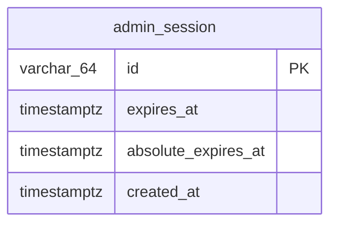

# 管理画面のログイン・ログアウト 実装計画

> **For agentic workers:** REQUIRED SUB-SKILL: Use superpowers:subagent-driven-development (recommended) or superpowers:executing-plans to implement this plan task-by-task. Steps use checkbox (`- [ ]`) syntax for tracking.

**Goal:** 管理画面の認証を「環境変数のトークンを Bearer で送る」方式から「ID + パスワードでログインし、サーバー側セッション + httpOnly Cookie で書き込み API を守る」方式に置き換える。

**Architecture:** backend は既存のオニオン構成に `auth` ドメインを足す（`domain/auth` → `usecase/auth/{command,query}` → `infrastructure/postgres/auth` + `infrastructure/auth`（bcrypt） → `presentation/http/auth`）。セッションは Postgres の `admin_session` テーブルに置き、`presentation/http/common.RequireAdminSession` が Cookie を検証する。frontend は `/admin/login` 画面と `/admin/*` のルートガードを足し、`lib/admin-auth.ts` を消す。

**Tech Stack:** Go 1.25 / Echo / GORM / golang-migrate / `golang.org/x/crypto/bcrypt` / swag、React + Vite + TanStack Query / Orval 生成フック / MSW / Vitest + RTL / Playwright

**Spec:** `docs/superpowers/specs/2026-09-30-admin-login-design.md`

## Global Constraints

- コメントは日本語。Repository の型と各メソッドには一行の What コメント。複雑なメソッドにも一行の What コメント（`CLAUDE.md`）
- テストは対象と同じディレクトリ・同名（`*_test.go` / `*.test.ts(x)`）。Go は外部テストパッケージ（`package xxx_test`）、テーブルドリブン + `t.Parallel()`
- Go の関数は循環的複雑度 10 以下（golangci-lint）。`gofmt` 済み
- コミットは `<type>: <日本語 subject（50 文字以内）>`、末尾に `Co-Authored-By: Claude Fable 5.1 <noreply@anthropic.com>`。1 タスク 1〜2 コミット。ブランチは `feat/admin-login`（作成済み）
- Cookie: 名前 `admin_session`、`HttpOnly; SameSite=Lax; Path=/api; Max-Age=86400`。`Secure` は付けない（http でしか動かさない）
- セッション: アイドル 1 時間、絶対 24 時間。ID は `crypto/rand` 32 byte の base64url（43 文字）
- 総当たり: 失敗 5 回で 1 分ロック（プロセス内メモリ）
- 参考資料の出典・固有名を docs / コード / コミットに書かない（脅威モデルから自分で導いた判断として書く）
- `backend/migrations/*.sql` を変えたら `docs/db/backend-schema.{json,md}` を同じ変更に含める（hook がブロックする）
- `go.mod` を変えたら同じ変更に `docs/adr/*.md` を含める（hook がブロックする）
- テーブル名は既存に合わせて単数形 `admin_session`
- 実 DB のテストは `cd backend && make db-up migrate-up` 済みのローカル Postgres に対して走り、繋がらなければ skip

## Review Focus

仕様に書いていないが、使う人が踏みそうな入力。各行のテストは所有するタスクに足してある。

1. パスワードの前後に空白がある → トリムせずそのまま照合する（Task 2 の `Credentials` テスト）
2. `admin_session` Cookie の値が空 → 401、UseCase を呼ばない（Task 7 の `RequireAdminSession` テスト「値が空なら401」）
3. `Origin` が `null`（プライバシーモードや `file://`） → 403（Task 7 の `RequireSameOrigin` テスト「Origin が null は403」）
4. ロック中に正しいパスワードを送る → 429 のまま、セッションは作られない（Task 6 の `LoginUsecase` テスト「ロック中は正しいパスワードでも429」）
5. `/admin/login` を開いたままログイン済みになっている（別タブでログインした） → ログインすればそのまま `/admin` へ行ける。二重ログインを弾かない（Task 13 の `useLogin` テスト「成功したら from へ、無ければ /admin へ」で担保）

---

### Task 1: sentinel エラーと HTTP ステータスの対応を足す

**Files:**
- Modify: `backend/internal/domain/common/error.go`
- Modify: `backend/internal/presentation/http/common/error_handler.go:64-71`
- Test: `backend/internal/presentation/http/common/error_handler_test.go`（既存に追記）

**Interfaces:**
- Produces: `domaincommon.ErrUnauthorized`（→ 401）、`domaincommon.ErrTooManyAttempts`（→ 429）

- [ ] **Step 1: 失敗するテストを書く**

`error_handler_test.go` の既存のテーブル（`toErrorResponse` か `HTTPErrorHandler` を検証しているもの）に 2 行足す。既存テストの形に合わせる。テーブルが無ければ次を追加:

```go
func TestHTTPErrorHandler_AuthErrors(t *testing.T) {
	silenceLog(t)
	tests := []struct {
		name string
		err  error
		want int
	}{
		{name: "ErrUnauthorizedは401", err: domaincommon.ErrUnauthorized, want: http.StatusUnauthorized},
		{name: "ErrTooManyAttemptsは429", err: domaincommon.ErrTooManyAttempts, want: http.StatusTooManyRequests},
	}
	for _, tt := range tests {
		t.Run(tt.name, func(t *testing.T) {
			e := common.NewEcho()
			e.GET("/x", func(echo.Context) error { return tt.err })
			rec := httptest.NewRecorder()
			e.ServeHTTP(rec, httptest.NewRequest(http.MethodGet, "/x", nil))
			if rec.Code != tt.want {
				t.Fatalf("status = %d, want %d", rec.Code, tt.want)
			}
		})
	}
}
```

- [ ] **Step 2: 失敗を確認**

Run: `cd backend && go test ./internal/presentation/http/common/ -run TestHTTPErrorHandler_AuthErrors`
Expected: コンパイルエラー（`ErrUnauthorized` 未定義）

- [ ] **Step 3: 実装**

`error.go`:

```go
var (
	ErrNotFound        = errors.New("not found")         // → 404
	ErrInvalid         = errors.New("invalid")           // → 400
	ErrConflict        = errors.New("conflict")          // → 409
	ErrUnauthorized    = errors.New("unauthorized")      // → 401
	ErrTooManyAttempts = errors.New("too many attempts") // → 429
)
```

`error_handler.go` の `switch` に追加:

```go
	case errors.Is(err, domaincommon.ErrUnauthorized):
		return http.StatusUnauthorized, ErrorResponse{Message: err.Error()}
	case errors.Is(err, domaincommon.ErrTooManyAttempts):
		return http.StatusTooManyRequests, ErrorResponse{Message: err.Error()}
```

- [ ] **Step 4: 通ることを確認**

Run: `cd backend && go test ./internal/presentation/http/common/ ./internal/domain/...`
Expected: PASS

- [ ] **Step 5: コミット**

```bash
git add backend/internal/domain/common/error.go backend/internal/presentation/http/common/error_handler.go backend/internal/presentation/http/common/error_handler_test.go
git commit -m "feat: 認証エラーのsentinelと401/429への変換を追加"
```

---

### Task 2: domain/auth（Credentials・Session・ポート）

**Files:**
- Create: `backend/internal/domain/auth/credentials.go`
- Create: `backend/internal/domain/auth/credentials_test.go`
- Create: `backend/internal/domain/auth/session.go`
- Create: `backend/internal/domain/auth/session_test.go`
- Create: `backend/internal/domain/auth/ports.go`

**Interfaces:**
- Produces:
  - `auth.NewCredentials(id, password string) (Credentials, error)`、`Credentials.ID() string`、`Credentials.Password() string`
  - `auth.SessionID string`、`auth.NewSessionID() (SessionID, error)`
  - `auth.Session{ID SessionID; ExpiresAt, AbsoluteExpiresAt time.Time}`、`auth.NewSession(id SessionID, now time.Time) *Session`、`(*Session).IsValid(now) bool`、`(*Session).Extend(now)`
  - `auth.IdleTimeout = time.Hour`、`auth.AbsoluteTimeout = 24 * time.Hour`
  - `auth.SessionRepository`（`Save / Find / Delete / UpdateExpiry`）、`auth.PasswordVerifier`（`Matches(hash, password string) bool`）

- [ ] **Step 1: Credentials の失敗するテスト**

`credentials_test.go`:

```go
package auth_test

import (
	"errors"
	"testing"

	"github.com/mrstsgk/book-management-system/backend/internal/domain/auth"
	"github.com/mrstsgk/book-management-system/backend/internal/domain/common"
)

func TestNewCredentials(t *testing.T) {
	t.Parallel()
	tests := []struct {
		name     string
		id, pw   string
		wantID   string
		wantPW   string
		wantErr  bool
	}{
		{name: "IDとパスワードをそのまま持つ", id: "admin", pw: "pa ss ", wantID: "admin", wantPW: "pa ss "},
		{name: "パスワードの前後の空白は落とさない", id: "admin", pw: " secret ", wantID: "admin", wantPW: " secret "},
		{name: "IDが空はエラー", id: "", pw: "x", wantErr: true},
		{name: "パスワードが空はエラー", id: "admin", pw: "", wantErr: true},
		{name: "IDが空白だけはエラー", id: " ", pw: "x", wantErr: true},
	}
	for _, tt := range tests {
		t.Run(tt.name, func(t *testing.T) {
			t.Parallel()
			got, err := auth.NewCredentials(tt.id, tt.pw)
			if tt.wantErr {
				if !errors.Is(err, common.ErrInvalid) {
					t.Fatalf("err = %v, want ErrInvalid", err)
				}
				return
			}
			if err != nil {
				t.Fatalf("unexpected error: %v", err)
			}
			if got.ID() != tt.wantID || got.Password() != tt.wantPW {
				t.Fatalf("got (%q, %q), want (%q, %q)", got.ID(), got.Password(), tt.wantID, tt.wantPW)
			}
		})
	}
}
```

- [ ] **Step 2: Session の失敗するテスト**

`session_test.go`:

```go
package auth_test

import (
	"encoding/base64"
	"testing"
	"time"

	"github.com/mrstsgk/book-management-system/backend/internal/domain/auth"
)

func TestNewSessionID(t *testing.T) {
	t.Parallel()
	a, err := auth.NewSessionID()
	if err != nil {
		t.Fatal(err)
	}
	b, _ := auth.NewSessionID()
	if a == b {
		t.Fatal("two IDs must differ")
	}
	if len(a) != 43 {
		t.Fatalf("len = %d, want 43 (32 bytes base64url without padding)", len(a))
	}
	if _, err := base64.RawURLEncoding.DecodeString(string(a)); err != nil {
		t.Fatalf("not base64url: %v", err)
	}
}

func TestSession(t *testing.T) {
	t.Parallel()
	now := time.Date(2026, 9, 30, 12, 0, 0, 0, time.UTC)

	t.Run("発行直後はアイドル1時間・絶対24時間", func(t *testing.T) {
		t.Parallel()
		s := auth.NewSession("id", now)
		if !s.ExpiresAt.Equal(now.Add(time.Hour)) || !s.AbsoluteExpiresAt.Equal(now.Add(24*time.Hour)) {
			t.Fatalf("got %+v", s)
		}
	})

	tests := []struct {
		name  string
		at    time.Time
		valid bool
	}{
		{name: "アイドル期限の直前は有効", at: now.Add(time.Hour - time.Second), valid: true},
		{name: "アイドル期限ちょうどは無効", at: now.Add(time.Hour), valid: false},
		{name: "アイドル期限+1秒は無効", at: now.Add(time.Hour + time.Second), valid: false},
	}
	for _, tt := range tests {
		t.Run(tt.name, func(t *testing.T) {
			t.Parallel()
			s := auth.NewSession("id", now)
			if got := s.IsValid(tt.at); got != tt.valid {
				t.Fatalf("IsValid = %v, want %v", got, tt.valid)
			}
		})
	}

	t.Run("延長するとアイドル期限が今+1時間になる", func(t *testing.T) {
		t.Parallel()
		s := auth.NewSession("id", now)
		s.Extend(now.Add(30 * time.Minute))
		if !s.ExpiresAt.Equal(now.Add(90 * time.Minute)) {
			t.Fatalf("ExpiresAt = %v", s.ExpiresAt)
		}
	})

	t.Run("延長しても絶対期限を超えない（絶対期限に達すれば無効になる）", func(t *testing.T) {
		t.Parallel()
		s := auth.NewSession("id", now)
		s.Extend(now.Add(23*time.Hour + 30*time.Minute))
		if !s.ExpiresAt.Equal(now.Add(24 * time.Hour)) {
			t.Fatalf("ExpiresAt = %v, want the absolute limit", s.ExpiresAt)
		}
		if s.IsValid(now.Add(24 * time.Hour)) {
			t.Fatal("must be invalid at the absolute limit")
		}
	})
}
```

- [ ] **Step 3: 失敗を確認**

Run: `cd backend && go test ./internal/domain/auth/`
Expected: コンパイルエラー

- [ ] **Step 4: 実装**

`credentials.go`:

```go
package auth

import (
	"fmt"
	"strings"

	"github.com/mrstsgk/book-management-system/backend/internal/domain/common"
)

// Credentials はログイン画面から受け取った ID とパスワード。空を拒否するだけで、正しいかどうかは判定しない。
type Credentials struct {
	id       string
	password string
}

// NewCredentials は空欄を弾く。パスワードはトリムしない（先頭や末尾の空白もパスワードの一部として扱う）。
func NewCredentials(id, password string) (Credentials, error) {
	if strings.TrimSpace(id) == "" {
		return Credentials{}, fmt.Errorf("%w: IDを入力してください", common.ErrInvalid)
	}
	if password == "" {
		return Credentials{}, fmt.Errorf("%w: パスワードを入力してください", common.ErrInvalid)
	}
	return Credentials{id: id, password: password}, nil
}

func (c Credentials) ID() string       { return c.id }
func (c Credentials) Password() string { return c.password }
```

`session.go`:

```go
package auth

import (
	"crypto/rand"
	"encoding/base64"
	"time"
)

const (
	// IdleTimeout は操作が無いまま失効するまでの時間。書き込み API を通るたびにここまで延びる。
	IdleTimeout = time.Hour
	// AbsoluteTimeout はログインからの上限。延長しても超えない（盗まれたセッションが延命され続けないため）。
	AbsoluteTimeout = 24 * time.Hour
)

// SessionID はブラウザに渡す唯一の値。推測できないよう乱数から作る。
type SessionID string

// NewSessionID は 32 byte の乱数を base64url（パディング無し・43 文字）にする。
func NewSessionID() (SessionID, error) {
	var b [32]byte
	if _, err := rand.Read(b[:]); err != nil {
		return "", err
	}
	return SessionID(base64.RawURLEncoding.EncodeToString(b[:])), nil
}

// Session はログイン済みの状態。ID 以外はいつまで有効かだけを持つ（誰のセッションかは、利用者が自分 1 人なので持たない）。
type Session struct {
	ID                SessionID
	ExpiresAt         time.Time
	AbsoluteExpiresAt time.Time
}

func NewSession(id SessionID, now time.Time) *Session {
	return &Session{ID: id, ExpiresAt: now.Add(IdleTimeout), AbsoluteExpiresAt: now.Add(AbsoluteTimeout)}
}

// IsValid はアイドル期限に達していなければ true（期限ちょうどは無効）。Extend が絶対期限で頭打ちにするので、
// アイドル期限は常に絶対期限以下であり、絶対期限を別に比べる必要は無い。
func (s *Session) IsValid(now time.Time) bool {
	return now.Before(s.ExpiresAt)
}

// Extend はアイドル期限を今 + IdleTimeout に延ばす。絶対期限は超えない。
func (s *Session) Extend(now time.Time) {
	next := now.Add(IdleTimeout)
	if next.After(s.AbsoluteExpiresAt) {
		next = s.AbsoluteExpiresAt
	}
	s.ExpiresAt = next
}
```

`ports.go`:

```go
package auth

import (
	"context"
	"time"
)

// SessionRepository はセッションを永続化するポート。
type SessionRepository interface {
	// Save は s を新規保存する。
	Save(ctx context.Context, s *Session) error
	// Find は id のセッションを返す。無ければ common.ErrNotFound を返す（期限切れでも行があれば返す）。
	Find(ctx context.Context, id SessionID) (*Session, error)
	// Delete は id のセッションを消す。無くてもエラーにしない。
	Delete(ctx context.Context, id SessionID) error
	// UpdateExpiry は id のアイドル期限を expiresAt にする。
	UpdateExpiry(ctx context.Context, id SessionID, expiresAt time.Time) error
}

// PasswordVerifier はパスワードとハッシュの照合。ハッシュ方式（bcrypt）を Domain から隠すための ExternalGateway 相当。
type PasswordVerifier interface {
	// Matches は password が hash に対応していれば true。
	Matches(hash, password string) bool
}
```

- [ ] **Step 5: 通ることを確認**

Run: `cd backend && go test ./internal/domain/auth/ && gofmt -l ./internal/domain/auth`
Expected: PASS、gofmt の出力なし

- [ ] **Step 6: コミット**

```bash
git add backend/internal/domain/auth
git commit -m "feat: 認証ドメインにCredentials・Session・ポートを追加"
```

---

### Task 3: admin_session テーブルのマイグレーションと DB 資料

**Files:**
- Create: `backend/migrations/000008_create_admin_session.up.sql`
- Create: `backend/migrations/000008_create_admin_session.down.sql`
- Modify: `docs/db/backend-schema.json`
- Modify: `docs/db/backend-schema.md`

- [ ] **Step 1: up / down を書く**

`000008_create_admin_session.up.sql`:

```sql
CREATE TABLE admin_session (
    id                  VARCHAR(64) PRIMARY KEY,
    expires_at          TIMESTAMPTZ NOT NULL,
    absolute_expires_at TIMESTAMPTZ NOT NULL,
    created_at          TIMESTAMPTZ NOT NULL DEFAULT NOW()
);

COMMENT ON TABLE admin_session IS '管理画面のログイン済みセッション。利用者は自分 1 人なので誰のセッションかは持たない。パスワードもハッシュも入れない';
COMMENT ON COLUMN admin_session.id IS 'セッションID（32 byte の乱数を base64url にした 43 文字）。ブラウザには httpOnly Cookie でこれだけを渡す';
COMMENT ON COLUMN admin_session.expires_at IS 'アイドル期限。書き込み API を通るたびに「今 + 1 時間」に延びる（絶対期限は超えない）';
COMMENT ON COLUMN admin_session.absolute_expires_at IS '絶対期限。ログイン時刻 + 24 時間で固定';
COMMENT ON COLUMN admin_session.created_at IS 'ログイン日時';
```

`000008_create_admin_session.down.sql`:

```sql
DROP TABLE IF EXISTS admin_session;
```

- [ ] **Step 2: 適用して確認**

Run: `cd backend && make migrate-up && docker compose exec -T db psql -U postgres -d book_management -c '\d admin_session'`
Expected: 4 カラムのテーブルが出る

- [ ] **Step 3: DB 資料を更新**

`backend-schema.json` の `tables` に追加（`book_tag` の後）:

```json
    "admin_session": {
      "description": "管理画面のログイン済みセッション。利用者は自分 1 人なので誰のセッションかは持たない。パスワードもハッシュも入れない。",
      "source": "backend/migrations/000008_create_admin_session.up.sql",
      "columns": [
        { "name": "id", "type": "VARCHAR(64)", "nullable": false, "pk": true, "description": "セッションID（32 byte の乱数を base64url にした 43 文字）。ブラウザには httpOnly Cookie でこれだけを渡す" },
        { "name": "expires_at", "type": "TIMESTAMPTZ", "nullable": false, "description": "アイドル期限。書き込み API を通るたびに「今 + 1 時間」に延びる（絶対期限は超えない）" },
        { "name": "absolute_expires_at", "type": "TIMESTAMPTZ", "nullable": false, "description": "絶対期限。ログイン時刻 + 24 時間で固定" },
        { "name": "created_at", "type": "TIMESTAMPTZ", "nullable": false, "default": "NOW()", "description": "ログイン日時" }
      ],
      "indexes": [],
      "constraints": []
    }
```

`backend-schema.md` の末尾に追加:

````markdown

`admin_session`: 管理画面のログイン済みセッション。利用者は自分 1 人なので誰のセッションかは持たない。期限切れの行は消さずに残す（判定は期限の比較で行い、1 人利用で行数は増えない）。


````

- [ ] **Step 4: コミット**

```bash
git add backend/migrations/000008_create_admin_session.up.sql backend/migrations/000008_create_admin_session.down.sql docs/db/backend-schema.json docs/db/backend-schema.md
git commit -m "feat: 管理画面のセッションを保存するadmin_sessionテーブルを追加"
```

---

### Task 4: postgres/auth の SessionRepository（契約テスト）

**Files:**
- Create: `backend/internal/infrastructure/postgres/auth/repository.go`
- Create: `backend/internal/infrastructure/postgres/auth/repository_test.go`
- Create: `backend/internal/infrastructure/postgres/auth/helper_test.go`

**Interfaces:**
- Consumes: `auth.SessionRepository`、`auth.Session`（Task 2）
- Produces: `pgauth.NewRepository(db *gorm.DB) auth.SessionRepository`

- [ ] **Step 1: helper と失敗するテスト**

`helper_test.go`（tag の同名ファイルと同じ。`SELECT 1 FROM tag` を `admin_session` に変える）:

```go
package auth_test

import (
	"testing"

	"gorm.io/gorm"

	pgcommon "github.com/mrstsgk/book-management-system/backend/internal/infrastructure/postgres/common"
)

// connectTestDB はローカルの開発用 DB に接続する。実際の PostgreSQL に対する契約テストなので、
// DB に繋がらなければ失敗ではなく skip する（docs/rules/testing.md）。
func connectTestDB(t *testing.T) *gorm.DB {
	t.Helper()
	db, err := pgcommon.Connect(pgcommon.Config{
		Host: "localhost", Port: "5432", User: "postgres", Password: "postgres",
		DBName: "book_management", SSLMode: "disable",
	})
	if err != nil {
		t.Skipf("skipping: local Postgres not reachable (run `make db-up migrate-up` first): %v", err)
	}
	if err := db.Exec("SELECT 1 FROM admin_session LIMIT 0").Error; err != nil {
		t.Skipf("skipping: schema not migrated (run `make migrate-up` first): %v", err)
	}
	return db
}
```

`repository_test.go`:

```go
package auth_test

import (
	"context"
	"errors"
	"testing"
	"time"

	domainauth "github.com/mrstsgk/book-management-system/backend/internal/domain/auth"
	domaincommon "github.com/mrstsgk/book-management-system/backend/internal/domain/common"
	pgauth "github.com/mrstsgk/book-management-system/backend/internal/infrastructure/postgres/auth"
)

func newSession(t *testing.T) *domainauth.Session {
	t.Helper()
	id, err := domainauth.NewSessionID()
	if err != nil {
		t.Fatal(err)
	}
	return domainauth.NewSession(id, time.Now().UTC().Truncate(time.Microsecond))
}

func TestRepository_SaveThenFind(t *testing.T) {
	db := connectTestDB(t)
	repo := pgauth.NewRepository(db)
	s := newSession(t)
	t.Cleanup(func() { db.Exec("DELETE FROM admin_session WHERE id = ?", string(s.ID)) })

	if err := repo.Save(context.Background(), s); err != nil {
		t.Fatalf("Save: %v", err)
	}
	got, err := repo.Find(context.Background(), s.ID)
	if err != nil {
		t.Fatalf("Find: %v", err)
	}
	if got.ID != s.ID || !got.ExpiresAt.Equal(s.ExpiresAt) || !got.AbsoluteExpiresAt.Equal(s.AbsoluteExpiresAt) {
		t.Fatalf("got %+v, want %+v", got, s)
	}
}

func TestRepository_Find_NotFound(t *testing.T) {
	repo := pgauth.NewRepository(connectTestDB(t))
	if _, err := repo.Find(context.Background(), "no-such-session"); !errors.Is(err, domaincommon.ErrNotFound) {
		t.Fatalf("err = %v, want ErrNotFound", err)
	}
}

func TestRepository_UpdateExpiry(t *testing.T) {
	db := connectTestDB(t)
	repo := pgauth.NewRepository(db)
	s := newSession(t)
	t.Cleanup(func() { db.Exec("DELETE FROM admin_session WHERE id = ?", string(s.ID)) })
	if err := repo.Save(context.Background(), s); err != nil {
		t.Fatal(err)
	}

	next := s.ExpiresAt.Add(30 * time.Minute)
	if err := repo.UpdateExpiry(context.Background(), s.ID, next); err != nil {
		t.Fatalf("UpdateExpiry: %v", err)
	}
	got, _ := repo.Find(context.Background(), s.ID)
	if !got.ExpiresAt.Equal(next) {
		t.Fatalf("ExpiresAt = %v, want %v", got.ExpiresAt, next)
	}
	if !got.AbsoluteExpiresAt.Equal(s.AbsoluteExpiresAt) {
		t.Fatal("absolute limit must not change")
	}
}

func TestRepository_Delete(t *testing.T) {
	db := connectTestDB(t)
	repo := pgauth.NewRepository(db)
	s := newSession(t)
	if err := repo.Save(context.Background(), s); err != nil {
		t.Fatal(err)
	}

	if err := repo.Delete(context.Background(), s.ID); err != nil {
		t.Fatalf("Delete: %v", err)
	}
	if _, err := repo.Find(context.Background(), s.ID); !errors.Is(err, domaincommon.ErrNotFound) {
		t.Fatalf("Find after delete: err = %v, want ErrNotFound", err)
	}
	if err := repo.Delete(context.Background(), s.ID); err != nil {
		t.Fatalf("Delete again must not fail: %v", err)
	}
}

// テーブルにパスワードもハッシュも入らないことを列名で確かめる（設計の「秘密はサーバーの環境変数にだけ置く」の担保）。
func TestRepository_TableHasNoSecretColumns(t *testing.T) {
	db := connectTestDB(t)
	var cols []string
	if err := db.Raw("SELECT column_name FROM information_schema.columns WHERE table_name = 'admin_session'").Scan(&cols).Error; err != nil {
		t.Fatal(err)
	}
	for _, c := range cols {
		if c == "password" || c == "password_hash" {
			t.Fatalf("admin_session must not have column %q", c)
		}
	}
}
```

- [ ] **Step 2: 失敗を確認**

Run: `cd backend && go test ./internal/infrastructure/postgres/auth/`
Expected: コンパイルエラー

- [ ] **Step 3: 実装**

`repository.go`:

```go
package auth

import (
	"context"
	"errors"
	"fmt"
	"time"

	"gorm.io/gorm"

	domainauth "github.com/mrstsgk/book-management-system/backend/internal/domain/auth"
	domaincommon "github.com/mrstsgk/book-management-system/backend/internal/domain/common"
)

type model struct {
	ID                string    `gorm:"column:id;primaryKey;size:64"`
	ExpiresAt         time.Time `gorm:"column:expires_at;not null"`
	AbsoluteExpiresAt time.Time `gorm:"column:absolute_expires_at;not null"`
	CreatedAt         time.Time `gorm:"column:created_at;not null"`
}

func (model) TableName() string {
	return "admin_session"
}

// repository は admin_session テーブルに対して domainauth.SessionRepository を実装する。
type repository struct {
	db *gorm.DB
}

func NewRepository(db *gorm.DB) domainauth.SessionRepository {
	return &repository{db: db}
}

// Save は行を挿入する。
func (r *repository) Save(ctx context.Context, s *domainauth.Session) error {
	row := model{ID: string(s.ID), ExpiresAt: s.ExpiresAt, AbsoluteExpiresAt: s.AbsoluteExpiresAt, CreatedAt: time.Now()}
	return r.db.WithContext(ctx).Create(&row).Error
}

// Find は id の行を返す。無ければ common.ErrNotFound を返す。
func (r *repository) Find(ctx context.Context, id domainauth.SessionID) (*domainauth.Session, error) {
	var row model
	if err := r.db.WithContext(ctx).First(&row, "id = ?", string(id)).Error; err != nil {
		if errors.Is(err, gorm.ErrRecordNotFound) {
			return nil, fmt.Errorf("%w: セッションが見つかりません", domaincommon.ErrNotFound)
		}
		return nil, err
	}
	return &domainauth.Session{ID: domainauth.SessionID(row.ID), ExpiresAt: row.ExpiresAt, AbsoluteExpiresAt: row.AbsoluteExpiresAt}, nil
}

// Delete は id の行を消す。無くてもエラーにしない（ログアウトは冪等でよい）。
func (r *repository) Delete(ctx context.Context, id domainauth.SessionID) error {
	return r.db.WithContext(ctx).Delete(&model{}, "id = ?", string(id)).Error
}

// UpdateExpiry は id のアイドル期限だけを更新する。
func (r *repository) UpdateExpiry(ctx context.Context, id domainauth.SessionID, expiresAt time.Time) error {
	return r.db.WithContext(ctx).Model(&model{}).Where("id = ?", string(id)).Update("expires_at", expiresAt).Error
}
```

- [ ] **Step 4: 通ることを確認**

Run: `cd backend && go test ./internal/infrastructure/postgres/auth/`
Expected: PASS（DB 未起動なら SKIP）

- [ ] **Step 5: コミット**

```bash
git add backend/internal/infrastructure/postgres/auth
git commit -m "feat: admin_sessionに対するSessionRepositoryを追加"
```

---

### Task 5: bcrypt の PasswordVerifier・hashpw コマンド・ADR

`golang.org/x/crypto` を直接依存に上げるので `go.mod` が変わる。同じ変更に ADR を含めないと hook が止める。

**Files:**
- Create: `backend/internal/infrastructure/auth/bcrypt.go`
- Create: `backend/internal/infrastructure/auth/bcrypt_test.go`
- Create: `backend/cmd/hashpw/main.go`
- Create: `backend/cmd/hashpw/main_test.go`
- Modify: `backend/go.mod`、`backend/go.sum`（`go mod tidy`）
- Create: `docs/adr/2026-09-30-admin-login-with-server-side-session.md`

**Interfaces:**
- Consumes: `auth.PasswordVerifier`（Task 2）
- Produces: `infraauth.NewBcryptVerifier() auth.PasswordVerifier`、`infraauth.HashPassword(password string) (string, error)`（cost 12）

- [ ] **Step 1: 失敗するテスト**

`bcrypt_test.go`:

```go
package auth_test

import (
	"strings"
	"testing"

	infraauth "github.com/mrstsgk/book-management-system/backend/internal/infrastructure/auth"
)

func TestBcryptVerifier(t *testing.T) {
	t.Parallel()
	hash, err := infraauth.HashPassword("correct horse")
	if err != nil {
		t.Fatal(err)
	}
	// "$2a$12$" のようにコストが 12 で始まる（総当たりを遅くする設計値）
	if !strings.HasPrefix(hash, "$2a$12$") {
		t.Fatalf("hash = %q, want bcrypt cost 12", hash)
	}

	v := infraauth.NewBcryptVerifier()
	tests := []struct {
		name string
		pw   string
		want bool
	}{
		{name: "正しいパスワードは一致", pw: "correct horse", want: true},
		{name: "違うパスワードは不一致", pw: "wrong", want: false},
		{name: "前後に空白が付くと不一致", pw: " correct horse ", want: false},
		{name: "空は不一致", pw: "", want: false},
	}
	for _, tt := range tests {
		t.Run(tt.name, func(t *testing.T) {
			t.Parallel()
			if got := v.Matches(hash, tt.pw); got != tt.want {
				t.Fatalf("Matches = %v, want %v", got, tt.want)
			}
		})
	}

	t.Run("壊れたハッシュは不一致（panic しない）", func(t *testing.T) {
		t.Parallel()
		if v.Matches("not-a-hash", "x") {
			t.Fatal("must be false")
		}
	})
}
```

`cmd/hashpw/main_test.go`:

```go
package main

import (
	"bytes"
	"strings"
	"testing"

	"golang.org/x/crypto/bcrypt"
)

func TestRun(t *testing.T) {
	t.Parallel()
	var out bytes.Buffer
	if err := run(strings.NewReader("secret\n"), &out); err != nil {
		t.Fatal(err)
	}
	hash := strings.TrimSpace(out.String())
	// 末尾の改行はパスワードに含めない
	if err := bcrypt.CompareHashAndPassword([]byte(hash), []byte("secret")); err != nil {
		t.Fatalf("hash does not match the input: %v", err)
	}
}

func TestRun_EmptyIsError(t *testing.T) {
	t.Parallel()
	if err := run(strings.NewReader("\n"), &bytes.Buffer{}); err == nil {
		t.Fatal("expected error for empty password")
	}
}
```

- [ ] **Step 2: 失敗を確認**

Run: `cd backend && go test ./internal/infrastructure/auth/ ./cmd/hashpw/`
Expected: コンパイルエラー

- [ ] **Step 3: 実装**

`bcrypt.go`:

```go
package auth

import (
	"golang.org/x/crypto/bcrypt"

	domainauth "github.com/mrstsgk/book-management-system/backend/internal/domain/auth"
)

// hashCost は bcrypt のコスト。既定（10）より高くして総当たりを遅くする。ログインは 1 人が 1 日に数回なので待ち時間は問題にならない。
const hashCost = 12

type bcryptVerifier struct{}

func NewBcryptVerifier() domainauth.PasswordVerifier {
	return bcryptVerifier{}
}

// Matches は bcrypt で照合する。壊れたハッシュはエラーになるが、それも「一致しない」として扱う。
func (bcryptVerifier) Matches(hash, password string) bool {
	return bcrypt.CompareHashAndPassword([]byte(hash), []byte(password)) == nil
}

// HashPassword は ADMIN_PASSWORD_HASH に置く値を作る（cmd/hashpw が使う）。
func HashPassword(password string) (string, error) {
	b, err := bcrypt.GenerateFromPassword([]byte(password), hashCost)
	if err != nil {
		return "", err
	}
	return string(b), nil
}
```

`cmd/hashpw/main.go`:

```go
// hashpw は標準入力から読んだパスワードの bcrypt ハッシュを出す。ADMIN_PASSWORD_HASH に設定する値を作るためのもの。
// 引数で受けないのは、パスワードが shell の履歴に残らないようにするため。
//
//	echo -n 'password' | go run ./cmd/hashpw
package main

import (
	"bufio"
	"errors"
	"fmt"
	"io"
	"os"
	"strings"

	infraauth "github.com/mrstsgk/book-management-system/backend/internal/infrastructure/auth"
)

func main() {
	if err := run(os.Stdin, os.Stdout); err != nil {
		fmt.Fprintln(os.Stderr, err)
		os.Exit(1)
	}
}

// run は 1 行読み、末尾の改行だけを落としてハッシュにする。
func run(in io.Reader, out io.Writer) error {
	line, err := bufio.NewReader(in).ReadString('\n')
	if err != nil && !errors.Is(err, io.EOF) {
		return err
	}
	password := strings.TrimRight(line, "\r\n")
	if password == "" {
		return errors.New("パスワードが空です")
	}
	hash, err := infraauth.HashPassword(password)
	if err != nil {
		return err
	}
	_, err = fmt.Fprintln(out, hash)
	return err
}
```

Run: `cd backend && go mod tidy`（`golang.org/x/crypto` が直接依存に上がる）

- [ ] **Step 4: ADR を書く**

`docs/adr/2026-09-30-admin-login-with-server-side-session.md`:

```markdown
# 管理画面のログインはサーバー側セッション + httpOnly Cookie で守る

**日付:** 2026-09-30
**状態:** 採用
**カテゴリ:** architecture
**参照:** [設計](../superpowers/specs/2026-09-30-admin-login-design.md)、[置き換えた ADR](./2026-09-30-admin-token-from-env.md)

## 背景・経緯

書き込み系 API は、環境変数の管理者トークンを `Authorization: Bearer` で送る方式で守っていた。frontend はそのトークンを `VITE_ADMIN_TOKEN` から読んで画面のコードに埋め込むため、ビルドして公開すると誰でも読めて書き込める。「公開しない前提でだけ成り立つ」と ADR に残していたが、要求定義 §1 の「設計と実装がしっかりした人」を伝えるには、認証も脅威を特定して対策を選んだ形にしたい。

脅威モデルは「利用者は自分 1 人、ローカルで動かす、公開しない」。守るのは「書き込み系 API を自分以外に使われないこと」。

## 決定

ID + パスワードでログインし、サーバー側セッション（Postgres の `admin_session`）を httpOnly Cookie で持つ。Bearer トークン方式は残さない（認証手段を 1 つにする）。

| 脅威 | 対策 | どこで確かめるか |
|---|---|---|
| 画面のコードに埋め込まれた秘密が読まれる | 秘密（パスワードの bcrypt ハッシュ）はバックエンドの環境変数にだけ置き、ブラウザには意味を持たないセッション ID しか渡さない | `postgres/auth` の契約テスト（テーブルに秘密のカラムが無い） |
| XSS でセッションが盗まれる | Cookie を `HttpOnly` にする | `presentation/http/auth` の Handler テスト |
| CSRF | Cookie を `SameSite=Lax` にし、状態を変える要求は `Origin` が自サイトでなければ 403 | `common.RequireSameOrigin` のテスト |
| セッション ID の推測 | `crypto/rand` 32 byte を base64url | `domain/auth` のテスト |
| 盗まれたセッションが使われ続ける | アイドル 1 時間・絶対 24 時間で失効。ログアウトでサーバー側の行を消す | `domain/auth`・`usecase/auth`・結合テスト（ログアウト後の再利用が 401） |
| パスワードの総当たり | bcrypt（コスト 12）で照合を遅くし、失敗 5 回で 1 分ロック | `infrastructure/auth`・`usecase/auth/command` のテスト |
| 応答時間から ID の存在を推測される | ID が違っても bcrypt を必ず実行する。ID の比較は定数時間 | `LoginUsecase` のテスト（ID 不一致でも Verifier が呼ばれる） |
| 設定漏れで誰でも書き込める | `ADMIN_ID` / `ADMIN_PASSWORD_HASH` に既定値を置かない | `config` のテスト |

依存の追加: `golang.org/x/crypto`（bcrypt）を間接依存から直接依存に上げる。自前でハッシュを実装しないため。

## 検討した代替案

| 案 | 概要 | 却下理由 |
|---|---|---|
| A（採用） | サーバー側セッション + httpOnly Cookie | 上の表のとおり脅威ごとに対策を置け、Postgres 以外の新しいインフラが要らない |
| B | ログイン画面でトークンを入力し sessionStorage に持つ | 画面のコードに埋め込む問題は解けるが、sessionStorage は JS から読めるため XSS で即流出する。失効の手段も無い |
| C | マネージド ID プロバイダ + 外部セッションストア | 要求定義 §4（ユーザー管理なし・デプロイなし）と釣り合わない。ローカルではエミュレータ相手にしか動かず、本物に対して動いた保証が得られない |
| D | Bearer トークンのまま、トークンだけ画面で入力する | B と同じ弱点。CSRF は成立しないが XSS には無防備 |

## 判断基準（任意）

公開するときに足すもの: Cookie の `Secure`（https になるため）、frontend を別オリジンに置くなら `credentials: 'include'`、ロックの永続化（多プロセス化するなら）。ユーザーが 2 人以上になったら、この方式を捨てて C を検討する。
```

- [ ] **Step 5: 通ることを確認**

Run: `cd backend && go test ./internal/infrastructure/auth/ ./cmd/hashpw/ && echo -n 'password' | go run ./cmd/hashpw`
Expected: PASS、`$2a$12$...` が 1 行出る

- [ ] **Step 6: コミット**

```bash
git add backend/internal/infrastructure/auth backend/cmd/hashpw backend/go.mod backend/go.sum docs/adr/2026-09-30-admin-login-with-server-side-session.md
git commit -m "feat: bcryptのPasswordVerifierとハッシュ生成コマンドを追加"
```

---

### Task 6: usecase/auth（Login・Logout・CheckSession・ロック）

**Files:**
- Create: `backend/internal/usecase/auth/command/login.go`
- Create: `backend/internal/usecase/auth/command/login_test.go`
- Create: `backend/internal/usecase/auth/command/logout.go`
- Create: `backend/internal/usecase/auth/command/logout_test.go`
- Create: `backend/internal/usecase/auth/query/check_session.go`
- Create: `backend/internal/usecase/auth/query/check_session_test.go`

**Interfaces:**
- Consumes: `auth.*`（Task 2）、`domaincommon.ErrUnauthorized` / `ErrTooManyAttempts`（Task 1）
- Produces:
  - `command.LoginCommand{ID, Password string}`、`command.LoginUsecase.Execute(ctx, LoginCommand) (string, error)`（セッション ID）
  - `command.LoginUsecaseImpl{Admin AdminAccount; Verifier auth.PasswordVerifier; Sessions auth.SessionRepository; Now func() time.Time}`（失敗回数とロック期限は非公開フィールド。1 インスタンスを全リクエストで共有する）、`command.AdminAccount{ID, PasswordHash string}`
  - `command.LogoutUsecase.Execute(ctx, id string) error`、`command.LogoutUsecaseImpl{Sessions auth.SessionRepository}`
  - `query.CheckSessionUsecase.Execute(ctx, id string) error`（無効なら `ErrUnauthorized`。有効なら延長）、`query.CheckSessionUsecaseImpl{Sessions auth.SessionRepository; Now func() time.Time}`

- [ ] **Step 1: LoginUsecase の失敗するテスト**

`login_test.go`:

```go
package command_test

import (
	"context"
	"errors"
	"testing"
	"time"

	"github.com/mrstsgk/book-management-system/backend/internal/domain/auth"
	"github.com/mrstsgk/book-management-system/backend/internal/domain/common"
	"github.com/mrstsgk/book-management-system/backend/internal/usecase/auth/command"
)

// fakeSessions は auth.SessionRepository の手書き Fake（docs/rules/testing.md）。
type fakeSessions struct {
	saved   *auth.Session
	saveErr error

	found   *auth.Session
	findErr error

	deletedID auth.SessionID
	deleteErr error

	updatedID auth.SessionID
	updatedAt time.Time
}

func (f *fakeSessions) Save(_ context.Context, s *auth.Session) error {
	if f.saveErr != nil {
		return f.saveErr
	}
	f.saved = s
	return nil
}
func (f *fakeSessions) Find(context.Context, auth.SessionID) (*auth.Session, error) {
	return f.found, f.findErr
}
func (f *fakeSessions) Delete(_ context.Context, id auth.SessionID) error {
	f.deletedID = id
	return f.deleteErr
}
func (f *fakeSessions) UpdateExpiry(_ context.Context, id auth.SessionID, at time.Time) error {
	f.updatedID, f.updatedAt = id, at
	return nil
}

// fakeVerifier は呼ばれた回数を数える（ID 不一致でも照合が走ることを確かめるため）。
type fakeVerifier struct {
	calls int
	ok    bool
}

func (f *fakeVerifier) Matches(string, string) bool {
	f.calls++
	return f.ok
}

var fixedNow = time.Date(2026, 9, 30, 12, 0, 0, 0, time.UTC)

func newLogin(sessions *fakeSessions, v *fakeVerifier) *command.LoginUsecaseImpl {
	return &command.LoginUsecaseImpl{
		Admin:    command.AdminAccount{ID: "admin", PasswordHash: "$hash"},
		Verifier: v,
		Sessions: sessions,
		Now:      func() time.Time { return fixedNow },
	}
}

// failTimes は失敗を n 回積む（ロックのテストの前提を作る）。
func failTimes(t *testing.T, uc *command.LoginUsecaseImpl, n int) {
	t.Helper()
	for i := 0; i < n; i++ {
		_, _ = uc.Execute(context.Background(), command.LoginCommand{ID: "admin", Password: "bad"})
	}
}

func TestLoginUsecase_Execute(t *testing.T) {
	t.Parallel()

	t.Run("IDとパスワードが合えばセッションを保存してIDを返す", func(t *testing.T) {
		t.Parallel()
		sessions := &fakeSessions{}
		uc := newLogin(sessions, &fakeVerifier{ok: true})

		id, err := uc.Execute(context.Background(), command.LoginCommand{ID: "admin", Password: "pw"})
		if err != nil {
			t.Fatalf("unexpected error: %v", err)
		}
		if sessions.saved == nil || string(sessions.saved.ID) != id || len(id) != 43 {
			t.Fatalf("saved %+v, returned %q", sessions.saved, id)
		}
		if !sessions.saved.ExpiresAt.Equal(uc.Now().Add(time.Hour)) {
			t.Fatalf("ExpiresAt = %v", sessions.saved.ExpiresAt)
		}
	})

	t.Run("IDが違えば401、保存しない、それでも照合は1回走る", func(t *testing.T) {
		t.Parallel()
		sessions := &fakeSessions{}
		v := &fakeVerifier{ok: true}
		uc := newLogin(sessions, v)

		_, err := uc.Execute(context.Background(), command.LoginCommand{ID: "other", Password: "pw"})
		if !errors.Is(err, common.ErrUnauthorized) {
			t.Fatalf("err = %v, want ErrUnauthorized", err)
		}
		if sessions.saved != nil {
			t.Fatal("must not save a session")
		}
		if v.calls != 1 {
			t.Fatalf("verifier calls = %d, want 1 (constant work regardless of ID)", v.calls)
		}
	})

	t.Run("パスワードが違えば401で保存しない", func(t *testing.T) {
		t.Parallel()
		sessions := &fakeSessions{}
		uc := newLogin(sessions, &fakeVerifier{ok: false})

		if _, err := uc.Execute(context.Background(), command.LoginCommand{ID: "admin", Password: "bad"}); !errors.Is(err, common.ErrUnauthorized) {
			t.Fatalf("err = %v, want ErrUnauthorized", err)
		}
		if sessions.saved != nil {
			t.Fatal("must not save a session")
		}
	})

	t.Run("空欄は400で照合しない", func(t *testing.T) {
		t.Parallel()
		v := &fakeVerifier{ok: true}
		uc := newLogin(&fakeSessions{}, v)

		if _, err := uc.Execute(context.Background(), command.LoginCommand{ID: "admin", Password: ""}); !errors.Is(err, common.ErrInvalid) {
			t.Fatalf("err = %v, want ErrInvalid", err)
		}
		if v.calls != 0 {
			t.Fatal("verifier must not be called for empty input")
		}
	})

	t.Run("4回失敗まではロックしない", func(t *testing.T) {
		t.Parallel()
		v := &fakeVerifier{ok: false}
		uc := newLogin(&fakeSessions{}, v)
		failTimes(t, uc, 4)
		if _, err := uc.Execute(context.Background(), command.LoginCommand{ID: "admin", Password: "bad"}); !errors.Is(err, common.ErrUnauthorized) {
			t.Fatalf("err = %v, want ErrUnauthorized (not locked yet)", err)
		}
	})

	t.Run("5回失敗すると6回目は照合せず429", func(t *testing.T) {
		t.Parallel()
		v := &fakeVerifier{ok: false}
		uc := newLogin(&fakeSessions{}, v)
		failTimes(t, uc, 5)
		if _, err := uc.Execute(context.Background(), command.LoginCommand{ID: "admin", Password: "bad"}); !errors.Is(err, common.ErrTooManyAttempts) {
			t.Fatalf("err = %v, want ErrTooManyAttempts", err)
		}
		if v.calls != 5 {
			t.Fatalf("verifier calls = %d, want 5 (locked attempt must not verify)", v.calls)
		}
	})

	t.Run("ロック中は正しいパスワードでも429でセッションを作らない", func(t *testing.T) {
		t.Parallel()
		sessions := &fakeSessions{}
		v := &fakeVerifier{ok: false}
		uc := newLogin(sessions, v)
		failTimes(t, uc, 5)
		v.ok = true
		if _, err := uc.Execute(context.Background(), command.LoginCommand{ID: "admin", Password: "right"}); !errors.Is(err, common.ErrTooManyAttempts) {
			t.Fatalf("err = %v, want ErrTooManyAttempts", err)
		}
		if sessions.saved != nil {
			t.Fatal("must not save a session while locked")
		}
	})

	t.Run("1分経てばロックが解ける", func(t *testing.T) {
		t.Parallel()
		v := &fakeVerifier{ok: false}
		uc := newLogin(&fakeSessions{}, v)
		failTimes(t, uc, 5)
		uc.Now = func() time.Time { return fixedNow.Add(time.Minute) }
		v.ok = true
		if _, err := uc.Execute(context.Background(), command.LoginCommand{ID: "admin", Password: "right"}); err != nil {
			t.Fatalf("unexpected error after the lock expired: %v", err)
		}
	})

	t.Run("成功すると失敗回数が戻る", func(t *testing.T) {
		t.Parallel()
		v := &fakeVerifier{ok: false}
		uc := newLogin(&fakeSessions{}, v)
		failTimes(t, uc, 4)
		v.ok = true
		if _, err := uc.Execute(context.Background(), command.LoginCommand{ID: "admin", Password: "right"}); err != nil {
			t.Fatalf("unexpected error: %v", err)
		}
		v.ok = false
		if _, err := uc.Execute(context.Background(), command.LoginCommand{ID: "admin", Password: "bad"}); !errors.Is(err, common.ErrUnauthorized) {
			t.Fatalf("err = %v, want ErrUnauthorized (count must have been reset)", err)
		}
	})

	t.Run("設定が空なら常に401", func(t *testing.T) {
		t.Parallel()
		uc := newLogin(&fakeSessions{}, &fakeVerifier{ok: true})
		uc.Admin = command.AdminAccount{}
		if _, err := uc.Execute(context.Background(), command.LoginCommand{ID: "", Password: "pw"}); err == nil {
			t.Fatal("expected error")
		}
		if _, err := uc.Execute(context.Background(), command.LoginCommand{ID: "admin", Password: "pw"}); !errors.Is(err, common.ErrUnauthorized) {
			t.Fatalf("err = %v, want ErrUnauthorized", err)
		}
	})

	t.Run("Repositoryのエラーはそのまま伝わる", func(t *testing.T) {
		t.Parallel()
		boom := errors.New("db down")
		uc := newLogin(&fakeSessions{saveErr: boom}, &fakeVerifier{ok: true})
		if _, err := uc.Execute(context.Background(), command.LoginCommand{ID: "admin", Password: "pw"}); !errors.Is(err, boom) {
			t.Fatalf("err = %v, want %v", err, boom)
		}
	})
}
```

- [ ] **Step 3: Logout・CheckSession の失敗するテスト**

`logout_test.go`:

```go
package command_test

import (
	"context"
	"errors"
	"testing"

	"github.com/mrstsgk/book-management-system/backend/internal/usecase/auth/command"
)

func TestLogoutUsecase_Execute(t *testing.T) {
	t.Parallel()

	t.Run("セッションを削除する", func(t *testing.T) {
		t.Parallel()
		sessions := &fakeSessions{}
		uc := &command.LogoutUsecaseImpl{Sessions: sessions}
		if err := uc.Execute(context.Background(), "sid"); err != nil {
			t.Fatal(err)
		}
		if string(sessions.deletedID) != "sid" {
			t.Fatalf("deleted %q", sessions.deletedID)
		}
	})

	t.Run("Repositoryのエラーはそのまま伝わる", func(t *testing.T) {
		t.Parallel()
		boom := errors.New("db down")
		uc := &command.LogoutUsecaseImpl{Sessions: &fakeSessions{deleteErr: boom}}
		if err := uc.Execute(context.Background(), "sid"); !errors.Is(err, boom) {
			t.Fatalf("err = %v, want %v", err, boom)
		}
	})
}
```

`query/check_session_test.go`（`fakeSessions` は package が違うので再定義する）:

```go
package query_test

import (
	"context"
	"errors"
	"testing"
	"time"

	"github.com/mrstsgk/book-management-system/backend/internal/domain/auth"
	"github.com/mrstsgk/book-management-system/backend/internal/domain/common"
	"github.com/mrstsgk/book-management-system/backend/internal/usecase/auth/query"
)

type fakeSessions struct {
	found     *auth.Session
	findErr   error
	updatedID auth.SessionID
	updatedAt time.Time
}

func (f *fakeSessions) Save(context.Context, *auth.Session) error { return nil }
func (f *fakeSessions) Find(context.Context, auth.SessionID) (*auth.Session, error) {
	return f.found, f.findErr
}
func (f *fakeSessions) Delete(context.Context, auth.SessionID) error { return nil }
func (f *fakeSessions) UpdateExpiry(_ context.Context, id auth.SessionID, at time.Time) error {
	f.updatedID, f.updatedAt = id, at
	return nil
}

func TestCheckSessionUsecase_Execute(t *testing.T) {
	t.Parallel()
	issued := time.Date(2026, 9, 30, 12, 0, 0, 0, time.UTC)

	t.Run("有効なら延長する", func(t *testing.T) {
		t.Parallel()
		sessions := &fakeSessions{found: auth.NewSession("sid", issued)}
		now := issued.Add(30 * time.Minute)
		uc := &query.CheckSessionUsecaseImpl{Sessions: sessions, Now: func() time.Time { return now }}

		if err := uc.Execute(context.Background(), "sid"); err != nil {
			t.Fatal(err)
		}
		if string(sessions.updatedID) != "sid" || !sessions.updatedAt.Equal(now.Add(time.Hour)) {
			t.Fatalf("updated (%q, %v)", sessions.updatedID, sessions.updatedAt)
		}
	})

	t.Run("アイドル期限切れは401で延長しない", func(t *testing.T) {
		t.Parallel()
		sessions := &fakeSessions{found: auth.NewSession("sid", issued)}
		uc := &query.CheckSessionUsecaseImpl{Sessions: sessions, Now: func() time.Time { return issued.Add(time.Hour) }}

		if err := uc.Execute(context.Background(), "sid"); !errors.Is(err, common.ErrUnauthorized) {
			t.Fatalf("err = %v, want ErrUnauthorized", err)
		}
		if sessions.updatedID != "" {
			t.Fatal("must not extend an expired session")
		}
	})

	t.Run("見つからなければ401", func(t *testing.T) {
		t.Parallel()
		sessions := &fakeSessions{findErr: common.ErrNotFound}
		uc := &query.CheckSessionUsecaseImpl{Sessions: sessions, Now: time.Now}
		if err := uc.Execute(context.Background(), "nope"); !errors.Is(err, common.ErrUnauthorized) {
			t.Fatalf("err = %v, want ErrUnauthorized", err)
		}
	})

	t.Run("Repositoryの他のエラーはそのまま伝わる", func(t *testing.T) {
		t.Parallel()
		boom := errors.New("db down")
		uc := &query.CheckSessionUsecaseImpl{Sessions: &fakeSessions{findErr: boom}, Now: time.Now}
		if err := uc.Execute(context.Background(), "sid"); !errors.Is(err, boom) {
			t.Fatalf("err = %v, want %v", err, boom)
		}
	})
}
```

- [ ] **Step 4: 失敗を確認**

Run: `cd backend && go test ./internal/usecase/auth/...`
Expected: コンパイルエラー

- [ ] **Step 5: 実装**

`command/login.go`:

```go
package command

import (
	"context"
	"crypto/subtle"
	"fmt"
	"sync"
	"time"

	"github.com/mrstsgk/book-management-system/backend/internal/domain/auth"
	"github.com/mrstsgk/book-management-system/backend/internal/domain/common"
)

const (
	maxFailures  = 5
	lockDuration = time.Minute
)

// LoginCommand は LoginUsecase の入力。データだけを持ち、ロジックは持たない。
type LoginCommand struct {
	ID       string
	Password string
}

// AdminAccount は環境変数から読んだ管理者の ID とパスワードのハッシュ。
type AdminAccount struct {
	ID           string
	PasswordHash string
}

type LoginUsecase interface {
	// Execute は照合に成功したらセッションを発行し、その ID を返す。
	Execute(ctx context.Context, cmd LoginCommand) (string, error)
}

// LoginUsecaseImpl は 1 インスタンスを全リクエストで共有する（失敗回数を持つため）。
type LoginUsecaseImpl struct {
	Admin    AdminAccount
	Verifier auth.PasswordVerifier
	Sessions auth.SessionRepository
	Now      func() time.Time

	// 総当たり対策。利用者は 1 人なので ID ごとに分けない。
	// ponytail: プロセス内メモリ。再起動で消え、複数プロセスでは共有されない。公開して多プロセスにするなら DB に移す
	mu          sync.Mutex
	failures    int
	lockedUntil time.Time
}

// Execute は空欄 → ロック → ID とパスワードの照合 → セッション保存の順に進む。
// ID が違ってもパスワードの照合を必ず行い、応答時間から ID の当たり外れが分からないようにする。
func (u *LoginUsecaseImpl) Execute(ctx context.Context, cmd LoginCommand) (string, error) {
	creds, err := auth.NewCredentials(cmd.ID, cmd.Password)
	if err != nil {
		return "", err
	}
	now := u.Now()
	if u.locked(now) {
		return "", fmt.Errorf("%w: しばらく待ってからやり直してください", common.ErrTooManyAttempts)
	}
	if !u.matches(creds) {
		u.fail(now)
		return "", fmt.Errorf("%w: IDかパスワードが違います", common.ErrUnauthorized)
	}
	u.reset()

	id, err := auth.NewSessionID()
	if err != nil {
		return "", err
	}
	s := auth.NewSession(id, now)
	if err := u.Sessions.Save(ctx, s); err != nil {
		return "", err
	}
	return string(id), nil
}

// matches は ID を定数時間で比べ、その結果に関わらずパスワードも照合する。設定が空なら常に false。
func (u *LoginUsecaseImpl) matches(creds auth.Credentials) bool {
	idOK := subtle.ConstantTimeCompare([]byte(creds.ID()), []byte(u.Admin.ID)) == 1
	pwOK := u.Verifier.Matches(u.Admin.PasswordHash, creds.Password())
	return u.Admin.ID != "" && u.Admin.PasswordHash != "" && idOK && pwOK
}

func (u *LoginUsecaseImpl) locked(now time.Time) bool {
	u.mu.Lock()
	defer u.mu.Unlock()
	return now.Before(u.lockedUntil)
}

// fail は失敗を数え、maxFailures に達したら lockDuration の間ロックして回数を戻す。
func (u *LoginUsecaseImpl) fail(now time.Time) {
	u.mu.Lock()
	defer u.mu.Unlock()
	u.failures++
	if u.failures >= maxFailures {
		u.lockedUntil = now.Add(lockDuration)
		u.failures = 0
	}
}

func (u *LoginUsecaseImpl) reset() {
	u.mu.Lock()
	defer u.mu.Unlock()
	u.failures = 0
}
```

`command/logout.go`:

```go
package command

import (
	"context"

	"github.com/mrstsgk/book-management-system/backend/internal/domain/auth"
)

type LogoutUsecase interface {
	Execute(ctx context.Context, sessionID string) error
}

type LogoutUsecaseImpl struct {
	Sessions auth.SessionRepository
}

// Execute はセッションを消す。既に無くてもエラーにしない。
func (u *LogoutUsecaseImpl) Execute(ctx context.Context, sessionID string) error {
	return u.Sessions.Delete(ctx, auth.SessionID(sessionID))
}
```

`query/check_session.go`:

```go
package query

import (
	"context"
	"errors"
	"fmt"
	"time"

	"github.com/mrstsgk/book-management-system/backend/internal/domain/auth"
	"github.com/mrstsgk/book-management-system/backend/internal/domain/common"
)

type CheckSessionUsecase interface {
	// Execute は sessionID が有効なら nil を返してアイドル期限を延ばす。無効なら common.ErrUnauthorized。
	Execute(ctx context.Context, sessionID string) error
}

type CheckSessionUsecaseImpl struct {
	Sessions auth.SessionRepository
	Now      func() time.Time
}

// Execute は見つからない・期限切れを同じ 401 にし、有効なときだけ延長する。
func (u *CheckSessionUsecaseImpl) Execute(ctx context.Context, sessionID string) error {
	s, err := u.Sessions.Find(ctx, auth.SessionID(sessionID))
	if errors.Is(err, common.ErrNotFound) {
		return fmt.Errorf("%w: ログインしてください", common.ErrUnauthorized)
	}
	if err != nil {
		return err
	}
	now := u.Now()
	if !s.IsValid(now) {
		return fmt.Errorf("%w: ログインの期限が切れました", common.ErrUnauthorized)
	}
	s.Extend(now)
	return u.Sessions.UpdateExpiry(ctx, s.ID, s.ExpiresAt)
}
```

- [ ] **Step 6: 通ることを確認**

Run: `cd backend && go test ./internal/usecase/auth/... && gofmt -l ./internal/usecase/auth`
Expected: PASS

- [ ] **Step 7: コミット**

```bash
git add backend/internal/usecase/auth
git commit -m "feat: ログイン・ログアウト・セッション確認のUseCaseを追加"
```

---

### Task 7: presentation/common の Cookie・RequireAdminSession・RequireSameOrigin

**Files:**
- Create: `backend/internal/presentation/http/common/session_cookie.go`
- Create: `backend/internal/presentation/http/common/session_cookie_test.go`
- Create: `backend/internal/presentation/http/common/admin_session.go`
- Create: `backend/internal/presentation/http/common/admin_session_test.go`
- Create: `backend/internal/presentation/http/common/same_origin.go`
- Create: `backend/internal/presentation/http/common/same_origin_test.go`

**Interfaces:**
- Consumes: `authqry.CheckSessionUsecase`（Task 6）
- Produces:
  - `common.SessionCookieName = "admin_session"`、`common.SetSessionCookie(c echo.Context, id string)`、`common.ClearSessionCookie(c echo.Context)`
  - `common.RequireAdminSession(check authqry.CheckSessionUsecase) echo.MiddlewareFunc`
  - `common.RequireSameOrigin() echo.MiddlewareFunc`

- [ ] **Step 1: 失敗するテスト**

`session_cookie_test.go`:

```go
package common_test

import (
	"net/http"
	"net/http/httptest"
	"testing"

	"github.com/labstack/echo/v4"

	"github.com/mrstsgk/book-management-system/backend/internal/presentation/http/common"
)

func setCookieOf(t *testing.T, handler echo.HandlerFunc) *http.Cookie {
	t.Helper()
	silenceLog(t)
	e := common.NewEcho()
	e.POST("/x", handler)
	rec := httptest.NewRecorder()
	e.ServeHTTP(rec, httptest.NewRequest(http.MethodPost, "/x", nil))
	cookies := rec.Result().Cookies()
	if len(cookies) != 1 {
		t.Fatalf("cookies = %d, want 1", len(cookies))
	}
	return cookies[0]
}

func TestSetSessionCookie(t *testing.T) {
	ck := setCookieOf(t, func(c echo.Context) error {
		common.SetSessionCookie(c, "sid")
		return c.NoContent(http.StatusNoContent)
	})
	if ck.Name != common.SessionCookieName || ck.Value != "sid" {
		t.Fatalf("cookie = %s=%s", ck.Name, ck.Value)
	}
	if !ck.HttpOnly || ck.SameSite != http.SameSiteLaxMode || ck.Path != "/api" || ck.MaxAge != 86400 {
		t.Fatalf("attributes = %+v, want HttpOnly, Lax, Path=/api, Max-Age=86400", ck)
	}
}

func TestClearSessionCookie(t *testing.T) {
	ck := setCookieOf(t, func(c echo.Context) error {
		common.ClearSessionCookie(c)
		return c.NoContent(http.StatusNoContent)
	})
	if ck.Name != common.SessionCookieName || ck.Value != "" || ck.MaxAge != -1 {
		t.Fatalf("cookie = %+v, want an empty value with Max-Age=0", ck)
	}
	if !ck.HttpOnly || ck.Path != "/api" {
		t.Fatalf("clearing cookie must keep the same Path and HttpOnly: %+v", ck)
	}
}
```

`admin_session_test.go`:

```go
package common_test

import (
	"context"
	"errors"
	"net/http"
	"net/http/httptest"
	"testing"

	"github.com/labstack/echo/v4"

	domaincommon "github.com/mrstsgk/book-management-system/backend/internal/domain/common"
	"github.com/mrstsgk/book-management-system/backend/internal/presentation/http/common"
)

type fakeCheck func(context.Context, string) error

func (f fakeCheck) Execute(ctx context.Context, id string) error { return f(ctx, id) }

func TestRequireAdminSession(t *testing.T) {
	silenceLog(t)
	valid := fakeCheck(func(_ context.Context, id string) error {
		if id == "good" {
			return nil
		}
		return domaincommon.ErrUnauthorized
	})
	tests := []struct {
		name    string
		cookies []string
		check   fakeCheck
		want    int
	}{
		{name: "有効なセッションなら通す", cookies: []string{"good"}, check: valid, want: http.StatusOK},
		{name: "無効なセッションは401", cookies: []string{"bad"}, check: valid, want: http.StatusUnauthorized},
		{name: "Cookieが無ければ401でUseCaseを呼ばない", cookies: nil, check: fakeCheck(func(context.Context, string) error {
			t.Error("must not be called")
			return nil
		}), want: http.StatusUnauthorized},
		{name: "値が空なら401", cookies: []string{""}, check: valid, want: http.StatusUnauthorized},
		{name: "UseCaseの他のエラーは500", cookies: []string{"good"}, check: fakeCheck(func(context.Context, string) error {
			return errors.New("db down")
		}), want: http.StatusInternalServerError},
	}
	for _, tt := range tests {
		t.Run(tt.name, func(t *testing.T) {
			e := common.NewEcho()
			called := false
			e.POST("/w", func(c echo.Context) error {
				called = true
				return c.NoContent(http.StatusOK)
			}, common.RequireAdminSession(tt.check))
			req := httptest.NewRequest(http.MethodPost, "/w", nil)
			for _, v := range tt.cookies {
				req.AddCookie(&http.Cookie{Name: common.SessionCookieName, Value: v})
			}
			rec := httptest.NewRecorder()
			e.ServeHTTP(rec, req)

			if rec.Code != tt.want {
				t.Fatalf("status = %d, want %d", rec.Code, tt.want)
			}
			if called != (tt.want == http.StatusOK) {
				t.Fatalf("handler called = %v", called)
			}
		})
	}
}
```

`same_origin_test.go`:

```go
package common_test

import (
	"net/http"
	"net/http/httptest"
	"testing"

	"github.com/labstack/echo/v4"

	"github.com/mrstsgk/book-management-system/backend/internal/presentation/http/common"
)

func TestRequireSameOrigin(t *testing.T) {
	silenceLog(t)
	tests := []struct {
		name    string
		method  string
		origin  string
		want    int
	}{
		{name: "Originが自サイトなら通す", method: http.MethodPost, origin: "http://localhost:3000", want: http.StatusOK},
		{name: "Originが別サイトは403", method: http.MethodPost, origin: "http://evil.test", want: http.StatusForbidden},
		{name: "Originがnullは403", method: http.MethodPost, origin: "null", want: http.StatusForbidden},
		{name: "Originが無ければ403", method: http.MethodPost, want: http.StatusForbidden},
		{name: "ポート違いは403", method: http.MethodPost, origin: "http://localhost:8080", want: http.StatusForbidden},
		{name: "GETには掛からない", method: http.MethodGet, origin: "http://evil.test", want: http.StatusOK},
	}
	for _, tt := range tests {
		t.Run(tt.name, func(t *testing.T) {
			e := common.NewEcho()
			handler := func(c echo.Context) error { return c.NoContent(http.StatusOK) }
			e.POST("/w", handler, common.RequireSameOrigin())
			e.GET("/w", handler, common.RequireSameOrigin())
			req := httptest.NewRequest(tt.method, "http://localhost:3000/w", nil)
			if tt.origin != "" {
				req.Header.Set("Origin", tt.origin)
			}
			rec := httptest.NewRecorder()
			e.ServeHTTP(rec, req)
			if rec.Code != tt.want {
				t.Fatalf("status = %d, want %d", rec.Code, tt.want)
			}
		})
	}
}
```

- [ ] **Step 2: 失敗を確認**

Run: `cd backend && go test ./internal/presentation/http/common/`
Expected: コンパイルエラー

- [ ] **Step 3: 実装**

`session_cookie.go`:

```go
package common

import (
	"net/http"

	"github.com/labstack/echo/v4"
)

const SessionCookieName = "admin_session"

// sessionCookieMaxAge は絶対期限（24 時間）と同じ。サーバー側が先に失効すれば Cookie が残っていても 401 になる。
const sessionCookieMaxAge = 86400

// SetSessionCookie はセッション ID を httpOnly Cookie で返す。Path=/api で画面のパスには送らせない。
// SameSite=Lax で他サイトからの POST には付かない（CSRF の一段目。二段目は RequireSameOrigin）。
// ponytail: Secure は付けない（ローカルの http でしか動かさない）。https で公開するなら Secure: true にする
func SetSessionCookie(c echo.Context, id string) {
	c.SetCookie(&http.Cookie{
		Name: SessionCookieName, Value: id, Path: "/api", MaxAge: sessionCookieMaxAge,
		HttpOnly: true, SameSite: http.SameSiteLaxMode,
	})
}

// ClearSessionCookie はブラウザ側の Cookie を消す（サーバー側の行は LogoutUsecase が消す）。
func ClearSessionCookie(c echo.Context) {
	c.SetCookie(&http.Cookie{
		Name: SessionCookieName, Value: "", Path: "/api", MaxAge: -1,
		HttpOnly: true, SameSite: http.SameSiteLaxMode,
	})
}
```

`admin_session.go`:

```go
package common

import (
	"fmt"

	"github.com/labstack/echo/v4"

	domaincommon "github.com/mrstsgk/book-management-system/backend/internal/domain/common"
	authqry "github.com/mrstsgk/book-management-system/backend/internal/usecase/auth/query"
)

// RequireAdminSession は書き込み系の API を自分だけが使えるようにする。Cookie のセッションが有効でなければ 401。
// 有効なら UseCase 側でアイドル期限が延びる。
func RequireAdminSession(check authqry.CheckSessionUsecase) echo.MiddlewareFunc {
	return func(next echo.HandlerFunc) echo.HandlerFunc {
		return func(c echo.Context) error {
			ck, err := c.Cookie(SessionCookieName)
			if err != nil || ck.Value == "" {
				return fmt.Errorf("%w: ログインしてください", domaincommon.ErrUnauthorized)
			}
			if err := check.Execute(c.Request().Context(), ck.Value); err != nil {
				return err
			}
			return next(c)
		}
	}
}
```

`same_origin.go`:

```go
package common

import (
	"net/http"
	"net/url"

	"github.com/labstack/echo/v4"
)

// RequireSameOrigin は状態を変える要求（GET / HEAD 以外）の Origin が「自分のスキーム://Host」と一致しなければ 403 にする。
// SameSite=Lax の Cookie だけでも他サイトからの POST には付かないが、将来の既定値の変更に備えて二段目として置く。
// ブラウザは POST に必ず Origin を付けるので、無ければ（または "null" なら）拒否してよい。Referer は見ない。
func RequireSameOrigin() echo.MiddlewareFunc {
	return func(next echo.HandlerFunc) echo.HandlerFunc {
		return func(c echo.Context) error {
			req := c.Request()
			if req.Method == http.MethodGet || req.Method == http.MethodHead {
				return next(c)
			}
			if req.Header.Get("Origin") != c.Scheme()+"://"+req.Host {
				return echo.NewHTTPError(http.StatusForbidden, "forbidden")
			}
			return next(c)
		}
	}
}
```

`same_origin.go` の import は `net/http` と `echo` だけ（`net/url` は要らない）。

- [ ] **Step 4: 通ることを確認**

Run: `cd backend && go test ./internal/presentation/http/common/ && gofmt -l ./internal/presentation/http/common`
Expected: PASS

- [ ] **Step 5: コミット**

```bash
git add backend/internal/presentation/http/common/session_cookie.go backend/internal/presentation/http/common/session_cookie_test.go backend/internal/presentation/http/common/admin_session.go backend/internal/presentation/http/common/admin_session_test.go backend/internal/presentation/http/common/same_origin.go backend/internal/presentation/http/common/same_origin_test.go
git commit -m "feat: セッションCookieとOrigin検証のミドルウェアを追加"
```

---

### Task 8: presentation/http/auth の Handler

**Files:**
- Create: `backend/internal/presentation/http/auth/handler.go`
- Create: `backend/internal/presentation/http/auth/handler_test.go`

**Interfaces:**
- Consumes: Task 6 の UseCase、Task 7 の Cookie ヘルパーとミドルウェア
- Produces: `httpauth.Handler{LoginUC authcmd.LoginUsecase; LogoutUC authcmd.LogoutUsecase; CheckUC authqry.CheckSessionUsecase; SameOrigin echo.MiddlewareFunc}`、`(*Handler).Register(g *echo.Group)`（`POST /login`、`POST /logout`、`GET /session`）

- [ ] **Step 1: 失敗するテスト**

`handler_test.go`:

```go
package auth_test

import (
	"context"
	"errors"
	"io"
	"log/slog"
	"net/http"
	"net/http/httptest"
	"strings"
	"testing"

	"github.com/labstack/echo/v4"

	domaincommon "github.com/mrstsgk/book-management-system/backend/internal/domain/common"
	httpauth "github.com/mrstsgk/book-management-system/backend/internal/presentation/http/auth"
	"github.com/mrstsgk/book-management-system/backend/internal/presentation/http/common"
	authcmd "github.com/mrstsgk/book-management-system/backend/internal/usecase/auth/command"
)

type fakeLogin func(context.Context, authcmd.LoginCommand) (string, error)

func (f fakeLogin) Execute(ctx context.Context, cmd authcmd.LoginCommand) (string, error) {
	return f(ctx, cmd)
}

type fakeLogout func(context.Context, string) error

func (f fakeLogout) Execute(ctx context.Context, id string) error { return f(ctx, id) }

type fakeCheck func(context.Context, string) error

func (f fakeCheck) Execute(ctx context.Context, id string) error { return f(ctx, id) }

// serve は cmd/api/main.go と同じ形（NewEcho + Register）でハンドラを組み立ててリクエストを流す。
// Origin は自サイトを付ける（RequireSameOrigin を通すため。Origin 自体の分岐は common のテストが担う）。
func serve(t *testing.T, h *httpauth.Handler, method, path, body, cookie string) *httptest.ResponseRecorder {
	t.Helper()
	orig := slog.Default()
	slog.SetDefault(slog.New(slog.NewTextHandler(io.Discard, nil)))
	t.Cleanup(func() { slog.SetDefault(orig) })

	h.SameOrigin = common.RequireSameOrigin()
	e := common.NewEcho()
	h.Register(e.Group("/api/auth"))
	req := httptest.NewRequest(method, "http://localhost:3000"+path, strings.NewReader(body))
	req.Header.Set(echo.HeaderContentType, echo.MIMEApplicationJSON)
	req.Header.Set("Origin", "http://localhost:3000")
	if cookie != "" {
		req.AddCookie(&http.Cookie{Name: common.SessionCookieName, Value: cookie})
	}
	rec := httptest.NewRecorder()
	e.ServeHTTP(rec, req)
	return rec
}

func sessionCookie(t *testing.T, rec *httptest.ResponseRecorder) *http.Cookie {
	t.Helper()
	for _, ck := range rec.Result().Cookies() {
		if ck.Name == common.SessionCookieName {
			return ck
		}
	}
	t.Fatalf("no %s cookie in %v", common.SessionCookieName, rec.Header())
	return nil
}

func TestHandlerLogin(t *testing.T) {
	t.Run("合っていれば204でhttpOnlyのCookieを返す", func(t *testing.T) {
		var got authcmd.LoginCommand
		h := &httpauth.Handler{LoginUC: fakeLogin(func(_ context.Context, cmd authcmd.LoginCommand) (string, error) {
			got = cmd
			return strings.Repeat("a", 43), nil
		})}
		rec := serve(t, h, http.MethodPost, "/api/auth/login", `{"id":"admin","password":"pw"}`, "")
		if rec.Code != http.StatusNoContent {
			t.Fatalf("status = %d, want 204 (body=%s)", rec.Code, rec.Body.String())
		}
		if got != (authcmd.LoginCommand{ID: "admin", Password: "pw"}) {
			t.Fatalf("usecase received %+v", got)
		}
		ck := sessionCookie(t, rec)
		if len(ck.Value) != 43 || !ck.HttpOnly || ck.SameSite != http.SameSiteLaxMode || ck.Path != "/api" {
			t.Fatalf("cookie = %+v", ck)
		}
	})

	t.Run("Originが別サイトなら403でUseCaseを呼ばない", func(t *testing.T) {
		h := &httpauth.Handler{LoginUC: fakeLogin(func(context.Context, authcmd.LoginCommand) (string, error) {
			t.Error("usecase must not be called")
			return "", nil
		})}
		h.SameOrigin = common.RequireSameOrigin()
		e := common.NewEcho()
		h.Register(e.Group("/api/auth"))
		req := httptest.NewRequest(http.MethodPost, "http://localhost:3000/api/auth/login", strings.NewReader(`{"id":"a","password":"b"}`))
		req.Header.Set(echo.HeaderContentType, echo.MIMEApplicationJSON)
		req.Header.Set("Origin", "http://evil.test")
		rec := httptest.NewRecorder()
		e.ServeHTTP(rec, req)
		if rec.Code != http.StatusForbidden {
			t.Fatalf("status = %d, want 403", rec.Code)
		}
	})

	for _, tt := range []struct {
		name string
		body string
		err  error
		want int
	}{
		{name: "空欄は400でUseCaseを呼ばない", body: `{"id":"","password":""}`, want: http.StatusBadRequest},
		{name: "JSONでなければ400", body: `not json`, want: http.StatusBadRequest},
		{name: "不一致は401", body: `{"id":"admin","password":"bad"}`, err: domaincommon.ErrUnauthorized, want: http.StatusUnauthorized},
		{name: "ロック中は429", body: `{"id":"admin","password":"bad"}`, err: domaincommon.ErrTooManyAttempts, want: http.StatusTooManyRequests},
		{name: "UseCaseの障害は500", body: `{"id":"admin","password":"pw"}`, err: errors.New("db down"), want: http.StatusInternalServerError},
	} {
		t.Run(tt.name, func(t *testing.T) {
			h := &httpauth.Handler{LoginUC: fakeLogin(func(context.Context, authcmd.LoginCommand) (string, error) {
				if tt.err == nil {
					t.Error("usecase must not be called")
				}
				return "", tt.err
			})}
			rec := serve(t, h, http.MethodPost, "/api/auth/login", tt.body, "")
			if rec.Code != tt.want {
				t.Fatalf("status = %d, want %d (body=%s)", rec.Code, tt.want, rec.Body.String())
			}
			for _, ck := range rec.Result().Cookies() {
				if ck.Name == common.SessionCookieName {
					t.Fatal("must not set a session cookie on failure")
				}
			}
		})
	}
}

func TestHandlerLogout(t *testing.T) {
	t.Run("Cookieがあれば削除して204、Cookieを消す", func(t *testing.T) {
		var gotID string
		h := &httpauth.Handler{LogoutUC: fakeLogout(func(_ context.Context, id string) error { gotID = id; return nil })}
		rec := serve(t, h, http.MethodPost, "/api/auth/logout", "", "sid")
		if rec.Code != http.StatusNoContent || gotID != "sid" {
			t.Fatalf("status = %d id = %q", rec.Code, gotID)
		}
		if ck := sessionCookie(t, rec); ck.Value != "" || ck.MaxAge != -1 {
			t.Fatalf("cookie = %+v, want cleared", ck)
		}
	})

	t.Run("Cookieが無くても204でUseCaseを呼ばない", func(t *testing.T) {
		h := &httpauth.Handler{LogoutUC: fakeLogout(func(context.Context, string) error {
			t.Error("usecase must not be called")
			return nil
		})}
		if rec := serve(t, h, http.MethodPost, "/api/auth/logout", "", ""); rec.Code != http.StatusNoContent {
			t.Fatalf("status = %d, want 204", rec.Code)
		}
	})

	t.Run("UseCaseの障害は500", func(t *testing.T) {
		h := &httpauth.Handler{LogoutUC: fakeLogout(func(context.Context, string) error { return errors.New("db down") })}
		if rec := serve(t, h, http.MethodPost, "/api/auth/logout", "", "sid"); rec.Code != http.StatusInternalServerError {
			t.Fatalf("status = %d, want 500", rec.Code)
		}
	})
}

func TestHandlerSession(t *testing.T) {
	check := fakeCheck(func(_ context.Context, id string) error {
		if id == "good" {
			return nil
		}
		return domaincommon.ErrUnauthorized
	})
	for _, tt := range []struct {
		name   string
		cookie string
		want   int
	}{
		{name: "有効なら204", cookie: "good", want: http.StatusNoContent},
		{name: "無効なら401", cookie: "bad", want: http.StatusUnauthorized},
		{name: "Cookieが無ければ401", cookie: "", want: http.StatusUnauthorized},
	} {
		t.Run(tt.name, func(t *testing.T) {
			h := &httpauth.Handler{CheckUC: check}
			if rec := serve(t, h, http.MethodGet, "/api/auth/session", "", tt.cookie); rec.Code != tt.want {
				t.Fatalf("status = %d, want %d", rec.Code, tt.want)
			}
		})
	}
}
```

- [ ] **Step 2: 失敗を確認**

Run: `cd backend && go test ./internal/presentation/http/auth/`
Expected: コンパイルエラー

- [ ] **Step 3: 実装**

`handler.go`:

```go
package auth

import (
	"net/http"

	"github.com/labstack/echo/v4"

	"github.com/mrstsgk/book-management-system/backend/internal/presentation/http/common"
	authcmd "github.com/mrstsgk/book-management-system/backend/internal/usecase/auth/command"
	authqry "github.com/mrstsgk/book-management-system/backend/internal/usecase/auth/query"
)

type LoginRequest struct {
	ID       string `json:"id" validate:"required" example:"admin"`
	Password string `json:"password" validate:"required" example:"correct horse battery staple"`
} // @name LoginRequest

// Handler は HTTP と UseCase の変換だけを行う（業務ロジックは持たない）。
type Handler struct {
	LoginUC  authcmd.LoginUsecase
	LogoutUC authcmd.LogoutUsecase
	CheckUC  authqry.CheckSessionUsecase
	// SameOrigin は状態を変える要求（login / logout）に掛ける CSRF 対策。
	SameOrigin echo.MiddlewareFunc
}

func (h *Handler) Register(g *echo.Group) {
	g.POST("/login", h.Login, h.SameOrigin)
	g.POST("/logout", h.Logout, h.SameOrigin)
	g.GET("/session", h.Session, common.RequireAdminSession(h.CheckUC))
}

// Login godoc
// @Summary      管理画面にログインする
// @Description  ID とパスワードが合えばセッションを発行し、httpOnly Cookie（admin_session）で返す。どちらが違うかは返さない。失敗が続くとしばらく 429
// @Tags         auth
// @Accept       json
// @Param        body body LoginRequest true "body"
// @Success      204
// @Failure      400 {object} common.ErrorResponse
// @Failure      401 {object} common.ErrorResponse
// @Failure      403 {object} common.ErrorResponse
// @Failure      429 {object} common.ErrorResponse
// @Failure      500 {object} common.ErrorResponse
// @Router       /api/auth/login [post]
func (h *Handler) Login(c echo.Context) error {
	req, err := common.BindValidate[LoginRequest](c)
	if err != nil {
		return err
	}
	id, err := h.LoginUC.Execute(c.Request().Context(), authcmd.LoginCommand{ID: req.ID, Password: req.Password})
	if err != nil {
		return err
	}
	common.SetSessionCookie(c, id)
	return c.NoContent(http.StatusNoContent)
}

// Logout godoc
// @Summary      ログアウトする
// @Description  サーバー側のセッションを消し、Cookie も消す。ログインしていなくても 204
// @Tags         auth
// @Success      204
// @Failure      403 {object} common.ErrorResponse
// @Failure      500 {object} common.ErrorResponse
// @Router       /api/auth/logout [post]
func (h *Handler) Logout(c echo.Context) error {
	if ck, err := c.Cookie(common.SessionCookieName); err == nil && ck.Value != "" {
		if err := h.LogoutUC.Execute(c.Request().Context(), ck.Value); err != nil {
			return err
		}
	}
	common.ClearSessionCookie(c)
	return c.NoContent(http.StatusNoContent)
}

// Session godoc
// @Summary      ログイン中かを確かめる
// @Description  ログイン済みの Cookie（admin_session）が有効なら 204。画面のガードに使う。有効ならアイドル期限が延びる
// @Tags         auth
// @Success      204
// @Failure      401 {object} common.ErrorResponse
// @Failure      500 {object} common.ErrorResponse
// @Router       /api/auth/session [get]
func (h *Handler) Session(c echo.Context) error {
	return c.NoContent(http.StatusNoContent)
}
```

- [ ] **Step 4: 通ることを確認**

Run: `cd backend && go test ./internal/presentation/http/auth/ && gofmt -l ./internal/presentation/http/auth`
Expected: PASS

- [ ] **Step 5: コミット**

```bash
git add backend/internal/presentation/http/auth
git commit -m "feat: ログイン・ログアウト・セッション確認のHandlerを追加"
```

---

### Task 9: config・main の配線、既存 Handler テストの切り替え、RequireAdminToken の削除、swagger 再排出

**Files:**
- Modify: `backend/config/config.go`、`backend/config/config_test.go`
- Modify: `backend/cmd/api/main.go`
- Delete: `backend/internal/presentation/http/common/admin_auth.go`、`admin_auth_test.go`
- Modify: `backend/internal/presentation/http/tag/handler_test.go:24,96-113`、`book/handler_test.go:24,61,67`、`catalog/handler_test.go:21,36,41`
- Modify: `backend/internal/presentation/http/book/handler.go`、`tag/handler.go`、`catalog/handler.go`（swag の `@Security AdminToken` 行を削除し `@Failure 403` を書き込み系に追加）
- Modify: `backend/api/docs/swagger.yaml`、`swagger.json`（`make swagger` で再生成）

- [ ] **Step 1: config の失敗するテスト**

`config_test.go` の `clearEnv` のキーを `"ADMIN_TOKEN"` → `"ADMIN_ID", "ADMIN_PASSWORD_HASH"` に変え、`TestLoad` の既定値テストの `AdminToken` の検証を次に置き換える。`TestLoad_AdminTokenCanBeOverridden` は削除し、次を追加:

```go
	if cfg.Admin.ID != "" || cfg.Admin.PasswordHash != "" {
		t.Errorf("Admin = %+v, want no default (a missing setting must not open write access)", cfg.Admin)
	}
```

```go
func TestLoad_Admin(t *testing.T) {
	clearEnv(t)
	t.Setenv("ADMIN_ID", "me")
	t.Setenv("ADMIN_PASSWORD_HASH", "$2a$12$x")
	cfg, err := config.Load()
	if err != nil {
		t.Fatal(err)
	}
	if cfg.Admin.ID != "me" || cfg.Admin.PasswordHash != "$2a$12$x" {
		t.Fatalf("got %+v", cfg.Admin)
	}
}
```

- [ ] **Step 2: config を実装**

`config.go`:

```go
type Config struct {
	LogLevel slog.Level
	HTTPPort string
	DB       DBConfig
	Catalog  CatalogConfig
	// Admin は管理画面のログインに使う ID とパスワードの bcrypt ハッシュ。既定値は無い（未設定ならログインできない）。
	Admin AdminConfig
}

// AdminConfig は管理者 1 人分の資格情報。ハッシュは `go run ./cmd/hashpw` で作る。
type AdminConfig struct {
	ID           string
	PasswordHash string
}
```

`Load` の `AdminToken: ...` を次に置き換える（`getenv` ではなく `os.Getenv`。既定値を持たせないため）:

```go
		Admin: AdminConfig{
			ID:           os.Getenv("ADMIN_ID"),
			PasswordHash: os.Getenv("ADMIN_PASSWORD_HASH"),
		},
```

`Load` のコメントの「開発用の管理者トークン」を「管理者の ID・パスワードには既定値を置かない（設定漏れで書き込めるようにしないため）」に変える。

Run: `cd backend && go test ./config/`
Expected: PASS

- [ ] **Step 3: main.go を配線**

swag の先頭コメントから `@securityDefinitions.apikey AdminToken` 〜 `@description ...` の 4 行を消し、代わりに `// @description 書き込み系 API は POST /api/auth/login で得た httpOnly Cookie（admin_session）が要る` を `@BasePath` の後に足す。

`run()` の `registerRoutes(e, db, bookCatalog, cfg.AdminToken)` を `registerRoutes(e, db, bookCatalog, cfg)` に、`registerRoutes` を次に:

```go
// registerRoutes は手書きの DI（infra → usecase → presentation）で各ハンドラを組み立てて登録する。
func registerRoutes(e *echo.Echo, db *gorm.DB, bookCatalog domainbook.BookCatalog, cfg config.Config) {
	books := pgbook.NewRepository(db)
	bookQuery := pgbook.NewQuery(db)
	tags := pgtag.NewRepository(db)
	tagQuery := pgtag.NewQuery(db)
	sessions := pgauth.NewRepository(db)

	checkSession := &authqry.CheckSessionUsecaseImpl{Sessions: sessions, Now: time.Now}
	// 書き込み系はセッションの検証と Origin の検証を両方通す
	adminOnly := func(next echo.HandlerFunc) echo.HandlerFunc {
		return httpcommon.RequireSameOrigin()(httpcommon.RequireAdminSession(checkSession)(next))
	}
	sameOrigin := httpcommon.RequireSameOrigin()

	api := e.Group("/api")
	(&httpauth.Handler{
		LoginUC: &authcmd.LoginUsecaseImpl{
			Admin:    authcmd.AdminAccount{ID: cfg.Admin.ID, PasswordHash: cfg.Admin.PasswordHash},
			Verifier: infraauth.NewBcryptVerifier(),
			Sessions: sessions,
			Now:      time.Now,
		},
		LogoutUC:   &authcmd.LogoutUsecaseImpl{Sessions: sessions},
		CheckUC:    checkSession,
		SameOrigin: sameOrigin,
	}).Register(api.Group("/auth"))
	(&httpbook.Handler{
		... 既存のまま ...
		AdminOnly: adminOnly,
	}).Register(api.Group("/books"))
	(&httpcatalog.Handler{
		LookupUC:  &bookqry.LookupCatalogUsecaseImpl{Catalog: bookCatalog},
		AdminOnly: httpcommon.RequireAdminSession(checkSession), // GET なので Origin 検証は要らない
	}).Register(api.Group("/catalog"))
	(&httptag.Handler{
		... 既存のまま ...
		AdminOnly: adminOnly,
	}).Register(api.Group("/tags"))
}
```

import に `infraauth ".../internal/infrastructure/auth"`、`pgauth ".../internal/infrastructure/postgres/auth"`、`httpauth ".../internal/presentation/http/auth"`、`authcmd ".../internal/usecase/auth/command"`、`authqry ".../internal/usecase/auth/query"` を足す。`main_test.go` が `registerRoutes` を呼んでいれば引数を `config.Config{}` に合わせる。

- [ ] **Step 4: 既存 Handler テストを Cookie 方式に切り替える**

tag / book / catalog の `handler_test.go` それぞれで:

`const adminToken = "test-admin-token"` → `const testSession = "test-session"` に変え、次のフェイクを足す:

```go
// fakeAdminOnly は本物の RequireAdminSession の代わり（Cookie の値が testSession なら通す）。
// セッションの分岐は common のテストが担うので、ここでは「認証が要る経路に付いているか」だけを見る
func fakeAdminOnly(next echo.HandlerFunc) echo.HandlerFunc {
	return func(c echo.Context) error {
		if ck, err := c.Cookie(common.SessionCookieName); err != nil || ck.Value != testSession {
			return echo.NewHTTPError(http.StatusUnauthorized, "unauthorized")
		}
		return next(c)
	}
}
```

`serve` の `h.AdminOnly = common.RequireAdminToken(adminToken)` → `h.AdminOnly = fakeAdminOnly`、`req.Header.Set(echo.HeaderAuthorization, "Bearer "+adminToken)` → `req.AddCookie(&http.Cookie{Name: common.SessionCookieName, Value: testSession})`。`withToken` の名前は `withSession` に変えてよい。テスト名の「トークン」は「ログイン済み」に読み替える（最低限、動くことを優先し、名前は触れる範囲で）。

各 `handler.go` の swag: `// @Security AdminToken` を消し、書き込み系（POST/PUT/DELETE）には `// @Failure 403 {object} common.ErrorResponse` を足す。`@Summary` の「（自分だけ）」は残す。

- [ ] **Step 5: RequireAdminToken を消す**

```bash
git rm backend/internal/presentation/http/common/admin_auth.go backend/internal/presentation/http/common/admin_auth_test.go
```

Run: `cd backend && go build ./... && go vet ./... && grep -rn "RequireAdminToken\|AdminToken" --include=*.go . ; echo "grep exit=$?"`
Expected: build 成功、grep に何も出ない（exit=1）

- [ ] **Step 6: swagger を再排出し、全テスト**

Run: `cd backend && make swagger && make test && make lint`
Expected: `api/docs/swagger.{yaml,json}` に `/api/auth/login` `/api/auth/logout` `/api/auth/session` と `LoginRequest` が入る。`securityDefinitions` が消える。テスト・lint PASS

- [ ] **Step 7: コミット（2 つに分ける）**

```bash
git add backend/config backend/cmd/api/main.go backend/cmd/api/main_test.go backend/internal/presentation/http/tag backend/internal/presentation/http/book backend/internal/presentation/http/catalog backend/internal/presentation/http/common backend/api/docs
git commit -m "feat: 書き込み系APIの認証をセッションCookieに切り替える"
```

---

### Task 10: auth の結合テスト（login → 書き込み → logout → 401）

**Files:**
- Create: `backend/internal/presentation/http/auth/handler_integration_test.go`

- [ ] **Step 1: テストを書く**

```go
package auth_test

import (
	"fmt"
	"net/http"
	"net/http/httptest"
	"strings"
	"testing"
	"time"

	"github.com/labstack/echo/v4"
	"golang.org/x/crypto/bcrypt"
	"gorm.io/gorm"

	infraauth "github.com/mrstsgk/book-management-system/backend/internal/infrastructure/auth"
	pgauth "github.com/mrstsgk/book-management-system/backend/internal/infrastructure/postgres/auth"
	pgcommon "github.com/mrstsgk/book-management-system/backend/internal/infrastructure/postgres/common"
	pgtag "github.com/mrstsgk/book-management-system/backend/internal/infrastructure/postgres/tag"
	httpauth "github.com/mrstsgk/book-management-system/backend/internal/presentation/http/auth"
	"github.com/mrstsgk/book-management-system/backend/internal/presentation/http/common"
	httptag "github.com/mrstsgk/book-management-system/backend/internal/presentation/http/tag"
	authcmd "github.com/mrstsgk/book-management-system/backend/internal/usecase/auth/command"
	authqry "github.com/mrstsgk/book-management-system/backend/internal/usecase/auth/query"
	tagcmd "github.com/mrstsgk/book-management-system/backend/internal/usecase/tag/command"
)

// Presentation → Infrastructure の結合テスト（docs/rules/testing.md）。
// 実 DB のセッションと bcrypt を通して、login → 書き込み API → logout → 同じ Cookie で 401 の配線を確かめる。
// 分岐網羅は handler_test.go・usecase・契約テストが担う。

func connectTestDB(t *testing.T) *gorm.DB {
	t.Helper()
	db, err := pgcommon.Connect(pgcommon.Config{
		Host: "localhost", Port: "5432", User: "postgres", Password: "postgres",
		DBName: "book_management", SSLMode: "disable",
	})
	if err != nil {
		t.Skipf("skipping: local Postgres not reachable (run `make db-up migrate-up` first): %v", err)
	}
	if err := db.Exec("SELECT 1 FROM admin_session LIMIT 0").Error; err != nil {
		t.Skipf("skipping: schema not migrated (run `make migrate-up` first): %v", err)
	}
	return db
}

// newIntegrationEcho は cmd/api/main.go と同じ形で auth と tag を配線する。bcrypt はテストが速いよう最小コスト。
func newIntegrationEcho(t *testing.T, db *gorm.DB) *echo.Echo {
	t.Helper()
	hash, err := bcrypt.GenerateFromPassword([]byte("pw"), bcrypt.MinCost)
	if err != nil {
		t.Fatal(err)
	}
	sessions := pgauth.NewRepository(db)
	check := &authqry.CheckSessionUsecaseImpl{Sessions: sessions, Now: time.Now}
	adminOnly := func(next echo.HandlerFunc) echo.HandlerFunc {
		return common.RequireSameOrigin()(common.RequireAdminSession(check)(next))
	}

	e := common.NewEcho()
	api := e.Group("/api")
	(&httpauth.Handler{
		LoginUC: &authcmd.LoginUsecaseImpl{
			Admin: authcmd.AdminAccount{ID: "admin", PasswordHash: string(hash)}, Verifier: infraauth.NewBcryptVerifier(),
			Sessions: sessions, Now: time.Now,
		},
		LogoutUC: &authcmd.LogoutUsecaseImpl{Sessions: sessions}, CheckUC: check, SameOrigin: common.RequireSameOrigin(),
	}).Register(api.Group("/auth"))
	repo := pgtag.NewRepository(db)
	(&httptag.Handler{
		RegisterUC: &tagcmd.RegisterUsecaseImpl{Tags: repo}, DeleteUC: &tagcmd.DeleteUsecaseImpl{Tags: repo}, AdminOnly: adminOnly,
	}).Register(api.Group("/tags"))
	return e
}

func do(e *echo.Echo, method, path, body string, cookie *http.Cookie) *httptest.ResponseRecorder {
	req := httptest.NewRequest(method, "http://localhost:3000"+path, strings.NewReader(body))
	req.Header.Set(echo.HeaderContentType, echo.MIMEApplicationJSON)
	req.Header.Set("Origin", "http://localhost:3000")
	if cookie != nil {
		req.AddCookie(cookie)
	}
	rec := httptest.NewRecorder()
	e.ServeHTTP(rec, req)
	return rec
}

func cookieOf(t *testing.T, rec *httptest.ResponseRecorder) *http.Cookie {
	t.Helper()
	for _, ck := range rec.Result().Cookies() {
		if ck.Name == common.SessionCookieName {
			return ck
		}
	}
	t.Fatalf("no session cookie (status=%d body=%s)", rec.Code, rec.Body.String())
	return nil
}

func TestIntegration_LoginWriteLogout(t *testing.T) {
	db := connectTestDB(t)
	e := newIntegrationEcho(t, db)

	rec := do(e, http.MethodPost, "/api/auth/login", `{"id":"admin","password":"pw"}`, nil)
	if rec.Code != http.StatusNoContent {
		t.Fatalf("login status = %d (body=%s)", rec.Code, rec.Body.String())
	}
	session := cookieOf(t, rec)
	t.Cleanup(func() { db.Exec("DELETE FROM admin_session WHERE id = ?", session.Value) })

	name := fmt.Sprintf("pt-auth-%06d", time.Now().UnixNano()%1_000_000)
	rec = do(e, http.MethodPost, "/api/tags", fmt.Sprintf(`{"name":%q}`, name), session)
	if rec.Code != http.StatusOK {
		t.Fatalf("write with session: status = %d (body=%s)", rec.Code, rec.Body.String())
	}
	t.Cleanup(func() { db.Exec("DELETE FROM tag WHERE name = ?", name) })

	if rec = do(e, http.MethodPost, "/api/auth/logout", "", session); rec.Code != http.StatusNoContent {
		t.Fatalf("logout status = %d", rec.Code)
	}
	if rec = do(e, http.MethodPost, "/api/tags", `{"name":"after-logout"}`, session); rec.Code != http.StatusUnauthorized {
		t.Fatalf("write after logout: status = %d, want 401", rec.Code)
	}
}

func TestIntegration_Login_401(t *testing.T) {
	e := newIntegrationEcho(t, connectTestDB(t))
	if rec := do(e, http.MethodPost, "/api/auth/login", `{"id":"admin","password":"wrong"}`, nil); rec.Code != http.StatusUnauthorized {
		t.Fatalf("status = %d, want 401", rec.Code)
	}
}

func TestIntegration_Login_400(t *testing.T) {
	e := newIntegrationEcho(t, connectTestDB(t))
	if rec := do(e, http.MethodPost, "/api/auth/login", `{}`, nil); rec.Code != http.StatusBadRequest {
		t.Fatalf("status = %d, want 400", rec.Code)
	}
}

func TestIntegration_Login_429(t *testing.T) {
	e := newIntegrationEcho(t, connectTestDB(t))
	for i := 0; i < 5; i++ {
		do(e, http.MethodPost, "/api/auth/login", `{"id":"admin","password":"wrong"}`, nil)
	}
	if rec := do(e, http.MethodPost, "/api/auth/login", `{"id":"admin","password":"pw"}`, nil); rec.Code != http.StatusTooManyRequests {
		t.Fatalf("status = %d, want 429", rec.Code)
	}
}

func TestIntegration_Session_204And401(t *testing.T) {
	db := connectTestDB(t)
	e := newIntegrationEcho(t, db)
	rec := do(e, http.MethodPost, "/api/auth/login", `{"id":"admin","password":"pw"}`, nil)
	session := cookieOf(t, rec)
	t.Cleanup(func() { db.Exec("DELETE FROM admin_session WHERE id = ?", session.Value) })

	if rec = do(e, http.MethodGet, "/api/auth/session", "", session); rec.Code != http.StatusNoContent {
		t.Fatalf("status = %d, want 204", rec.Code)
	}
	if rec = do(e, http.MethodGet, "/api/auth/session", "", &http.Cookie{Name: common.SessionCookieName, Value: "nope"}); rec.Code != http.StatusUnauthorized {
		t.Fatalf("status = %d, want 401", rec.Code)
	}
}

func TestIntegration_Logout_403WithoutOrigin(t *testing.T) {
	e := newIntegrationEcho(t, connectTestDB(t))
	req := httptest.NewRequest(http.MethodPost, "http://localhost:3000/api/auth/logout", nil)
	rec := httptest.NewRecorder()
	e.ServeHTTP(rec, req)
	if rec.Code != http.StatusForbidden {
		t.Fatalf("status = %d, want 403", rec.Code)
	}
}
```

- [ ] **Step 2: 実行**

Run: `cd backend && go test ./internal/presentation/http/auth/ -run Integration -v`
Expected: PASS（DB 未起動なら SKIP）

- [ ] **Step 3: コミット**

```bash
git add backend/internal/presentation/http/auth/handler_integration_test.go
git commit -m "test: ログインから書き込み・ログアウトまでの結合テストを追加"
```

---

### Task 11: frontend の土台（proxy・生成・既定 MSW・admin-auth の削除）

**Files:**
- Modify: `frontend/web/vite.config.ts:19-26`
- Modify: `frontend/web/src/api/generated/*`（`pnpm gen:api` で再生成）
- Modify: `frontend/web/src/testing/handlers.ts`
- Delete: `frontend/web/src/lib/admin-auth.ts`、`admin-auth.test.ts`
- Modify: `frontend/web/src/vite-env.d.ts`
- Modify: `frontend/web/src/features/admin-tags/hooks/useAdminTags.ts:9,25-27`、`useAdminTags.test.ts:34-39`
- Modify: `frontend/web/src/features/admin-book-editor/hooks/useBookRegistration.ts:9,50-55`、`useBookRegistration.test.tsx`（`Authorization` を検証するテストを削除、`stubEnv` を削除）
- Modify: `frontend/web/src/features/admin-book-editor/hooks/useBookEditor.ts:10,56-62`、`useBookEditor.test.tsx`（同上）
- Modify: `frontend/web/src/app/routes/AdminTagsRoute.test.tsx:24-29`、`AdminBooksListRoute.test.tsx:36-39`、`AdminBookNewRoute.test.tsx`、`AdminBookEditRoute.test.tsx`（`stubEnv('VITE_ADMIN_TOKEN')` と `unstubAllEnvs` を削除）
- Modify: `frontend/web/src/components/layouts/AdminLayout.tsx:2,54-64`、`AdminLayout.test.tsx:53-70`（トークンのバナーと 2 テストを削除。ログアウトは Task 14）

- [ ] **Step 1: Vite の proxy の Host 書き換えをやめる**

`RequireSameOrigin` は `Origin` と `Host` を比べる。`changeOrigin: true` だと Host が `localhost:8080` に書き換わり、ブラウザの `Origin: http://localhost:3000` と食い違って 403 になる。

```ts
      '/api': {
        target: 'http://localhost:8080',
        // Host を書き換えない: バックエンドの Origin 検証（RequireSameOrigin）が
        // Origin と Host を比べるため、ブラウザの localhost:3000 のまま届ける
        changeOrigin: false,
      },
      '/health': {
        target: 'http://localhost:8080',
        changeOrigin: false,
      },
```

- [ ] **Step 2: 生成**

Run: `cd frontend && pnpm gen:api && grep -n "usePostApiAuthLogin\|usePostApiAuthLogout\|useGetApiAuthSession" web/src/api/generated/api.ts | head`
Expected: 3 つのフックが生成される。`api.msw.ts` に `getPostApiAuthLoginMockHandler` 等ができる

- [ ] **Step 3: 既定の MSW ハンドラに「ログイン済み」を足す**

`testing/handlers.ts`:

```ts
import { http, HttpResponse } from 'msw'
import { getBookManagementSystemAPIMock } from '@/api/generated/api.msw'

// 既定は Orval 生成（faker のランダム値）。具体値を検証するテストは
// server.use(get...MockHandler(fixture)) で上書きする。
// セッション確認だけは「ログイン済み（204）」を先頭で固定する（管理画面のテストの大半は
// ログイン済み前提で、未ログインの分岐は AdminGuard のテストが server.use で上書きする）
export const handlers = [
  http.get('*/api/auth/session', () => new HttpResponse(null, { status: 204 })),
  ...getBookManagementSystemAPIMock(),
]
```

- [ ] **Step 4: admin-auth を消し、hook から `request` を外す**

```bash
git rm frontend/web/src/lib/admin-auth.ts frontend/web/src/lib/admin-auth.test.ts
```

`vite-env.d.ts` から `VITE_ADMIN_TOKEN` の行を消す。

`useAdminTags.ts`: import を消し、`usePostApiTags()` / `usePutApiTagsId()` / `useDeleteApiTagsId()` にする。
`useBookRegistration.ts`: import を消し、`useGetApiCatalogIsbn(confirmedIsbn || 'x', { query: { enabled: confirmedIsbn !== '' } })`、`useGetApiTags()`、`usePostApiBooks()`。
`useBookEditor.ts`: import を消し、`useGetApiBooksId(id ?? 0, { query: { enabled: id !== undefined } })`、`useGetApiTags()`、`usePutApiBooksId()`、`useDeleteApiBooksId()`。

`AdminLayout.tsx`: `adminToken` の import と `{!adminToken() && (...)}` のブロックを消す。

各テストから `vi.stubEnv('VITE_ADMIN_TOKEN', …)` / `vi.unstubAllEnvs()` と、`Authorization` ヘッダーを検証しているテスト（`useBookRegistration.test.tsx` の「確かめる要求に Authorization が付く」など。`grep -rn "Authorization\|VITE_ADMIN_TOKEN" web/src` で洗う）を削除。`AdminLayout.test.tsx` の「管理者トークンが…」2 テストを削除。

- [ ] **Step 5: 確認**

Run: `cd frontend && grep -rn "admin-auth\|VITE_ADMIN_TOKEN\|adminRequest\|Authorization" web/src --include=*.ts --include=*.tsx | grep -v generated; pnpm typecheck && pnpm lint && pnpm test`
Expected: grep は空。typecheck / lint / test PASS

- [ ] **Step 6: コミット**

```bash
git add -A frontend/web/src frontend/web/vite.config.ts
git commit -m "refactor: 管理画面の要求から管理者トークンを外す"
```

---

### Task 12: 401 でログイン画面へ送る共有 hook

**Files:**
- Create: `frontend/web/src/hooks/useLoginRedirect.ts`
- Create: `frontend/web/src/hooks/useLoginRedirect.test.tsx`
- Modify: `useAdminTags.ts`、`useBookRegistration.ts`、`useBookEditor.ts`（各 `catch` / `onError` に 1 行）
- Modify: `useAdminTags.test.ts`（wrapper に `MemoryRouter` を足す。`createElement(MemoryRouter, null, createElement(QueryClientProvider, …))`）

**Interfaces:**
- Produces: `useLoginRedirect(): (error: unknown) => boolean`（401 なら `/admin/login` へ `state.from` 付きで遷移して true）

- [ ] **Step 1: 失敗するテスト**

```tsx
import { renderHook } from '@testing-library/react'
import type { ReactNode } from 'react'
import { MemoryRouter, Route, Routes, useLocation } from 'react-router-dom'
import { describe, expect, it } from 'vitest'
import { ApiError } from '@/api/mutator'
import { useLoginRedirect } from './useLoginRedirect'

let current: { pathname: string; state: unknown } = { pathname: '', state: null }
function Probe() {
  const loc = useLocation()
  current = { pathname: loc.pathname, state: loc.state }
  return null
}
function wrapper({ children }: { children: ReactNode }) {
  return (
    <MemoryRouter initialEntries={['/admin/tags']}>
      <Probe />
      <Routes>
        <Route path="*" element={children} />
      </Routes>
    </MemoryRouter>
  )
}

describe('useLoginRedirect', () => {
  it('401 なら元の場所を添えてログイン画面へ送り true を返す', () => {
    const { result } = renderHook(() => useLoginRedirect(), { wrapper })
    expect(result.current(new ApiError(401, 'unauthorized'))).toBe(true)
    expect(current.pathname).toBe('/admin/login')
    expect(current.state).toEqual({ from: '/admin/tags' })
  })

  it.each([
    ['409', new ApiError(409, 'conflict')],
    ['通信断', new ApiError(0, 'network')],
    ['ApiError でない', new Error('x')],
  ])('%s なら何もせず false', (_label, error) => {
    const { result } = renderHook(() => useLoginRedirect(), { wrapper })
    expect(result.current(error)).toBe(false)
    expect(current.pathname).toBe('/admin/tags')
  })
})
```

- [ ] **Step 2: 実装**

```ts
import { useLocation, useNavigate } from 'react-router-dom'
import { ApiError } from '@/api/mutator'

// 書き込み中にセッションが切れた（401）ら、今いた場所を添えてログイン画面へ送る。
// mutator に共通の 401 処理を置かないのは、公開画面の要求が 401 を受けることは無く、
// 管理画面の 3 つの hook に 1 行ずつ書く方が「どこで遷移するか」が読めるため
export function useLoginRedirect() {
  const navigate = useNavigate()
  const { pathname } = useLocation()
  return (error: unknown): boolean => {
    if (!(error instanceof ApiError) || error.status !== 401) return false
    navigate('/admin/login', { state: { from: pathname } })
    return true
  }
}
```

3 つの hook に組み込む:

- `useAdminTags.ts`: `const redirectIfUnauthorized = useLoginRedirect()` を足し、`addTag` / `renameTag` / `deleteTag` の `catch (e)` の先頭に `if (redirectIfUnauthorized(e)) return { ok: false, message: 'ログインしてください' }`
- `useBookRegistration.ts`: `registerMutation.mutate(..., { onError: redirectIfUnauthorized, … })`
- `useBookEditor.ts`: `updateMutation.mutate` の `onError: (err) => { if (redirectIfUnauthorized(err)) return; if (err.status === 409) setConflict(true) }`、`deleteMutation.mutate` の `onError: (err) => { if (redirectIfUnauthorized(err)) return; setDeleteError(...) }`

各 hook のテストに「401 なら /admin/login へ」を 1 件ずつ足す（`server.use(http.post('*/api/tags', () => HttpResponse.json({message:'unauthorized'}, {status: 401})))` → 操作 → `Probe` と同じ方法で pathname を見る。`useBookRegistration.test.tsx` / `useBookEditor.test.tsx` の wrapper は `MemoryRouter` 済みなので `Probe` だけ足す）。

- [ ] **Step 3: 確認**

Run: `cd frontend && pnpm typecheck && pnpm lint && pnpm test`
Expected: PASS

- [ ] **Step 4: コミット**

```bash
git add frontend/web/src/hooks frontend/web/src/features
git commit -m "feat: 書き込み中にセッションが切れたらログイン画面へ送る"
```

---

### Task 13: ログイン画面（feature `admin-login`）

**Files:**
- Create: `frontend/web/src/features/admin-login/hooks/useLogin.ts`
- Create: `frontend/web/src/features/admin-login/hooks/useLogin.test.tsx`
- Create: `frontend/web/src/features/admin-login/components/LoginForm.tsx`
- Create: `frontend/web/src/features/admin-login/components/LoginForm.test.tsx`
- Create: `frontend/web/src/features/admin-login/components/LoginForm.stories.tsx`
- Create: `frontend/web/src/app/routes/AdminLoginRoute.tsx`
- Create: `frontend/web/src/app/routes/AdminLoginRoute.test.tsx`
- Modify: `frontend/web/src/app/router.tsx`（`/admin/login` を `AdminLayout` の外に足す）

**Interfaces:**
- Produces: `useLogin()` → `{ id, password, setId, setPassword, submit, submitting, error }`、`LoginForm` props `{ id, password, onIdChange, onPasswordChange, onSubmit, submitting, error?: string }`

- [ ] **Step 1: useLogin の失敗するテスト**

```tsx
import { QueryClientProvider } from '@tanstack/react-query'
import { act, renderHook, waitFor } from '@testing-library/react'
import { http, HttpResponse } from 'msw'
import type { ReactNode } from 'react'
import { MemoryRouter, Route, Routes, useLocation } from 'react-router-dom'
import { describe, expect, it } from 'vitest'
import { createQueryClient } from '@/lib/query-client'
import { server } from '@/testing/server'
import { useLogin } from './useLogin'

let pathname = ''
function Probe() {
  pathname = useLocation().pathname
  return null
}
function makeWrapper(state?: unknown) {
  return function Wrapper({ children }: { children: ReactNode }) {
    return (
      <QueryClientProvider client={createQueryClient()}>
        <MemoryRouter initialEntries={[{ pathname: '/admin/login', state }]}>
          <Probe />
          <Routes>
            <Route path="*" element={children} />
          </Routes>
        </MemoryRouter>
      </QueryClientProvider>
    )
  }
}

function serveLogin(status: number) {
  server.use(
    http.post('*/api/auth/login', () =>
      status === 204
        ? new HttpResponse(null, { status: 204 })
        : HttpResponse.json({ message: 'x' }, { status }),
    ),
  )
}

describe('useLogin', () => {
  it('空欄があれば送信しない', async () => {
    let called = false
    server.use(
      http.post('*/api/auth/login', () => {
        called = true
        return new HttpResponse(null, { status: 204 })
      }),
    )
    const { result } = renderHook(() => useLogin(), { wrapper: makeWrapper() })
    act(() => result.current.setId('admin'))
    act(() => result.current.submit())
    await waitFor(() => expect(result.current.error).toBe('IDとパスワードを入力してください'))
    expect(called).toBe(false)
  })

  it('成功したら from へ戻る', async () => {
    serveLogin(204)
    const { result } = renderHook(() => useLogin(), { wrapper: makeWrapper({ from: '/admin/tags' }) })
    act(() => result.current.setId('admin'))
    act(() => result.current.setPassword('pw'))
    act(() => result.current.submit())
    await waitFor(() => expect(pathname).toBe('/admin/tags'))
  })

  it('from が無ければ /admin へ', async () => {
    serveLogin(204)
    const { result } = renderHook(() => useLogin(), { wrapper: makeWrapper() })
    act(() => result.current.setId('admin'))
    act(() => result.current.setPassword('pw'))
    act(() => result.current.submit())
    await waitFor(() => expect(pathname).toBe('/admin'))
  })

  it.each([
    [401, 'IDかパスワードが違います'],
    [429, 'しばらく待ってからやり直してください'],
    [500, 'ログインできませんでした。時間をおいてもう一度お試しください。'],
  ])('%s なら「%s」', async (status, message) => {
    serveLogin(status)
    const { result } = renderHook(() => useLogin(), { wrapper: makeWrapper() })
    act(() => result.current.setId('admin'))
    act(() => result.current.setPassword('pw'))
    act(() => result.current.submit())
    await waitFor(() => expect(result.current.error).toBe(message))
    expect(pathname).toBe('/admin/login')
    // 失敗しても入力は消えない
    expect(result.current.id).toBe('admin')
  })
})
```

- [ ] **Step 2: useLogin を実装**

```ts
import { useState } from 'react'
import { useLocation, useNavigate } from 'react-router-dom'
import { usePostApiAuthLogin } from '@/api/generated/api'
import { ApiError } from '@/api/mutator'

// 401 は ID とパスワードのどちらが違うかを出さない（バックエンドも区別して返さない）
function loginErrorMessage(error: ApiError | null): string | undefined {
  if (!error) return undefined
  if (error.status === 401) return 'IDかパスワードが違います'
  if (error.status === 429) return 'しばらく待ってからやり直してください'
  return 'ログインできませんでした。時間をおいてもう一度お試しください。'
}

export function useLogin() {
  const navigate = useNavigate()
  const location = useLocation()
  // useLoginRedirect / AdminGuard が state.from に元の場所を入れる
  const from = (location.state as { from?: string } | null)?.from
  const [id, setId] = useState('')
  const [password, setPassword] = useState('')
  const [localError, setLocalError] = useState<string | undefined>(undefined)
  const mutation = usePostApiAuthLogin()

  const submit = () => {
    if (mutation.isPending) return
    if (!id.trim() || !password) {
      setLocalError('IDとパスワードを入力してください')
      return
    }
    setLocalError(undefined)
    mutation.mutate(
      { data: { id, password } },
      {
        onSuccess: () => {
          navigate(from ?? '/admin', { replace: true })
        },
      },
    )
  }

  return {
    id,
    password,
    setId,
    setPassword,
    submit,
    submitting: mutation.isPending,
    error: localError ?? loginErrorMessage(mutation.error),
  }
}
```

- [ ] **Step 3: LoginForm の失敗するテスト**

```tsx
import { screen } from '@testing-library/react'
import userEvent from '@testing-library/user-event'
import { describe, expect, it, vi } from 'vitest'
import { renderWithProviders } from '@/testing/render'
import { LoginForm } from './LoginForm'

function renderForm(over: Partial<Parameters<typeof LoginForm>[0]> = {}) {
  const props = {
    id: '',
    password: '',
    onIdChange: vi.fn(),
    onPasswordChange: vi.fn(),
    onSubmit: vi.fn(),
    submitting: false,
    ...over,
  }
  renderWithProviders(<LoginForm {...props} />)
  return props
}

describe('LoginForm', () => {
  it('ID とパスワードの欄と、ログインボタンを出す', () => {
    renderForm()
    expect(screen.getByLabelText('ID （必須）')).toBeVisible()
    const pw = screen.getByLabelText('パスワード （必須）')
    expect(pw).toHaveAttribute('type', 'password')
    expect(pw).toHaveAttribute('autocomplete', 'current-password')
    expect(screen.getByRole('button', { name: 'ログイン' })).toBeEnabled()
  })

  it('送信すると onSubmit だけが呼ばれる', async () => {
    const props = renderForm({ id: 'admin', password: 'pw' })
    await userEvent.click(screen.getByRole('button', { name: 'ログイン' }))
    expect(props.onSubmit).toHaveBeenCalledTimes(1)
  })

  it('入力すると onIdChange / onPasswordChange が呼ばれる', async () => {
    const props = renderForm()
    await userEvent.type(screen.getByLabelText('ID （必須）'), 'a')
    await userEvent.type(screen.getByLabelText('パスワード （必須）'), 'b')
    expect(props.onIdChange).toHaveBeenCalledWith('a')
    expect(props.onPasswordChange).toHaveBeenCalledWith('b')
  })

  it('エラーは role="alert" で出す', () => {
    renderForm({ error: 'IDかパスワードが違います' })
    expect(screen.getByRole('alert')).toHaveTextContent('IDかパスワードが違います')
  })

  it('送信中はボタンを押せない', () => {
    renderForm({ submitting: true })
    expect(screen.getByRole('button', { name: 'ログイン' })).toBeDisabled()
  })
})
```

- [ ] **Step 4: LoginForm を実装**

```tsx
import { Button } from '@book-management/ui'
import { FormField } from '@/components/form/FormField'

type LoginFormProps = {
  id: string
  password: string
  onIdChange: (v: string) => void
  onPasswordChange: (v: string) => void
  onSubmit: () => void
  submitting: boolean
  error?: string
}

const inputClass =
  'h-11 rounded border border-ink-400 px-3 text-[15px] focus:border-brand-600 focus:outline-none'

export function LoginForm({
  id,
  password,
  onIdChange,
  onPasswordChange,
  onSubmit,
  submitting,
  error,
}: LoginFormProps) {
  return (
    <form
      className="flex w-full max-w-sm flex-col gap-5"
      onSubmit={(e) => {
        e.preventDefault()
        onSubmit()
      }}
    >
      {error && (
        <p role="alert" className="rounded bg-brand-50 px-3 py-2 text-sm text-brand-800">
          {error}
        </p>
      )}
      <FormField id="login-id" label="ID" required>
        <input
          id="login-id"
          className={inputClass}
          value={id}
          autoComplete="username"
          onChange={(e) => onIdChange(e.target.value)}
        />
      </FormField>
      <FormField id="login-password" label="パスワード" required>
        <input
          id="login-password"
          type="password"
          className={inputClass}
          value={password}
          autoComplete="current-password"
          onChange={(e) => onPasswordChange(e.target.value)}
        />
      </FormField>
      <Button type="submit" disabled={submitting}>
        ログイン
      </Button>
    </form>
  )
}
```

`Button` の props（`type` / `disabled` の受け方）は `packages/ui` の実装に合わせる。既存の `TagsView.tsx` での使い方を見て揃える。

`LoginForm.stories.tsx`: `Default` / `Error` / `Submitting` の 3 ストーリー（`TagsView.stories.tsx` の形に合わせる）。

- [ ] **Step 5: ルートを足す**

`AdminLoginRoute.tsx`:

```tsx
import { LoginForm } from '@/features/admin-login/components/LoginForm'
import { useLogin } from '@/features/admin-login/hooks/useLogin'

export function AdminLoginRoute() {
  const login = useLogin()
  return (
    <main className="flex min-h-full flex-col items-center justify-center gap-8 bg-ink-100 py-16">
      <h1 className="text-[28px] font-extrabold">管理画面にログイン</h1>
      <LoginForm
        id={login.id}
        password={login.password}
        onIdChange={login.setId}
        onPasswordChange={login.setPassword}
        onSubmit={login.submit}
        submitting={login.submitting}
        error={login.error}
      />
    </main>
  )
}
```

`router.tsx` の `<Route path="/admin" …>` の前に `<Route path="/admin/login" element={<AdminLoginRoute />} />` を足す。

`AdminLoginRoute.test.tsx`（配線の確認だけ）:

```tsx
import { screen } from '@testing-library/react'
import userEvent from '@testing-library/user-event'
import { http, HttpResponse } from 'msw'
import { describe, expect, it } from 'vitest'
import { AppRoutes } from '@/app/router'
import { renderWithProviders } from '@/testing/render'
import { server } from '@/testing/server'

describe('AdminLoginRoute', () => {
  it('/admin/login で ID とパスワードを入れてログインすると /admin の管理画面へ移る', async () => {
    server.use(http.post('*/api/auth/login', () => new HttpResponse(null, { status: 204 })))
    renderWithProviders(<AppRoutes />, { route: '/admin/login' })

    expect(screen.getByRole('heading', { name: '管理画面にログイン' })).toBeVisible()
    await userEvent.type(screen.getByLabelText('ID （必須）'), 'admin')
    await userEvent.type(screen.getByLabelText('パスワード （必須）'), 'pw')
    await userEvent.click(screen.getByRole('button', { name: 'ログイン' }))

    expect(await screen.findByRole('navigation', { name: '管理メニュー' })).toBeVisible()
  })

  it('間違えると文言を出し、入力は残る', async () => {
    server.use(http.post('*/api/auth/login', () => HttpResponse.json({ message: 'unauthorized' }, { status: 401 })))
    renderWithProviders(<AppRoutes />, { route: '/admin/login' })

    await userEvent.type(screen.getByLabelText('ID （必須）'), 'admin')
    await userEvent.type(screen.getByLabelText('パスワード （必須）'), 'bad')
    await userEvent.click(screen.getByRole('button', { name: 'ログイン' }))

    expect(await screen.findByRole('alert')).toHaveTextContent('IDかパスワードが違います')
    expect(screen.getByLabelText('ID （必須）')).toHaveValue('admin')
  })
})
```

- [ ] **Step 6: 確認**

Run: `cd frontend && pnpm typecheck && pnpm lint && pnpm test && pnpm build-storybook`
Expected: PASS

- [ ] **Step 7: コミット**

```bash
git add frontend/web/src/features/admin-login frontend/web/src/app/routes/AdminLoginRoute.tsx frontend/web/src/app/routes/AdminLoginRoute.test.tsx frontend/web/src/app/router.tsx
git commit -m "feat: 管理画面のログイン画面を追加"
```

---

### Task 14: ルートガードとログアウト

**Files:**
- Create: `frontend/web/src/features/admin-login/hooks/useSession.ts`
- Create: `frontend/web/src/features/admin-login/hooks/useSession.test.tsx`
- Create: `frontend/web/src/features/admin-login/hooks/useLogout.ts`
- Create: `frontend/web/src/features/admin-login/hooks/useLogout.test.tsx`
- Create: `frontend/web/src/app/AdminGuard.tsx`
- Create: `frontend/web/src/app/AdminGuard.test.tsx`
- Modify: `frontend/web/src/components/layouts/AdminLayout.tsx`（`onLogout` prop とボタン）、`AdminLayout.test.tsx`
- Modify: `frontend/web/src/app/router.tsx`

**Interfaces:**
- Produces: `useSession()` → `{ status: 'loading' | 'ok' | 'unauthorized' }`、`useLogout()` → `{ logout: () => void, pending: boolean }`、`AdminLayout` props `{ onLogout: () => void }`

- [ ] **Step 1: 失敗するテスト**

`useSession.test.tsx`:

```tsx
import { QueryClientProvider } from '@tanstack/react-query'
import { renderHook, waitFor } from '@testing-library/react'
import { http, HttpResponse } from 'msw'
import type { ReactNode } from 'react'
import { describe, expect, it } from 'vitest'
import { createQueryClient } from '@/lib/query-client'
import { server } from '@/testing/server'
import { useSession } from './useSession'

function wrapper({ children }: { children: ReactNode }) {
  return <QueryClientProvider client={createQueryClient()}>{children}</QueryClientProvider>
}

describe('useSession', () => {
  it.each([
    [204, 'ok'],
    [401, 'unauthorized'],
    [500, 'unauthorized'],
  ])('%s なら %s（204 以外はログインし直す）', async (status, expected) => {
    server.use(
      http.get('*/api/auth/session', () =>
        status === 204 ? new HttpResponse(null, { status: 204 }) : HttpResponse.json({ message: 'x' }, { status }),
      ),
    )
    const { result } = renderHook(() => useSession(), { wrapper })
    expect(result.current.status).toBe('loading')
    await waitFor(() => expect(result.current.status).toBe(expected))
  })
})
```

`useLogout.test.tsx`:

```tsx
import { QueryClientProvider } from '@tanstack/react-query'
import { act, renderHook, waitFor } from '@testing-library/react'
import { http, HttpResponse } from 'msw'
import type { ReactNode } from 'react'
import { MemoryRouter, Route, Routes, useLocation } from 'react-router-dom'
import { describe, expect, it } from 'vitest'
import { createQueryClient } from '@/lib/query-client'
import { server } from '@/testing/server'
import { useLogout } from './useLogout'

let pathname = ''
function Probe() {
  pathname = useLocation().pathname
  return null
}
function wrapper({ children }: { children: ReactNode }) {
  return (
    <QueryClientProvider client={createQueryClient()}>
      <MemoryRouter initialEntries={['/admin/tags']}>
        <Probe />
        <Routes>
          <Route path="*" element={children} />
        </Routes>
      </MemoryRouter>
    </QueryClientProvider>
  )
}

describe('useLogout', () => {
  it('POST /api/auth/logout を呼び、成功したら /admin/login へ', async () => {
    let called = false
    server.use(
      http.post('*/api/auth/logout', () => {
        called = true
        return new HttpResponse(null, { status: 204 })
      }),
    )
    const { result } = renderHook(() => useLogout(), { wrapper })
    act(() => result.current.logout())
    await waitFor(() => expect(pathname).toBe('/admin/login'))
    expect(called).toBe(true)
  })

  it('失敗してもログイン画面へ送る（Cookie はサーバーが消せなくても期限で切れる）', async () => {
    server.use(http.post('*/api/auth/logout', () => HttpResponse.json({ message: 'x' }, { status: 500 })))
    const { result } = renderHook(() => useLogout(), { wrapper })
    act(() => result.current.logout())
    await waitFor(() => expect(pathname).toBe('/admin/login'))
  })
})
```

`AdminGuard.test.tsx`:

```tsx
import { screen } from '@testing-library/react'
import { http, HttpResponse } from 'msw'
import { describe, expect, it } from 'vitest'
import { AppRoutes } from '@/app/router'
import { renderWithProviders } from '@/testing/render'
import { server } from '@/testing/server'

function serveSession(status: number) {
  server.use(
    http.get('*/api/auth/session', () =>
      status === 204 ? new HttpResponse(null, { status: 204 }) : HttpResponse.json({ message: 'x' }, { status }),
    ),
  )
}

describe('AdminGuard', () => {
  it('確認中は読み込み中を出す', () => {
    serveSession(204)
    renderWithProviders(<AppRoutes />, { route: '/admin/tags' })
    expect(screen.getByRole('status')).toHaveTextContent('読み込み中…')
  })

  it('ログイン済みなら管理画面を出す', async () => {
    serveSession(204)
    renderWithProviders(<AppRoutes />, { route: '/admin/tags' })
    expect(await screen.findByRole('heading', { name: '分野タグ' })).toBeVisible()
  })

  it.each([401, 500])('%s なら /admin/login へ送る', async (status) => {
    serveSession(status)
    renderWithProviders(<AppRoutes />, { route: '/admin/tags' })
    expect(await screen.findByRole('heading', { name: '管理画面にログイン' })).toBeVisible()
    expect(screen.queryByRole('navigation', { name: '管理メニュー' })).not.toBeInTheDocument()
  })
})
```

`AdminLayout.test.tsx` に追加（`renderWithProviders(<AppRoutes />, …)` のまま。既定ハンドラがログイン済みを返す）:

```tsx
  it('ログアウトを押すと POST /api/auth/logout を呼び、ログイン画面へ移る', async () => {
    let called = false
    server.use(
      http.post('*/api/auth/logout', () => {
        called = true
        return new HttpResponse(null, { status: 204 })
      }),
    )
    renderWithProviders(<AppRoutes />, { route: '/admin' })
    await userEvent.click(await screen.findByRole('button', { name: 'ログアウト' }))
    expect(await screen.findByRole('heading', { name: '管理画面にログイン' })).toBeVisible()
    expect(called).toBe(true)
  })
```

既存の AdminLayout テストは AdminGuard を通るようになるので、`getByRole` を `findByRole` に変える（セッション確認の 204 を待つため）。

- [ ] **Step 2: 実装**

`useSession.ts`:

```ts
import { useGetApiAuthSession } from '@/api/generated/api'

export type SessionStatus = 'loading' | 'ok' | 'unauthorized'

// 管理画面を開くたびに 1 回だけ確かめる（再取得は要らない。書き込みで 401 になれば useLoginRedirect が送る）。
// 204 以外はすべて「ログインし直す」扱い: サーバーが落ちていればログインも失敗し、その文言で伝わるので、
// ここにエラー表示と再試行は持たない
export function useSession() {
  const query = useGetApiAuthSession({ query: { retry: false, staleTime: Infinity } })
  const status: SessionStatus = query.isPending ? 'loading' : query.isSuccess ? 'ok' : 'unauthorized'
  return { status }
}
```

`useLogout.ts`:

```ts
import { useNavigate } from 'react-router-dom'
import { usePostApiAuthLogout } from '@/api/generated/api'

// 失敗してもログイン画面へ送る: サーバー側が消せなくてもセッションは期限で切れ、画面上は「抜けた」状態にしたい
export function useLogout() {
  const navigate = useNavigate()
  const mutation = usePostApiAuthLogout()
  const logout = () => {
    if (mutation.isPending) return
    mutation.mutate(undefined, {
      onSettled: () => navigate('/admin/login', { replace: true }),
    })
  }
  return { logout, pending: mutation.isPending }
}
```

`usePostApiAuthLogout` の `mutate` の第 1 引数は生成物に合わせる（ボディ無しなら `undefined`、または引数なし）。

`app/AdminGuard.tsx`:

```tsx
import { Navigate, useLocation } from 'react-router-dom'
import { AdminLayout } from '@/components/layouts/AdminLayout'
import { LoadingState } from '@/components/states/LoadingState'
import { useLogout } from '@/features/admin-login/hooks/useLogout'
import { useSession } from '@/features/admin-login/hooks/useSession'

// /admin/* の親。ログイン済みのときだけ AdminLayout（と子画面）を出す
export function AdminGuard() {
  const { status } = useSession()
  const { logout } = useLogout()
  const { pathname } = useLocation()

  if (status === 'loading') return <LoadingState />
  if (status === 'unauthorized')
    return <Navigate to="/admin/login" replace state={{ from: pathname }} />
  return <AdminLayout onLogout={logout} />
}
```

`AdminLayout.tsx`: `export function AdminLayout({ onLogout }: { onLogout: () => void })` にし、「公開画面を見る」の隣に:

```tsx
          <button
            type="button"
            onClick={onLogout}
            className="text-sm text-ink-300 hover:text-white"
          >
            ログアウト
          </button>
```

`router.tsx`: `<Route path="/admin" element={<AdminLayout />}>` → `<Route path="/admin" element={<AdminGuard />}>`（子はそのまま。`AdminLayout` が `<Outlet />` を持つので子画面はそこに出る）。`AdminLayout` の import を消し `AdminGuard` を足す。

- [ ] **Step 3: 確認**

Run: `cd frontend && pnpm typecheck && pnpm lint && pnpm test`
Expected: PASS（`Admin*Route.test.tsx` は既定ハンドラの 204 を経て今までどおり通る。通らなければ `getBy` → `findBy` に直す）

- [ ] **Step 4: コミット**

```bash
git add frontend/web/src/features/admin-login frontend/web/src/app frontend/web/src/components/layouts
git commit -m "feat: 管理画面のルートガードとログアウトを追加"
```

---

### Task 15: E2E にログインを足す

**Files:**
- Modify: `frontend/web/src/testing/e2e/helpers.ts`
- Modify: `frontend/web/src/testing/e2e/book-lifecycle.spec.ts`、`tag-lifecycle.spec.ts`

- [ ] **Step 1: helper**

`helpers.ts` に追加:

```ts
// 管理画面の操作の前に UI からログインする。資格情報は環境変数（README の手順）。
// storageState を使わないのは、spec が 2 つで UI ログインの方が短く、ログイン画面自体の配線も毎回確かめられるため
export async function login(page: Page) {
  const id = process.env.E2E_ADMIN_ID
  const password = process.env.E2E_ADMIN_PASSWORD
  if (!id || !password) {
    throw new Error('E2E_ADMIN_ID と E2E_ADMIN_PASSWORD を設定してください（frontend/README.md）')
  }
  await page.goto('/admin/login')
  await page.getByLabel('ID （必須）').fill(id)
  await page.getByLabel('パスワード （必須）').fill(password)
  await page.getByRole('button', { name: 'ログイン' }).click()
  await expect(page).toHaveURL('/admin')
}
```

- [ ] **Step 2: spec**

両 spec の `test.beforeAll` の `const page = await browser.newPage()` の直後と、本体 `test(...)` の先頭に `await login(page)` を足す。`import { login, … } from './helpers'`。

- [ ] **Step 3: 実行**

事前に backend を `ADMIN_ID=admin ADMIN_PASSWORD_HASH="$(echo -n 'pw' | go run ./cmd/hashpw)" make run`、frontend を `pnpm dev` で起動。

Run: `cd frontend && E2E_ADMIN_ID=admin E2E_ADMIN_PASSWORD=pw pnpm test:e2e`
Expected: 2 spec PASS

- [ ] **Step 4: コミット**

```bash
git add frontend/web/src/testing/e2e
git commit -m "test: E2Eの各導線の先頭でログインする"
```

---

### Task 16: docs の更新

**Files:**
- Modify: `docs/specifications.md:75-79`
- Modify: `backend/architecture.md:25,175-190`
- Modify: `backend/README.md:24,35,39-44`
- Modify: `frontend/README.md:27-35,48`
- Modify: `README.md:17,92`
- Modify: `docs/superpowers/specs/2026-09-30-admin-screens-design.md:8`
- Modify: `docs/adr/2026-09-30-admin-token-from-env.md:4`

- [ ] **Step 1: 各文書を直す**

`docs/specifications.md` §3.1 を「ログイン」にして:

```markdown
### 3.1 ログイン

- ID とパスワードでログインする。利用者は自分 1 人なので、ID・パスワードのハッシュはバックエンドの環境変数に置き、ユーザー管理は持たない（[ADR](./adr/2026-09-30-admin-login-with-server-side-session.md)）
- ログイン済みかはサーバー側のセッションで判定する。操作が無いまま 1 時間、またはログインから 24 時間で切れる。ログアウトで即座に切れる
- 未ログインで管理画面を開いたらログイン画面へ送り、ログインしたら元の画面へ戻す
- 失敗が続いたら（5 回で 1 分）しばらく受け付けない。どちらが違うかは伝えない
```

§4 の表（129 行目付近）の「書き込みは管理者トークンで守る…」を「書き込みはログイン済みのセッションで守る。ID・パスワードが未設定ならログインできない。閲覧は認証なし」に。

`backend/architecture.md`: 認証の行を「書き込み系はログイン済みのセッション Cookie（`presentation/http/common.RequireAdminSession` + `RequireSameOrigin`）。閲覧は認証なし」に。API 表に `POST /api/auth/login` / `POST /api/auth/logout`（不要）/ `GET /api/auth/session`（不要）の 3 行を足し、「認証は `Authorization: Bearer <ADMIN_TOKEN>`…」を「認証は httpOnly Cookie `admin_session`。ID とパスワードのハッシュは環境変数（`ADMIN_ID` / `ADMIN_PASSWORD_HASH`）。自分だけが書き込めればよいので、ユーザー管理は持たない」に。

`backend/README.md`: curl の例を `# ログイン: curl -c cookie.txt -H "Origin: http://localhost:8080" -H "Content-Type: application/json" -d '{"id":"admin","password":"..."}' http://localhost:8080/api/auth/login` と `# 登録: curl -b cookie.txt -H "Origin: http://localhost:8080" ...` に。「現状」の行を「書き込み系はログイン済みのセッション Cookie が必要」に。環境変数の表を:

```markdown
| 環境変数 | 既定値 | 内容 |
|---|---|---|
| `ADMIN_ID` | なし | 管理画面のログイン ID。未設定ならログインできない |
| `ADMIN_PASSWORD_HASH` | なし | パスワードの bcrypt ハッシュ。`echo -n 'password' \| go run ./cmd/hashpw` で作る |
| `OPENBD_BASE_URL` | `https://api.openbd.jp` | openBD（登録・キー不要） |
```

`frontend/README.md`: 「管理画面の管理者トークン」節を「管理画面のログイン」にして、backend の `ADMIN_ID` / `ADMIN_PASSWORD_HASH` を設定して起動し、`/admin/login` からログインする旨に。`.env.development.local` の手順は削除。E2E 節の手順 2 を「`E2E_ADMIN_ID` / `E2E_ADMIN_PASSWORD` を backend に設定した ID・パスワードにして実行する」に。

`README.md`: 管理画面の行を「実装済み」に、92 行目を「# 書き込み系 API はログイン（POST /api/auth/login）で得た Cookie が要る」に。「設計の方針」の表に 1 行足す:

```markdown
| 認証 | 管理画面は ID + パスワードでログインし、サーバー側セッションを httpOnly Cookie で持つ。脅威ごとに対策を選び、それぞれをテストで担保する | [ADR](./docs/adr/2026-09-30-admin-login-with-server-side-session.md)・[設計](./docs/superpowers/specs/2026-09-30-admin-login-design.md) |
```

`admin-screens-design.md` の「## ログインは後回し」の直下に `> 2026-09-30: [ログインの設計](./2026-09-30-admin-login-design.md) で置き換えた。以下は当時の判断。` を足す。

`2026-09-30-admin-token-from-env.md` の `**状態:** 採用` を `**状態:** 不採用（2026-09-30 に [サーバー側セッションでのログイン](./2026-09-30-admin-login-with-server-side-session.md) で置き換え）` に。

- [ ] **Step 2: 確認**

Run: `grep -rn "ADMIN_TOKEN\|VITE_ADMIN_TOKEN\|Bearer" README.md docs backend/README.md backend/architecture.md frontend/README.md | grep -v "docs/adr/2026-09-30-admin-token-from-env.md\|docs/superpowers/specs/2026-09-30-admin-screens-design.md\|docs/superpowers/plans"`
Expected: 空（ADR と旧設計は歴史として残す）

- [ ] **Step 3: コミット**

```bash
git add README.md docs backend/README.md backend/architecture.md frontend/README.md
git commit -m "docs: 管理画面の認証をログインとセッションに改める"
```

---

## 最後に

- `cd backend && make fmt-check lint vuln test swagger-check` と `cd frontend && pnpm typecheck lint format:check test build build-storybook gen:api:check` が通ること
- PR は `develop` へ。本文の「確認事項」にバックエンド・フロントエンドの自動テスト、ローカル確認（ログイン → 本の登録 → ログアウト → 再度 `/admin` でログイン画面へ）、CI を書く
